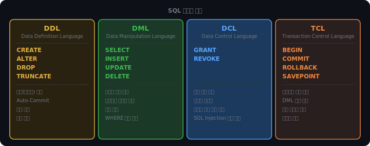
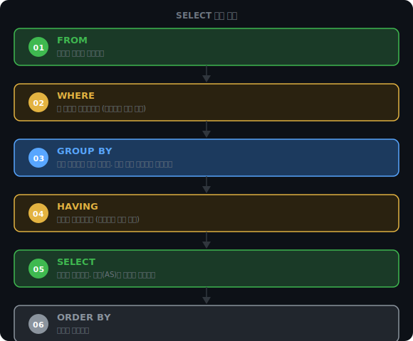

# SQL 기초와 RDBMS

데이터를 저장하고 꺼내는 방법은 여러 가지다. 파일에 직접 쓸 수도 있고, 인메모리 구조로 관리할 수도 있다. 그중에서 관계형 데이터베이스가 수십 년간 표준으로 쓰인 데는 이유가 있다. 그리고 그 데이터베이스를 다루는 언어가 SQL이다.

SQL 명령어를 분류하는 방법부터 시작해, RDBMS와 NoSQL이 왜 두 진영으로 나뉘었는지, SELECT 쿼리가 실제로 어떤 순서로 실행되는지를 살펴본다.

<br><br>

## SQL 명령어 분류

### 왜 분류가 필요한가

`DELETE FROM users WHERE id = 1`과 `DROP TABLE users`는 둘 다 데이터를 없애는 명령어처럼 보인다. 하지만 트랜잭션 안에서 작동 방식이 전혀 다르다.

```sql
BEGIN;
DELETE FROM users WHERE id = 1;
ROLLBACK; -- 삭제가 취소된다

BEGIN;
DROP TABLE users;
ROLLBACK; -- 취소되지 않는다. 테이블이 이미 사라졌다
```

이 차이를 만드는 것이 명령어 분류다. SQL 명령어는 역할에 따라 DDL, DML, DCL, TCL 네 가지로 나뉘고, 각 그룹이 트랜잭션과 맺는 관계가 다르다.



### DDL — 구조를 정의한다

DDL(Data Definition Language)은 테이블 자체를 만들고 바꾸고 지운다.

```sql
CREATE TABLE users (id INT, name VARCHAR(50), age INT);
ALTER TABLE users ADD COLUMN email VARCHAR(100);
DROP TABLE users;
```

실행하는 순간 자동으로 커밋된다. 트랜잭션 안에 넣어도 ROLLBACK이 먹히지 않는다.

이유는 DDL이 건드리는 대상에 있다. DDL은 데이터가 아니라 시스템 카탈로그, 즉 스키마 메타데이터를 변경한다. 어떤 테이블이 존재하고, 컬럼이 몇 개이며, 타입이 무엇인지 같은 정보다. 이 정보는 다른 세션에서도 즉시 보여야 하므로 트랜잭션 밖에서 바로 반영된다.

### DML — 데이터를 조작한다

DML(Data Manipulation Language)은 테이블 안의 데이터를 읽고 쓴다.

```sql
SELECT * FROM users WHERE age > 20;
INSERT INTO users VALUES (1, 'Alice', 25);
UPDATE users SET name = 'Bob' WHERE id = 1;
DELETE FROM users WHERE id = 1;
```

트랜잭션 안에서 동작한다. ROLLBACK하면 변경 전 상태로 돌아간다.

이것이 중요한 이유는 여러 DML을 하나의 작업 단위로 묶을 수 있어서다. 계좌 이체를 예로 들면, A 계좌 출금과 B 계좌 입금이 반드시 함께 성공하거나 함께 실패해야 한다. BEGIN으로 시작해 두 UPDATE를 묶고, 모두 성공하면 COMMIT, 하나라도 실패하면 ROLLBACK하는 방식으로 이를 보장한다.

### DCL — 권한을 제어한다

DCL(Data Control Language)은 누가 어떤 테이블에 어떤 작업을 할 수 있는지를 정한다.

```sql
GRANT SELECT, INSERT ON users TO 'api_server';
REVOKE INSERT ON users FROM 'readonly_user';
```

데이터베이스 보안의 출발점이다. 애플리케이션 서버 계정에 SELECT와 INSERT만 허용하면, SQL Injection이 성공하더라도 DROP TABLE이나 대규모 UPDATE 같은 파괴적인 명령은 실행되지 않는다. 계정별로 최소한의 권한만 부여하는 것이 원칙이다.

### TCL — 트랜잭션 경계를 제어한다

TCL(Transaction Control Language)은 DML 작업을 묶거나 취소하는 경계를 설정한다.

```sql
BEGIN;
UPDATE accounts SET balance = balance - 10000 WHERE id = 1;
UPDATE accounts SET balance = balance + 10000 WHERE id = 2;
COMMIT;    -- 두 UPDATE 모두 확정

ROLLBACK;  -- 두 UPDATE 모두 취소

SAVEPOINT before_update;
UPDATE users SET age = 30 WHERE id = 1;
ROLLBACK TO before_update; -- 이 UPDATE만 취소, 이전 작업은 유지
```

COMMIT에 도달하기 전에 오류가 나면 데이터베이스는 BEGIN 이전 상태로 돌아간다. SAVEPOINT는 트랜잭션 안에서 되돌아올 수 있는 중간 지점을 만든다.

<br><br>

## DELETE, TRUNCATE, DROP

세 명령어 모두 데이터를 없애지만, 작동하는 레벨이 다르다.

DELETE는 행을 하나씩 읽고 지운다. 각 삭제를 로그에 기록하기 때문에 ROLLBACK이 가능하다. WHERE 조건으로 대상 범위를 제한할 수 있다. 행 수에 비례해 시간이 걸린다.

TRUNCATE는 테이블이 차지하는 스토리지 페이지 자체를 해제한다. 행 단위 로그가 없으므로 롤백이 불가능하고 WHERE도 쓸 수 없다. 하지만 수백만 행을 지울 때도 거의 즉시 완료된다. 동작 방식이 데이터 삭제가 아닌 공간 재할당이어서 DDL로 분류된다.

DROP은 데이터만이 아니라 테이블 구조 자체를 제거한다. 이후 같은 이름의 테이블을 쓰려면 CREATE부터 다시 해야 한다.

| | DELETE | TRUNCATE | DROP |
|--|--|--|--|
| 분류 | DML | DDL | DDL |
| 테이블 구조 | 유지 | 유지 | 삭제 |
| 롤백 | 가능 | 불가 | 불가 |
| WHERE | 가능 | 불가 | 불가 |
| 속도 | 느림 (행 단위) | 빠름 (페이지 해제) | 빠름 |

<br><br>

## UNION과 UNION ALL

두 SELECT 결과를 합칠 때 쓴다.

```sql
SELECT name FROM employees
UNION
SELECT name FROM contractors;
```

UNION은 두 결과를 합친 뒤 중복을 제거한다. 내부적으로 해시 테이블을 만들어 이미 본 값인지 확인한다. 결과 전체를 해시 테이블에 올려야 하므로 메모리와 연산이 추가로 필요하다.

UNION ALL은 중복 제거 없이 두 결과를 그대로 이어 붙인다. 항상 UNION보다 빠르다. 중복이 없다는 것이 보장되거나, 중복이 있어도 상관없는 상황이라면 UNION ALL을 쓰는 것이 맞다.

<br><br>

## RDBMS와 NoSQL

### 관계형 데이터베이스가 지배했던 이유

RDBMS는 스키마를 미리 정하고, 테이블 간의 관계를 외래키로 연결하며, SQL로 데이터를 조작한다. 정합성이 강하다. 잔액이 음수가 되면 안 된다, 주문이 존재하지 않는 상품을 참조할 수 없다 같은 규칙을 데이터베이스 자체가 강제한다.

이 특성은 금융, 재고, 회원 시스템처럼 데이터 오류가 곧 비즈니스 손실로 이어지는 곳에 적합하다.

### 확장의 한계

문제는 트래픽이 기하급수적으로 늘어나면서 드러났다. RDBMS를 수평으로 확장하기가 어렵다. JOIN은 두 테이블의 데이터가 같은 서버에 있어야 자연스럽다. 데이터를 여러 서버에 쪼개면 JOIN 처리가 복잡해지고, 여러 서버에 걸친 트랜잭션도 비용이 크다. 서버 한 대의 사양을 높이는 방식으로 버티다 보면 결국 하드웨어 한계에 부딪힌다.

### NoSQL이 선택한 것

NoSQL은 처음부터 여러 서버에 분산 저장을 전제로 설계됐다. 스키마를 고정하지 않고, 정합성보다 가용성과 확장성을 우선한다. "데이터가 즉시 완전히 정확하지 않아도 괜찮다"는 것을 받아들이는 대신 수평 확장이 쉬워진다.

| 종류 | 예시 | 특징 |
|------|------|------|
| Key-Value | Redis | 가장 단순, 초고속 읽기·쓰기 |
| Document | MongoDB | JSON 형태, 유연한 스키마 |
| Column | Cassandra | 열 단위 저장, 대규모 쓰기에 강함 |
| Graph | Neo4j | 노드·엣지 구조, 관계 탐색에 특화 |

### 무엇을 선택하나

결제, 재고, 회원처럼 데이터 정합성이 깨지면 안 되는 곳은 RDBMS를 쓴다. "A 계좌에서 돈이 빠졌는데 B 계좌에 안 들어온" 상황은 허용할 수 없다.

소셜 피드, 로그, 캐시처럼 데이터 구조가 자주 바뀌거나 트래픽이 예측하기 어려운 곳은 NoSQL을 고려한다. 팔로워 수가 정확히 몇 명인지보다 빠르게 보여주는 것이 더 중요한 맥락이다.

<br><br>

## SELECT 실행 순서

### 작성 순서와 실행 순서가 다르다

SQL을 처음 배우면 작성하는 순서대로 실행된다고 생각하기 쉽다. 그렇지 않다.

```sql
SELECT city, COUNT(*) AS cnt
FROM users
WHERE age >= 20
GROUP BY city
HAVING COUNT(*) >= 2
ORDER BY cnt DESC
```

작성 순서는 SELECT → FROM → WHERE → GROUP BY → HAVING → ORDER BY다. 실제 실행 순서는 다르다.



```
1. FROM    → users 테이블 전체를 가져온다
2. WHERE   → age < 20인 행을 제거한다
3. GROUP BY → 남은 행을 city별로 묶는다
4. HAVING  → COUNT(*) < 2인 그룹을 제거한다
5. SELECT  → city와 COUNT(*)를 추출한다. 별칭(cnt)이 여기서 확정된다
6. ORDER BY → cnt 기준 내림차순으로 정렬한다
```

### GROUP BY가 테이블을 바꾸는 방식

GROUP BY를 실행하면 개별 행이 그룹으로 압축된다.

원본:

| customer_id | amount |
|------------|--------|
| A | 30,000 |
| B | 15,000 |
| A | 50,000 |
| B | 80,000 |
| A | 20,000 |

GROUP BY customer_id 후:

| customer_id | 묶인 amount |
|-------------|-----------|
| A | 30,000 / 50,000 / 20,000 |
| B | 15,000 / 80,000 |

이 시점에서 개별 amount 값에 접근할 수 없다. 그룹 전체를 하나의 값으로 표현하려면 집계함수(SUM, AVG, COUNT, MAX, MIN)를 써야 한다. SELECT에 GROUP BY 기준 컬럼이나 집계함수 외의 컬럼을 쓰면 오류가 난다. 그룹 안에 여러 값이 있는데 어떤 것을 보여줄지 데이터베이스가 결정할 수 없기 때문이다.

<iframe src="/DEV_LOG/Database/assets/demo_group_by.html" width="100%" height="560px" style="border:none;border-radius:12px;display:block"></iframe>

### WHERE에서 집계함수를 쓸 수 없는 이유

```sql
-- 오류: WHERE는 그룹이 생기기 전에 실행된다
SELECT city, COUNT(*) FROM users
WHERE COUNT(*) >= 2
GROUP BY city;

-- 정상: HAVING은 그룹이 생긴 뒤에 실행된다
SELECT city, COUNT(*) FROM users
GROUP BY city
HAVING COUNT(*) >= 2;
```

WHERE는 실행 순서 2번, GROUP BY는 3번이다. WHERE가 실행되는 시점에 그룹이 아직 없다. COUNT(*)는 그룹이 만들어져야 계산할 수 있는 값이므로, WHERE 안에서 쓸 수 없다.

WHERE는 개별 행을 거르는 체고, HAVING은 그룹을 거르는 체다. 같은 필터처럼 보이지만 역할이 다른 두 단계다.
