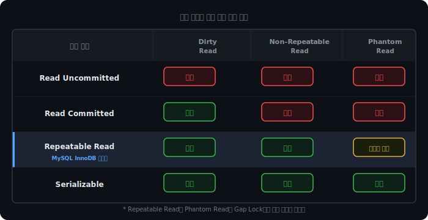
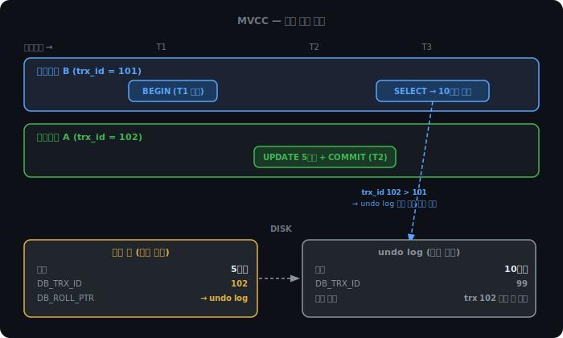

# 트랜잭션과 격리 수준

계좌 이체를 생각해보자. A 계좌에서 10만원을 빼고 B 계좌에 10만원을 넣는 두 개의 UPDATE 쿼리가 있다. 첫 번째 UPDATE가 성공한 직후 서버가 다운되면 어떻게 돼야 할까.

두 가지 결과만 허용된다. 둘 다 반영되거나, 둘 다 취소되거나. "절반만 된 상태"는 있어선 안 된다.

이것이 트랜잭션이 존재하는 이유다.

<br><br>

## ACID

트랜잭션이 지켜야 할 네 가지 성질을 ACID라고 부른다.

### Atomicity — 원자성

트랜잭션 안의 모든 연산은 전부 성공하거나 전부 취소된다. 중간 상태는 없다.

구현은 undo log로 한다. DB는 변경 전 데이터를 undo log에 미리 써두고, 실패가 발생하면 그것을 읽어 되돌린다.

### Consistency — 일관성

트랜잭션 전후로 DB에 정해진 규칙이 깨지지 않아야 한다. 잔액이 0 아래로 내려가면 안 된다는 제약이 있다면, 그 제약을 위반하는 트랜잭션은 통째로 거부된다.

일관성은 나머지 세 성질이 지켜지면 자연히 따라오는 성질에 가깝다.

### Isolation — 격리성

동시에 실행 중인 여러 트랜잭션은 서로의 진행 상황을 볼 수 없어야 한다.

완전한 격리를 보장하면 트랜잭션을 사실상 하나씩 순서대로 실행해야 한다. 처리량이 급격히 떨어진다. 그래서 DB는 격리 수준을 단계별로 나눠 어느 수준까지 격리할지 선택할 수 있도록 한다. 이것이 이 챕터의 핵심이다.

### Durability — 영속성

커밋된 데이터는 서버가 꺼져도 살아남아야 한다. 커밋 시점에 변경 내역을 디스크의 redo log(WAL)에 먼저 기록한다. 서버가 재시작되면 이 로그를 읽어 복구한다.

<br><br>

## 격리가 깨질 때 나타나는 세 가지 문제

격리 수준을 낮추면 성능이 올라가지만, 그 대신 세 가지 이상 현상이 발생할 수 있다.

### Dirty Read

```
트랜잭션 A: 잔액 10만원 → 5만원으로 수정 (커밋 전)
트랜잭션 B:                    잔액 읽음 → 5만원
트랜잭션 A:                                       롤백 → 잔액 10만원으로 복원
```

B는 A가 롤백한 뒤 존재하지 않게 된 값을 읽었다. 커밋되지 않은, 즉 "더럽혀진" 데이터를 읽는다는 뜻에서 Dirty Read라고 부른다.

### Non-Repeatable Read

```
트랜잭션 B: 잔액 읽음 → 10만원  (1차)
트랜잭션 A:               잔액 5만원으로 수정 + 커밋
트랜잭션 B: 잔액 읽음 → 5만원   (2차)  ← 같은 트랜잭션, 같은 쿼리, 다른 결과
```

Dirty Read와 달리 A는 커밋까지 마쳤다. "유효한 변경"인데도 같은 트랜잭션 안에서 같은 행을 두 번 읽었을 때 값이 달라진다.

### Phantom Read

```
트랜잭션 B: "잔액 > 5만원" 조회 → 2건  (1차)
트랜잭션 A:                         새 행 삽입(잔액 8만원) + 커밋
트랜잭션 B: "잔액 > 5만원" 조회 → 3건  (2차)  ← 없던 행이 생겼다
```

값이 변한 것이 아니라 행 자체가 생겼다. Non-Repeatable Read가 UPDATE 문제라면 Phantom Read는 INSERT/DELETE 문제다.

<br><br>

## 격리 수준 4단계

DB는 이 세 문제를 얼마나 막을지를 격리 수준으로 조절한다.



위로 올라갈수록 성능이 높고, 아래로 내려갈수록 안전하다.

Read Uncommitted는 커밋 전 데이터도 읽을 수 있어 세 문제 모두 발생한다. Serializable은 트랜잭션을 사실상 직렬로 처리해 세 문제 모두 막지만 처리량이 크게 떨어진다.

MySQL InnoDB의 기본값은 Repeatable Read다. 이 선택의 이유는 MVCC와 연결된다.

<br><br>

## MVCC — 락 없이 일관성을 유지하는 방법

Repeatable Read를 락(잠금) 기반으로 구현하면 읽기 작업에도 락이 걸린다. 트랜잭션 A가 어떤 행을 읽는 동안 트랜잭션 B도 같은 행을 읽으려 하면 대기해야 한다. 읽기가 많은 서비스에선 병목이 된다.

InnoDB는 대신 MVCC(Multi-Version Concurrency Control)를 쓴다. 락을 걸지 않고 각 행의 이전 버전을 저장해두는 방식이다.

### 버전을 어디에 저장하나

InnoDB는 모든 행에 두 개의 숨겨진 컬럼을 붙여둔다.

```
DB_TRX_ID  — 이 행을 마지막으로 수정한 트랜잭션 ID
DB_ROLL_PTR — undo log의 이전 버전으로 가는 포인터
```

트랜잭션 A(trx_id=102)가 잔액을 10만원에서 5만원으로 수정하면, 수정 전 값(10만원)은 undo log에 보관된다. 현재 행은 5만원으로 갱신되고, DB_ROLL_PTR는 undo log의 10만원 버전을 가리킨다.



### 스냅샷 읽기

트랜잭션 B(trx_id=101)가 잔액을 읽으려 한다. B는 T1 시점에 시작됐고, A(trx_id=102)는 T2 시점에 커밋됐다.

```
B의 판단: "현재 행의 DB_TRX_ID가 102인데, 102는 내가 시작(101)한 이후에 생긴 트랜잭션이다.
           내 스냅샷엔 포함되지 않는다 → DB_ROLL_PTR를 타고 undo log 읽기"
결과: 10만원 읽힘
```

B는 A의 변경을 보지 못한다. 락 없이.

이것이 "읽기가 쓰기를 막지 않고, 쓰기가 읽기를 막지 않는다"는 MVCC의 핵심 성질이다.

### undo log는 언제 삭제되나

A가 커밋하면 바로 삭제할 수 없다. 아직 실행 중인 트랜잭션이 그 버전을 필요로 할 수 있기 때문이다.

InnoDB의 백그라운드 purge 스레드는 주기적으로 "현재 살아있는 트랜잭션 중 가장 오래된 것보다도 이전에 생성된 버전"을 찾아 삭제한다. 이보다 오래된 버전은 어떤 활성 트랜잭션도 필요로 하지 않는다.

여기서 실제 장애 패턴이 나온다. 트랜잭션 하나를 몇 시간째 열어두면 그 트랜잭션이 "현재 살아있는 가장 오래된 것"이 된다. 그동안 다른 모든 트랜잭션의 undo log가 삭제되지 못하고 쌓인다. undo tablespace가 폭증해 DB가 느려지거나 다운될 수 있다. 트랜잭션을 짧게 끊어야 한다는 말의 진짜 이유 중 하나다.

<br><br>

## Gap Lock — Phantom Read 방지

이론상 Repeatable Read는 Phantom Read를 막지 못한다. 스냅샷 읽기는 행의 값 변경은 가려주지만, 새로 삽입된 행까지 가려주지는 않기 때문이다.

InnoDB는 Gap Lock으로 이것을 막는다.

```
트랜잭션 B: SELECT WHERE 잔액 > 5만원  →  (5만원, ∞) 범위에 Gap Lock 설정
트랜잭션 A: INSERT 잔액 8만원          →  Gap Lock에 걸려 대기
```

행 자체가 아니라 행 사이의 "빈 공간(gap)"에 락을 건다. 새 행이 그 구간 안으로 삽입되지 못하게 막는 방식이다.

덕분에 MySQL InnoDB의 Repeatable Read는 이론표와 달리 Phantom Read를 실제로는 대부분 차단한다.

아래 데모에서 세 가지 이상 현상을 직접 확인할 수 있다.

<iframe src="/DEV_LOG/Database/assets/demo_isolation_levels.html" width="100%" height="580px" style="border:none;border-radius:12px;display:block"></iframe>

<br><br>

## DB 데드락

### OS 데드락과 무엇이 다른가

두 트랜잭션이 서로가 가진 락을 기다리면 데드락이 된다.

```
트랜잭션 A: 계좌1 락 획득  →  계좌2 락 대기 중
트랜잭션 B: 계좌2 락 획득  →  계좌1 락 대기 중
(영원히 대기)
```

OS 데드락과 원리는 같다. 하지만 해결 전략이 다르다.

OS에서는 자원 할당 순서를 고정하는 식으로 데드락을 예방할 수 있다. DB에서는 어떤 트랜잭션이 어떤 순서로 어떤 행에 접근할지 실행 전에 알 수 없다. 예방이 현실적으로 불가능하다. 그래서 DB는 발생 후 감지하는 방식을 쓴다.

### Wait-for Graph

InnoDB는 트랜잭션 간의 대기 관계를 그래프로 관리한다.

```
A → B  (A가 B를 기다림)
B → A  (B가 A를 기다림)
→ 사이클 발견 = 데드락
```

사이클이 탐지되면 희생자(victim)를 하나 골라 롤백시킨다. 기준은 보통 "롤백 비용이 가장 적은 트랜잭션"이다. 변경한 행 수가 적은 쪽을 택한다. 롤백된 트랜잭션은 애플리케이션 쪽에서 재시도한다.

타임아웃 방식도 병행한다. 일정 시간 락을 획득하지 못하면 롤백시킨다. Wait-for Graph보다 단순하지만 데드락인지 단순 지연인지 구분하지 못한다는 단점이 있다.

<br><br>

## InnoDB가 Repeatable Read를 기본값으로 고른 이유

Serializable은 완전한 격리를 보장하지만 트랜잭션을 사실상 직렬 처리해 처리량이 급락한다. Read Committed는 빠르지만 같은 트랜잭션 안에서 읽기 일관성이 없다.

Repeatable Read + MVCC 조합은 이 사이의 균형점이다. 읽기에 락을 걸지 않아 처리량이 높고, 트랜잭션 시작 시점의 스냅샷을 유지해 읽기 일관성을 보장하며, Gap Lock으로 Phantom Read까지 대부분 막는다. 대부분의 애플리케이션에 이 수준이면 충분하다.
