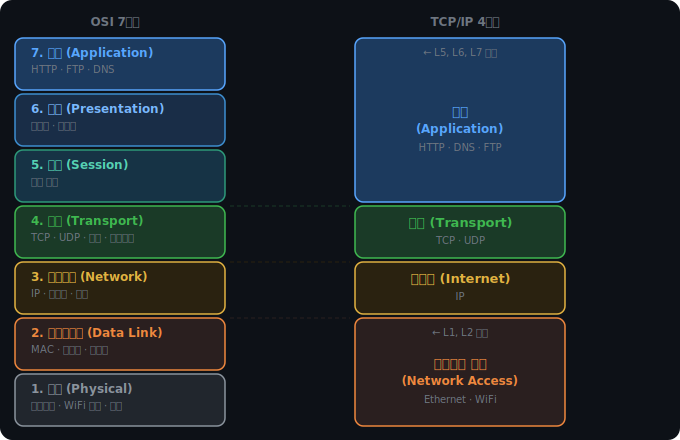
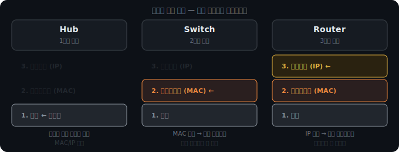
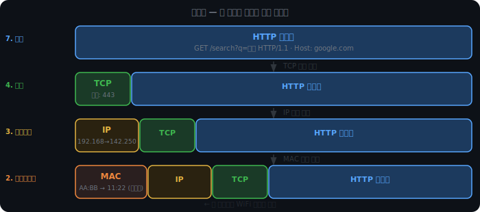

# OSI와 TCP/IP 계층

## 표준이 없던 시절

1980년대, 컴퓨터들은 각자의 언어를 쓰고 있었다. IBM은 SNA(Systems Network Architecture), DEC는 DECnet, Xerox는 XNS 같은 독자적인 네트워크 프로토콜을 만들었다. IBM 컴퓨터와 DEC 컴퓨터를 연결하는 건 불가능에 가까웠다.

ISO는 1984년 OSI 참조 모델을 발표했다. 어떤 제조사의 장비든 이 규칙을 따르면 서로 통신이 가능하도록 하겠다는 의도였다. 벤더 종속성을 끊기 위한 국제 표준이었다.

핵심 설계 원칙은 관심사의 분리다. 각 계층은 자기 역할만 알면 된다. HTTP 서버는 데이터가 WiFi로 전송되는지, 광섬유로 전송되는지 알 필요가 없다. NIC은 그 데이터가 HTTP 요청인지, FTP 파일인지 알 필요가 없다. 계층 간의 인터페이스만 지키면 내부 구현은 자유롭게 바꿀 수 있다.

이것이 실제로 의미하는 바는 이렇다. HTTP 코드를 하나도 바꾸지 않아도 Ethernet에서 WiFi 6로 전환할 수 있다. WiFi 안테나 설계를 바꿔도 TCP 스택은 전혀 영향받지 않는다. 수십 년간 상위 계층 프로토콜이 진화하는 동안 물리 계층은 독립적으로 발전할 수 있었던 이유다.

  

---

  

## OSI 7계층과 TCP/IP 4계층

OSI는 네트워크를 7개 계층으로 나눈다. 위로 올라갈수록 사용자에 가깝고, 아래로 내려갈수록 물리 매체에 가깝다.

각 계층이 데이터를 다루는 단위를 PDU(Protocol Data Unit)라 한다. 물리 계층은 비트, 데이터링크는 프레임, 네트워크는 패킷, 전송 계층은 세그먼트, 응용 계층은 메시지다.

### 응용·표현·세션 계층 (7, 6, 5)

사용자가 직접 쓰는 프로토콜이 7계층에 있다. HTTP, FTP, DNS, SMTP가 여기 속한다.

7계층이 하는 일은 "어떤 형식으로 데이터를 주고받느냐"를 정하는 것이다. HTTP는 "요청 줄 + 헤더 + 바디" 구조를 정의한다. DNS는 도메인 이름과 IP 주소를 매핑하는 쿼리/응답 형식을 정의한다. 같은 네트워크 인프라 위에서도 프로토콜마다 전혀 다른 방식으로 통신한다.

6계층(표현)은 암호화, 압축, 문자 인코딩을 담당한다. JSON 데이터를 UTF-8로 인코딩하거나, TLS로 페이로드를 암호화하는 것이 이 계층의 역할이다.

5계층(세션)은 연결 세션의 생성·유지·종료를 관리한다. 로그인 세션을 유지하거나 연결이 끊겼을 때 재연결하는 로직이 여기 속한다.

현대 프로토콜에서 이 세 계층의 경계는 흐릿하다. HTTP가 `Content-Type` 헤더로 표현 방식을 정의하고, `Authorization` 헤더로 세션 인증을 처리하는 식으로 한 프로토콜이 5·6·7계층 역할을 함께 수행하기 때문이다. TCP/IP 모델이 이 셋을 응용 계층 하나로 묶은 이유가 여기 있다.

### 전송 계층 (4)

같은 컴퓨터 안에서 어떤 앱으로 데이터를 보낼지 결정한다. 포트 번호가 이 계층에 있다.

IP 주소가 건물 주소라면, 포트 번호는 층수다. 서버 하나가 `0.0.0.0:80`(HTTP), `0.0.0.0:443`(HTTPS), `0.0.0.0:22`(SSH)를 동시에 열고 있을 수 있다. 패킷이 도착하면 OS는 포트 번호를 보고 어느 프로세스에 전달할지 결정한다.

TCP와 UDP가 4계층 프로토콜이다.

TCP는 연결 기반이다. 데이터를 보내기 전에 연결을 맺고(3-way Handshake), 순서 번호로 패킷 순서를 보장하며, 손실된 패킷은 재전송한다. 웹 브라우저, 이메일, 파일 전송처럼 데이터 무결성이 중요한 곳에 쓴다.

UDP는 비연결 기반이다. 연결 수립 없이 바로 데이터를 보낸다. 순서 보장도, 재전송도 없다. DNS 조회, 스트리밍, 온라인 게임처럼 약간의 손실보다 빠른 전달이 더 중요한 곳에 쓴다.

### 네트워크 계층 (3)

전 세계에서 어떤 컴퓨터인지를 식별한다. IP 주소가 이 계층이다.

IP 주소는 계층적 구조를 가진다. `192.168.0.5`에서 앞부분(`192.168.0`)은 네트워크 주소, 뒷부분(`5`)은 그 네트워크 안의 호스트 번호다. 라우터는 이 구조를 보고 "같은 네트워크 안인지, 다른 네트워크로 보내야 하는지"를 판단한다.

라우터는 라우팅 테이블을 갖고 있다. "목적지 IP 대역 X는 인터페이스 Y로 내보내라"는 규칙의 집합이다. 패킷이 들어오면 목적지 IP와 이 테이블을 대조해 다음 홉(hop)을 결정한다.

### 데이터링크 계층 (2)

같은 네트워크 구간에서 특정 장치를 식별한다. MAC(Media Access Control) 주소가 이 계층이다.

MAC 주소는 NIC 제조사가 하드웨어에 구워 넣는 48비트 주소다. 앞 24비트는 제조사 식별자(OUI), 뒤 24비트는 제조사가 부여한 일련번호다. IP 주소가 위치를 나타내는 논리적 주소라면, MAC 주소는 장치 자체를 나타내는 물리적 식별자다.

이더넷 프레임 구조도 이 계층에서 정의된다. 프레임 헤더에 출발지·목적지 MAC 주소가 들어가고, 트레일러에 FCS(Frame Check Sequence)가 붙어 전송 오류를 감지한다.

### 물리 계층 (1)

비트를 전기 신호, 빛, 전파로 변환해 물리 매체로 전송한다.

이 계층은 "0과 1을 어떤 신호로 표현하느냐"를 정의한다. 전압 레벨, 주파수, 펄스 타이밍이 여기서 결정된다. UTP 케이블, 광섬유, WiFi 전파는 모두 물리 계층의 다른 구현이다.

물리 계층 덕분에 상위 계층은 전송 매체에 무관해진다. 같은 이더넷 프레임이 구리선으로도, 광섬유로도, WiFi 전파로도 전달될 수 있다. 10Mbps 이더넷을 1Gbps로 업그레이드해도 상위 계층 프로토콜은 전혀 바꿀 필요가 없다.

### 계층별 대표 기기

네트워크 장비는 어느 계층까지 들여다보느냐로 구분된다.

Hub는 물리 계층 장비다. 들어온 전기 신호를 증폭해 연결된 모든 포트로 그대로 내보낸다. MAC 주소도, IP 주소도 보지 않는다. 어떤 데이터인지 전혀 모른 채 뿌린다.

Switch는 데이터링크 계층까지 이해한다. MAC 주소 테이블을 학습해 목적지 MAC에 해당하는 포트로만 프레임을 전달한다. Hub가 모든 포트로 뿌리는 것과 달리, Switch는 필요한 곳으로만 보낸다. 같은 네트워크 안의 트래픽을 효율적으로 분리한다.

Router는 네트워크 계층까지 이해한다. IP 주소를 보고 서로 다른 네트워크 사이에서 패킷을 라우팅한다. 가정의 "공유기"는 라우터 기능에 WiFi 액세스 포인트를 합쳐놓은 장치다.

  

---

  

## 캡슐화: 헤더가 붙고 떼어지는 과정

HTTP 요청이 만들어진 순간, 그 데이터는 아직 네트워크로 나갈 형태가 아니다. 응용 계층에서 물리 계층으로 내려가는 동안 각 계층이 자기 헤더를 앞에 붙인다. 이 과정이 캡슐화(Encapsulation)다.

수신 측에서는 반대 방향으로 진행된다. 물리 계층에서 위로 올라가며 각 계층이 자기 헤더를 뜯어내고 상위 계층에 넘긴다. 역캡슐화(Decapsulation)다.

헤더가 데이터 뒤가 아닌 앞에 붙는 이유가 있다. 라우터는 패킷 전체를 읽을 필요 없이 앞부분의 IP 헤더만 보고 다음 목적지를 결정한다. 헤더가 앞에 있을수록 처리 속도가 빨라진다.

### 각 헤더에 담기는 것

TCP 헤더에는 포트 번호와 순서 번호(Sequence Number)가 들어간다. 포트 번호로 목적지 앱을 찾고, 순서 번호로 쪼개진 세그먼트들을 재조립할 때 순서를 맞춘다.

IP 헤더에는 출발지와 목적지 IP 주소가 들어간다. 이 주소는 출발지에서 목적지에 도달할 때까지 바뀌지 않는다. 도중에 수십 개의 라우터를 거쳐도 IP 헤더의 주소는 그대로다.

MAC 헤더에는 현재 구간의 출발지·목적지 장치 주소가 들어간다. 한 구간이 끝나면 라우터가 해당 MAC 헤더를 제거하고 다음 구간을 위한 새 MAC 헤더를 붙인다.

  

---

  

## MAC과 IP: 역할이 다르다

IP 주소만으로도 전 세계 모든 컴퓨터를 식별할 수 있다. 그런데 MAC 주소가 따로 필요한 이유가 있다.

WiFi는 전파다. 공유기가 신호를 보내면 같은 네트워크에 연결된 모든 기기가 물리적으로 신호를 수신한다. 이 상황에서 NIC은 프레임의 목적지 MAC을 자신의 MAC과 비교해 "내 것인지" 판단한다. 일치하지 않으면 버린다. 이 필터링이 없으면 같은 네트워크의 모든 기기가 모든 프레임을 처리해야 한다.

IP는 논리적 주소다. 전 세계 어느 컴퓨터로 갈지를 결정한다. MAC은 하드웨어 주소다. 현재 네트워크 구간에서 특정 장치에 프레임을 전달하는 데 쓴다. 두 주소는 "목적지의 범위"가 다르다.

<iframe src="/DEV_LOG/Network/assets/demo_wifi_broadcast.html" width="100%" height="520" frameborder="0" style="border-radius:10px;border:1px solid #334155;display:block;" onload="this.style.height=(this.contentDocument||this.contentWindow.document).documentElement.scrollHeight+'px'"></iframe>

### MAC이 구간마다 교체되는 이유

라우터는 패킷을 받으면 MAC 헤더를 제거하고 IP 주소를 확인한다. 자신의 IP가 아니라면 라우팅 테이블에서 다음 홉(hop)을 찾는다. 라우팅 테이블은 "목적지 IP 대역별로 어느 방향으로 보낼지"를 저장한 표다.

다음 홉의 MAC 주소를 붙여 전달하면, 그 라우터가 같은 과정을 반복한다. 이 릴레이가 목적지 서버까지 이어진다.

<iframe src="/DEV_LOG/Network/assets/demo_packet_journey.html" width="100%" height="520" frameborder="0" style="border-radius:10px;border:1px solid #334155;display:block;" onload="this.style.height=(this.contentDocument||this.contentWindow.document).documentElement.scrollHeight+'px'"></iframe>

IP 주소는 처음부터 끝까지 변하지 않는다. 발신자의 IP가 "보낸 사람 주소"로 남아있어야 수신자가 응답을 돌려보낼 수 있기 때문이다. MAC 주소는 구간마다 새로 쓴다. MAC은 원래부터 그 구간에서만 유효한 로컬 주소이기 때문이다.

IP가 목적지까지의 전체 경로를 담당하고, MAC이 각 구간의 전달을 담당하는 이 구조가 인터넷이 수천 개의 서로 다른 네트워크를 넘나들며 동작할 수 있는 기반이다.

  

---

  

계층 구조가 갖춰졌다면 데이터 교환은 정해진 형식을 따라야 한다. 웹에서 가장 널리 쓰이는 그 형식이 HTTP다.
