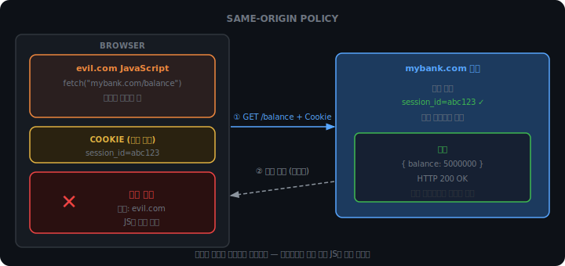
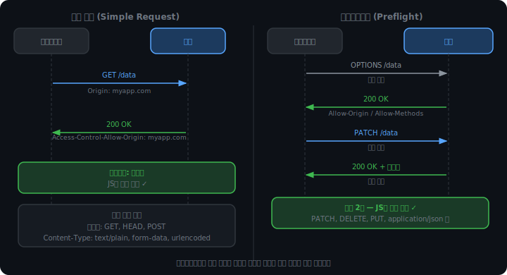
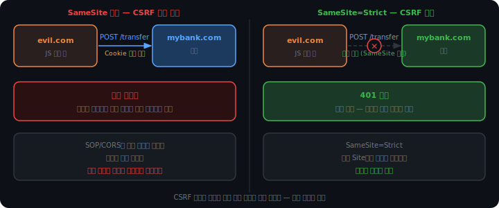

# CORS와 동일 출처 정책

웹 애플리케이션이 복잡해지면서 한 페이지가 여러 서버에 데이터를 요청하는 것이 일반적이 됐다. 프론트엔드와 백엔드가 다른 주소에 있고, 외부 API를 호출하고, CDN에서 자원을 가져온다.

이 환경에서 브라우저는 한 가지 문제를 안고 있다. 어떤 요청은 허락하고 어떤 요청은 막아야 하는가.

<br><br>

## 브라우저 안에서 실행되는 코드

웹 페이지를 열면 서버는 HTML, CSS, JavaScript 파일을 브라우저에 전달한다. 브라우저는 그 JavaScript를 실행한다. 여기에 중요한 함의가 있다.

`https://evil.com`에 접속하면 evil.com 서버가 만들어둔 JavaScript가 내 브라우저 안에서 실행된다. 그 코드 안에 이런 내용이 있어도 사용자는 알 수 없다.

```javascript
fetch("https://mybank.com/balance")
```

브라우저는 HTTP 요청을 보낼 때 해당 도메인에 저장된 쿠키를 자동으로 헤더에 붙인다. `mybank.com`에 로그인한 상태라면, evil.com의 JavaScript가 보내는 요청에도 그 세션 쿠키가 따라붙는다.

```
GET /balance HTTP/1.1
Host: mybank.com
Cookie: session_id=abc123     ← 브라우저가 자동으로 붙임
```

서버 입장에서 이 요청은 사용자가 직접 보낸 요청과 구분이 되지 않는다. 악성 사이트가 내 브라우저를 원격으로 조종하는 셈이다.

<br><br>

## Same-Origin Policy

이 문제를 막기 위해 브라우저는 규칙을 하나 세웠다.

> 다른 출처(Origin)에서 실행된 JavaScript는 다른 출처의 응답을 읽을 수 없다.

여기서 출처(Origin)는 세 가지 요소의 조합이다.

```
https://myapp.com:443
└─────┘ └────────┘ └──┘
프로토콜    호스트   포트
```

셋 중 하나라도 다르면 다른 Origin이다.

| 비교 | 같은 Origin? | 이유 |
|------|-------------|------|
| `https://myapp.com` vs `https://myapp.com/about` | ✓ | 경로는 Origin에 포함되지 않음 |
| `https://myapp.com` vs `http://myapp.com` | ✗ | 프로토콜 다름 |
| `https://myapp.com` vs `https://api.myapp.com` | ✗ | 호스트 다름 |
| `https://myapp.com` vs `https://myapp.com:8080` | ✗ | 포트 다름 |

중요한 것은 브라우저가 막는 대상이다. 요청 자체가 차단되는 것이 아니다. 요청은 서버에 도달하고, 서버는 응답을 돌려보낸다. 브라우저는 그 응답을 JavaScript에게 넘겨주지 않을 뿐이다.



<br><br>

## CORS: 서버가 허락을 선언한다

Same-Origin Policy는 보안 문제를 해결하지만 새로운 문제를 낳는다. 프론트엔드(`myapp.com`)가 같은 회사의 API 서버(`api.myapp.com`)에 요청을 보내는 것도 막힌다. 호스트가 다르기 때문이다.

이 제한을 풀기 위해 CORS(Cross-Origin Resource Sharing)가 나왔다. 서버가 응답 헤더에 허락할 출처를 명시하면, 브라우저가 그 응답을 JavaScript에 전달한다.

```
HTTP/1.1 200 OK
Access-Control-Allow-Origin: https://myapp.com
```

브라우저가 이 헤더를 확인하고 요청을 보낸 출처가 허락 목록에 있으면 응답을 통과시킨다.

```
Access-Control-Allow-Origin: *
```

와일드카드(`*`)를 쓰면 모든 출처를 허락한다. 공개 API(날씨, 지도 등)에서 쓰는 방식이다. 인증이 필요한 서비스에는 적합하지 않다.

서버 측에서는 라이브러리를 통해 설정한다. Node.js 예시:

```javascript
app.use(cors({
  origin: "https://myapp.com",
  methods: ["GET", "POST", "PATCH", "DELETE"],
  allowedHeaders: ["Content-Type", "Authorization"]
}))
```

<br><br>

## 단순 요청과 프리플라이트

CORS 요청은 두 가지 경로로 처리된다.

### 단순 요청

아래 조건을 모두 충족하면 브라우저는 곧바로 요청을 보내고, 응답에서 CORS 헤더를 확인한다.

- 메서드: `GET`, `POST`, `HEAD` 중 하나
- Content-Type: `text/plain`, `multipart/form-data`, `application/x-www-form-urlencoded` 중 하나
- 커스텀 헤더 없음

이 조건들은 HTML 폼이 원래부터 보낼 수 있었던 요청 유형이다. 브라우저가 CORS를 도입하기 전부터 존재했기 때문에 별도 사전 확인 없이 허용한다.

### 프리플라이트

조건을 벗어나면 브라우저는 실제 요청을 보내기 전에 먼저 묻는다. `OPTIONS` 메서드로 서버에 사전 확인 요청(프리플라이트)을 보내는 것이다.

```
OPTIONS /users/1 HTTP/1.1
Origin: https://myapp.com
Access-Control-Request-Method: PATCH
Access-Control-Request-Headers: Content-Type
```

서버가 허락하면:

```
HTTP/1.1 200 OK
Access-Control-Allow-Origin: https://myapp.com
Access-Control-Allow-Methods: GET, POST, PATCH
Access-Control-Allow-Headers: Content-Type
Access-Control-Max-Age: 86400
```

브라우저는 이 응답을 확인한 뒤 실제 `PATCH` 요청을 전송한다. `Max-Age`는 이 프리플라이트 응답을 캐시하는 시간이다. 같은 요청을 반복할 때 매번 OPTIONS를 보내지 않아도 된다.

`PATCH`, `DELETE`, `PUT` 같이 서버 상태를 바꾸는 메서드나 `application/json` Content-Type이 프리플라이트를 트리거한다. 보내고 나서 막으면 이미 서버에서 실행됐기 때문이다.



<iframe src="/DEV_LOG/Network/assets/demo_preflight.html" width="100%" height="500px" style="border:none;border-radius:12px;display:block"></iframe>

<br><br>

## 쿠키를 함께 보내려면

기본 설정에서 CORS 요청은 쿠키를 포함하지 않는다. 인증이 필요한 API를 호출하려면 클라이언트와 서버 양쪽에 설정이 필요하다.

클라이언트:

```javascript
fetch("https://api.myapp.com/profile", {
  credentials: "include"
})
```

서버:

```
Access-Control-Allow-Origin: https://myapp.com   ← 정확한 출처 명시 필수
Access-Control-Allow-Credentials: true
```

`credentials: "include"`를 쓸 때 서버가 `Access-Control-Allow-Origin: *`을 반환하면 브라우저가 차단한다. 와일드카드는 "누구든 허용"인데, 인증 정보(쿠키)를 싣는 요청에 "누구든 허용"은 모순이기 때문이다.

<br><br>

## CORS는 브라우저의 정책이다

CORS는 브라우저가 강제하는 규칙이다. 서버끼리 통신하거나 curl, Postman 같은 도구로 요청을 보내면 CORS 제한이 없다. 요청을 보내는 주체가 브라우저가 아니기 때문이다.

```bash
curl https://api.myapp.com/data    # CORS 헤더 없어도 응답 받음
```

"Postman에서는 되는데 브라우저에서는 안 된다"는 상황은 대부분 CORS 설정 문제다. 서버가 `Access-Control-Allow-Origin` 헤더를 보내지 않거나, 잘못된 출처를 허락하고 있을 가능성이 높다.

반대로, CORS 설정이 올바르더라도 서버 자체의 인증/인가 로직은 별개다. CORS는 브라우저와 서버 사이의 접근 제어이지, 서버 내부의 권한 관리가 아니다.

<br><br>

## CSRF: 응답이 아니라 요청이 문제다

Same-Origin Policy는 응답을 JavaScript에 넘겨주지 않는 방식으로 보호한다. 그런데 응답을 읽는 것이 목적이 아닌 공격이 있다.

CSRF(Cross-Site Request Forgery)다. evil.com이 다음 코드를 실행한다.

```javascript
fetch("https://mybank.com/transfer", {
  method: "POST",
  body: JSON.stringify({ to: "attacker", amount: 1000000 })
})
```

응답을 읽지 못하더라도, 이체 요청 자체는 서버에 도달하고 실행된다. 브라우저가 쿠키를 자동으로 붙이기 때문이다. 공격자는 응답 내용이 필요하지 않다. 서버가 동작을 실행하는 것만으로 목적이 달성된다.

### SameSite로 방어한다

SameSite 쿠키 속성은 쿠키가 붙는 조건을 제한한다.

```
Set-Cookie: session_id=abc123; SameSite=Strict
```

`SameSite=Strict`이면 브라우저는 다른 사이트에서 시작된 요청에 쿠키를 붙이지 않는다. evil.com에서 보내는 요청에 세션 쿠키가 없으므로 서버는 인증되지 않은 요청으로 처리한다.



<br><br>

## SameSite와 CORS의 기준 차이

SameSite와 CORS는 모두 출처를 기준으로 동작하지만, 기준이 다르다.

CORS는 Origin 단위다. 프로토콜, 호스트, 포트 세 가지가 모두 같아야 같은 Origin이다.

SameSite는 Site 단위다. 도메인의 등록 가능한 최상위 부분(eTLD+1)이 같으면 같은 Site다.

```
myapp.com  vs  api.myapp.com

CORS 기준:     다른 Origin  (호스트가 다름)
SameSite 기준: 같은 Site   (eTLD+1 = myapp.com으로 동일)
```

`myapp.com`의 JavaScript가 `api.myapp.com`에 요청을 보낼 때, SameSite 입장에서는 같은 사이트이므로 쿠키가 붙는다. CSRF 위험은 없다. 그러나 CORS 입장에서는 다른 Origin이므로 서버가 `Access-Control-Allow-Origin`을 명시해야 응답을 읽을 수 있다.

| | 기준 | 막는 것 |
|--|------|---------|
| SameSite | eTLD+1 (도메인 뿌리) | 쿠키 자동 첨부 → CSRF 방어 |
| CORS | Origin (프로토콜+호스트+포트) | 응답 읽기 → 데이터 탈취 방어 |

두 가지가 막는 대상이 다르기 때문에 함께 사용한다.

<br><br>

## 저장 위치에 따른 토큰 취약성

JWT를 어디에 저장하느냐에 따라 노출되는 위협이 달라진다.

localStorage에 저장하면 브라우저가 요청에 자동으로 붙이지 않는다. JavaScript가 직접 `Authorization` 헤더에 넣어야 한다. 다른 Origin의 JavaScript는 이 localStorage에 접근할 수 없으므로(SOP가 막음) CSRF 공격은 성립하지 않는다. 대신 myapp.com 자체에 악성 JavaScript가 주입되는 XSS 공격에 취약하다. 같은 Origin의 JavaScript는 localStorage를 자유롭게 읽기 때문이다.

HttpOnly 쿠키에 저장하면 JavaScript에서 접근이 불가능해 XSS로 토큰을 훔쳐가는 것이 차단된다. 그러나 쿠키는 자동으로 요청에 붙기 때문에 CSRF 공격에는 노출된다. SameSite 속성으로 보완한다.

| 저장 위치 | CSRF | XSS | 비고 |
|-----------|------|-----|------|
| localStorage | 안전 | 취약 | SOP가 다른 Origin의 접근 차단 |
| HttpOnly 쿠키 | 취약 | 안전 | SameSite=Strict로 CSRF 방어 |

어느 쪽을 선택하든 단독으로 완벽한 방어는 없다. 실무에서는 HttpOnly 쿠키에 Refresh Token을 저장하고 SameSite=Strict를 적용하는 조합을 주로 쓴다.
