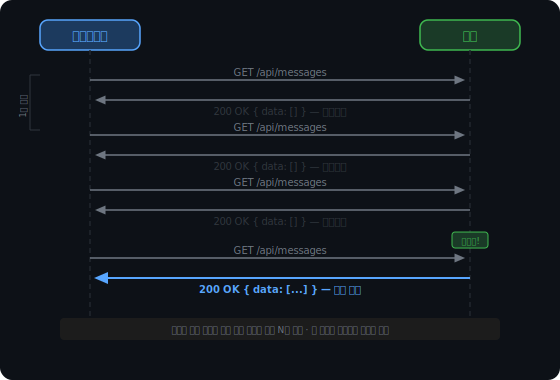
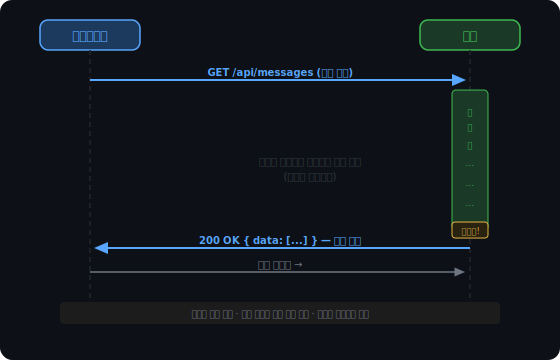
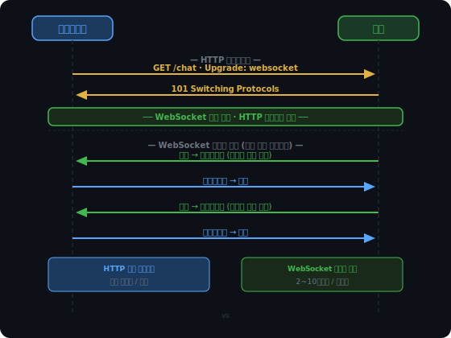
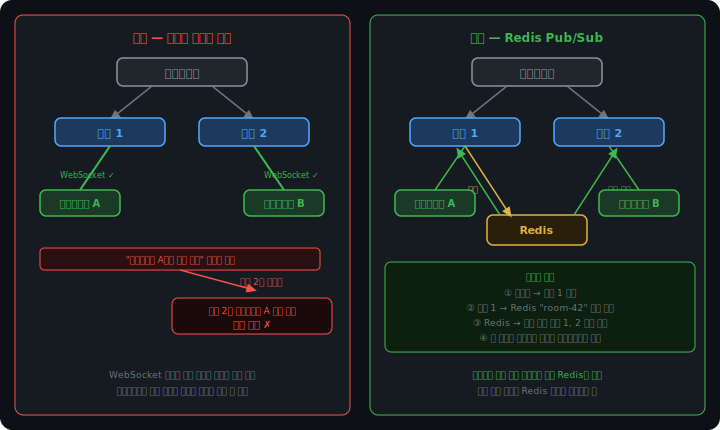
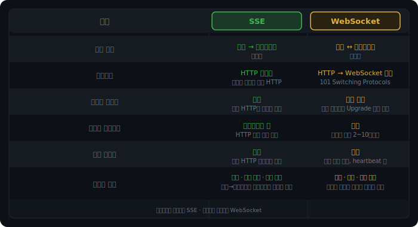

# 웹소켓과 실시간 통신

HTTP는 클라이언트가 먼저 요청을 보내야만 서버가 응답할 수 있는 구조다. 대부분의 웹 서비스에서는 이것으로 충분하다. 하지만 실시간 채팅, 주식 시세, 온라인 게임처럼 서버에 새 데이터가 생겼을 때 즉시 클라이언트에 전달해야 하는 상황에서 HTTP의 단방향 설계는 구조적 한계가 된다.

서버가 먼저 말을 걸 수 없다는 제약을 어떻게 돌파했는지, 그 과정을 순서대로 살펴본다.

<br><br>

## Polling과 Long Polling

### Polling

가장 단순한 해결책은 클라이언트가 주기적으로 서버에 물어보는 것이다.

```
클라이언트: "새 데이터 있어?" → 서버: "없어"
(1초 후)
클라이언트: "새 데이터 있어?" → 서버: "없어"
(1초 후)
클라이언트: "새 데이터 있어?" → 서버: "있어!"
```

구현은 단순하지만 문제가 두 가지다.

첫째, 데이터가 없는 상황에서도 요청이 반복된다. 서버 부하와 네트워크 낭비가 그대로 비용이 된다.

둘째, 폴링 주기만큼 지연이 발생한다. 1초 간격으로 폴링하면 서버에 데이터가 생긴 순간부터 최대 1초 뒤에야 클라이언트가 받는다. 실시간이라고 부르기 어렵다.



<br><br>

### Long Polling

폴링의 문제를 줄이기 위해 나온 방식이다. 핵심은 응답 시점을 서버가 제어한다는 것이다.

클라이언트가 요청을 보내면 서버는 바로 응답하지 않는다. 데이터가 생기거나 타임아웃이 될 때까지 응답을 붙들고 있다가, 데이터가 생기는 순간 응답을 돌려보낸다. 클라이언트는 응답을 받는 즉시 다음 요청을 다시 연결한다.

```
클라이언트 → 서버: "요청"
서버: (데이터가 생길 때까지 대기...)
서버 → 클라이언트: "데이터!"
클라이언트 → 서버: "요청" (즉시 재연결)
```

빈 응답이 줄고 데이터가 생기는 즉시 전달되므로 폴링보다 낫다.

그러나 한계가 있다. 클라이언트 수만큼 서버가 소켓을 열어 붙들고 있어야 한다. 동시 접속이 많으면 서버 자원이 고스란히 잠긴다. 또한 중간에 위치한 프록시나 로드밸런서가 "응답이 너무 늦다"고 판단해 연결을 강제로 끊는 타임아웃 문제도 발생한다.



<br><br>

## WebSocket

### 프로토콜 전환

WebSocket은 발상 자체가 다르다. 요청-응답 구조를 개선하는 대신, 연결을 맺고 나서 프로토콜을 바꿔버린다.

시작은 HTTP다. 클라이언트가 일반적인 HTTP 요청을 보내되 `Upgrade` 헤더를 포함해 WebSocket으로의 전환을 제안한다. 서버가 동의하면 101 Switching Protocols로 응답한다. 이 순간부터 같은 TCP 연결이 WebSocket 프레임을 주고받는 채널로 바뀐다.

```
클라이언트 → 서버:
  GET /chat HTTP/1.1
  Upgrade: websocket
  Connection: Upgrade

서버 → 클라이언트:
  HTTP/1.1 101 Switching Protocols
  Upgrade: websocket
  Connection: Upgrade

이후: HTTP 아님. WebSocket 프레임으로 양방향 통신.
```

101 Switching Protocols는 이 용도에만 존재하는 상태코드다.



<br><br>

### HTTP로 시작하는 이유

WebSocket이 처음에 HTTP를 거치는 데는 실용적인 이유가 있다.

기업이나 학교 네트워크에는 방화벽이 있다. 방화벽은 기본적으로 대부분의 포트를 차단하고, 80번(HTTP)과 443번(HTTPS)만 열어둔다. 웹 브라우징은 허용해야 하기 때문이다.

WebSocket이 전용 포트를 새로 열어 통신하려 하면 방화벽이 차단한다. 하지만 HTTP를 통해 이미 열린 443번 포트로 시작하면 방화벽을 통과한다. Upgrade로 프로토콜이 바뀐 이후에도 같은 TCP 연결을 그대로 사용하므로 방화벽 입장에서는 평범한 HTTPS 연결처럼 보인다.

이것은 완벽한 우회는 아니다. 구형 프록시나 레거시 기업 방화벽은 HTTP 패킷을 검사하다가 `Upgrade: websocket` 헤더를 인식하지 못하고 연결을 끊어버리는 경우가 있다. 최신 환경에서는 드문 일이지만, 네트워크 인프라가 오래된 환경에서는 고려해야 할 문제다.

<br><br>

### ws:// vs wss://

HTTP와 HTTPS의 관계와 동일하다. `ws://`는 암호화 없는 WebSocket, `wss://`는 TLS 위에서 동작하는 WebSocket이다.

실무에서 `ws://`를 거의 쓰지 않는 이유가 있다. 브라우저는 HTTPS 페이지에서 `ws://` 연결을 차단한다. Mixed Content 정책 때문이다 — HTTPS로 열린 페이지가 암호화되지 않은 리소스를 사용하는 것을 허용하지 않는다. 서비스가 HTTPS라면 WebSocket도 반드시 `wss://`여야 한다.

방화벽 측면에서도 `wss://`가 유리하다. `wss://`는 443번 포트를 통해 TLS로 암호화된 채 전달되므로, 구형 프록시가 `Upgrade: websocket` 헤더를 검사하다 차단하는 문제가 발생하기 어렵다. 패킷 내부를 볼 수 없기 때문이다.

<br><br>

### 연결 이후

핸드셰이크가 끝나면 서버와 클라이언트 모두 언제든 먼저 데이터를 보낼 수 있다. 단일 TCP 연결 위에서 양방향 통신이 이루어진다.

메시지 단위는 WebSocket 프레임이다. HTTP 헤더가 매 요청마다 수백 바이트를 차지하는 것과 달리, WebSocket 프레임 헤더는 2~10바이트에 불과하다. 메시지 교환이 잦을수록 WebSocket의 오버헤드 이점이 커진다.

<br><br>

### Heartbeat

WebSocket 연결이 수립된 후 양쪽이 아무 메시지도 주고받지 않으면 문제가 생긴다. NAT나 방화벽은 일정 시간 동안 트래픽이 없는 연결을 조용히 끊어버린다. 클라이언트와 서버는 연결이 살아있다고 착각하지만 중간 경로는 이미 사라진 상태다. 이를 half-open connection이라고 한다.

이를 해결하기 위해 WebSocket 프로토콜은 Ping/Pong 프레임을 내장하고 있다.

```
서버 → 클라이언트: Ping 프레임 (주기적으로 전송)
클라이언트 → 서버: Pong 프레임 (자동 응답)

Pong이 오지 않으면 → 연결이 끊긴 것으로 판단 → 정리
```

Ping/Pong은 애플리케이션 코드가 아니라 라이브러리/서버 레벨에서 자동으로 처리된다. 주기는 보통 30~60초로 설정한다. NAT나 방화벽의 idle 타임아웃보다 짧게 잡아야 효과가 있다.

Heartbeat의 역할은 두 가지다. 죽은 연결을 감지해 정리하는 것과, 주기적으로 패킷을 발생시켜 NAT가 연결 매핑을 유지하도록 하는 것이다.

<br><br>

### 스케일아웃 문제

HTTP 서버는 스케일아웃이 단순하다. 어떤 서버가 요청을 받아도 처리할 수 있다. 각 요청이 독립적이기 때문이다.

WebSocket은 다르다. 연결이 특정 서버의 소켓에 묶여 있다. 로드밸런서가 메시지를 다른 서버로 보내면 그 서버에는 해당 클라이언트의 소켓이 없어 전달할 수 없다.

해결책은 두 가지다. Sticky Session은 로드밸런서가 특정 클라이언트를 항상 같은 서버로 고정하는 방식이다. 구현이 단순하지만 해당 서버가 죽으면 물려 있던 연결이 전부 끊기고, 부하가 특정 서버에 몰릴 수 있다.

Redis Pub/Sub은 소켓은 각 서버에 두되, 메시지를 Redis를 통해 공유하는 방식이다. 서버들이 서로 직접 통신하지 않고 Redis가 중계한다. 서버 수가 늘어도 Redis 하나만 바라보면 되므로 확장이 깔끔하다. SSE도 연결이 특정 서버에 묶이는 구조는 동일하므로 같은 패턴을 적용한다.



<br><br>

## Server-Sent Events

WebSocket이 양방향 실시간 통신의 해법이라면, Server-Sent Events(SSE)는 단방향으로 충분한 경우의 간결한 대안이다.

SSE는 별도의 프로토콜 전환 없이 HTTP 응답을 단순히 끊지 않는다. `Content-Type: text/event-stream`으로 설정된 HTTP 응답이 열려 있는 동안, 서버는 원하는 시점마다 데이터를 흘려보낸다.

```
클라이언트: GET /events

서버: HTTP/1.1 200 OK
      Content-Type: text/event-stream

      data: 새 알림\n\n
      (10초 후)
      data: 새 알림\n\n
      (계속...)
```

클라이언트가 중간에 서버로 데이터를 보내려면 별도의 HTTP 요청을 새로 만들어야 한다. 연결 하나로 양방향 통신을 하는 WebSocket과의 핵심 차이다.

SSE는 순수 HTTP이므로 방화벽 호환성 문제가 없다. 구현도 단순하다. 서버 프레임워크의 기본 기능으로 스트리밍 응답을 열어두면 끝이다.

<br><br>

### 자동 재연결과 Last-Event-ID

SSE는 연결이 끊기면 브라우저가 자동으로 재연결을 시도한다. `EventSource` API에 내장된 동작으로, 별도 코드 없이 작동한다.

문제는 재연결하는 사이에 서버가 보낸 메시지다. 서버는 어디서부터 다시 보내야 할지 알아야 한다. 이를 위해 서버가 메시지에 ID를 붙인다.

```
id: 42
data: 새 알림\n\n

id: 43
data: 새 알림\n\n
```

브라우저는 마지막으로 받은 ID를 기억하고, 재연결 시 헤더에 실어 보낸다.

```
GET /events
Last-Event-ID: 43
```

서버는 43 이후 메시지부터 이어서 전달한다. 짧은 끊김은 클라이언트가 전혀 눈치채지 못하게 처리할 수 있다.

<br><br>

### 브라우저 연결 제한

HTTP/1.1에서 브라우저는 같은 도메인에 대해 최대 6개의 TCP 연결만 유지한다. SSE가 연결 하나를 점유하므로, 같은 도메인의 탭을 6개 이상 열면 7번째 탭의 SSE 연결이 블록된다.

HTTP/2에서는 이 문제가 사라진다. 멀티플렉싱으로 하나의 TCP 연결 안에 여러 스트림을 올릴 수 있어, 탭이 몇 개든 연결 하나에서 처리된다.

<br><br>

## 무엇을 선택할 것인가

성능만 보면 WebSocket이 유리하다. 단일 연결로 양방향 통신이 가능하고, 프레임 헤더 오버헤드도 작다. 그러나 구현 복잡도가 따라온다. 연결 끊김 감지, 재연결 처리, 핑/퐁 heartbeat, 스케일아웃 환경에서의 연결 공유 같은 문제를 서버에서 직접 관리해야 한다.

알림이나 주식 시세처럼 서버에서 클라이언트로 밀어주는 것으로 충분한 경우라면, SSE가 훨씬 적은 비용으로 같은 목적을 달성한다.


