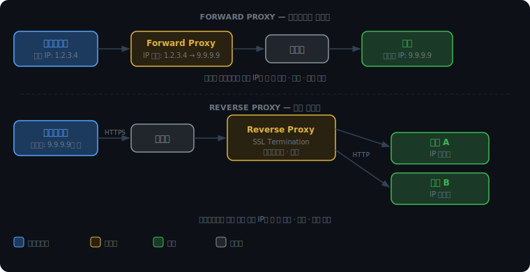
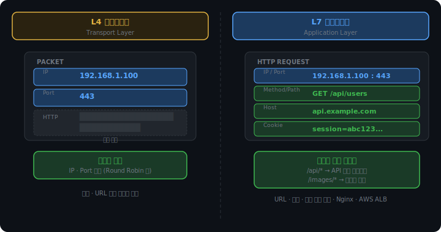
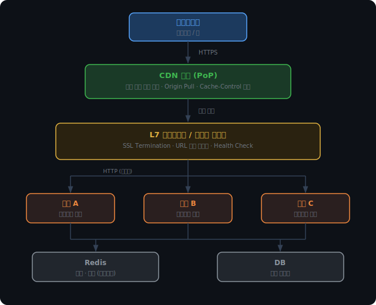

# CDN, 로드밸런서, 프록시

웹 서비스의 기본 구조는 단순하다. 클라이언트가 HTTP 요청을 보내면 서버가 받아서 처리하고 응답을 돌려준다. 도메인 하나, 서버 하나, DB 하나. 초기에는 이 구조로도 충분히 서비스를 운영할 수 있다.

문제는 사용자가 늘어날 때다. 트래픽이 두 배가 되면 서버가 버텨야 하고, 사용자가 전 세계에 퍼지면 물리적 거리로 인한 지연이 생기고, 서버 한 대가 죽으면 전체 서비스가 멈춘다. 이 세 가지 한계는 서비스가 성장하면 거의 동시에 찾아온다.

CDN, 로드밸런서, 프록시는 각자 이 문제들을 다른 각도에서 해결하는 인프라 컴포넌트다.

<br><br>

## 프록시

### 중간에 서 있다는 것

프록시(Proxy)는 대리인이라는 뜻이다. 클라이언트와 서버 사이에 위치해 요청과 응답을 대신 처리하는 중간 서버를 가리킨다.

어느 쪽의 대리인이냐에 따라 역할이 완전히 달라진다.

<br><br>

### Forward Proxy

포워드 프록시는 클라이언트의 대리인이다.

```
클라이언트 → [Forward Proxy] → 인터넷 → 서버
```

클라이언트가 서버에 직접 요청하는 대신, 포워드 프록시가 대신 요청을 보낸다. 서버는 클라이언트의 실제 IP를 보지 못하고 프록시의 IP만 본다.

세 가지 용도로 쓰인다.

익명화. 실제 클라이언트 IP를 외부에 노출하지 않는다. 서버 입장에서는 모든 요청이 프록시에서 온 것처럼 보인다.

캐싱. 자주 요청되는 콘텐츠를 프록시에 저장해두면, 다음에 같은 요청이 올 때 서버까지 가지 않고 프록시에서 바로 응답할 수 있다.

접근 제어. 기업이나 학교 네트워크에서 특정 사이트 접근을 차단할 때 포워드 프록시를 쓴다. 외부로 나가는 모든 요청이 프록시를 거치므로, 프록시가 목적지를 보고 허용 여부를 결정한다.

<br><br>

### Reverse Proxy

리버스 프록시는 서버의 대리인이다.

```
클라이언트 → 인터넷 → [Reverse Proxy] → 서버들
```

외부에서 보면 리버스 프록시가 곧 서버다. 클라이언트는 뒤에 실제 서버가 몇 대 있는지, 어떤 IP를 가지고 있는지 알지 못한다. 리버스 프록시가 요청을 받아 내부 서버로 전달하고, 응답을 다시 클라이언트에게 돌려준다.

주로 네 가지 역할을 한다.

로드밸런싱. 여러 서버에 요청을 분산한다. 뒤에서 자세히 다룬다.

SSL 종료(SSL Termination). 클라이언트와의 TLS 연결을 리버스 프록시에서 끝내고, 내부 서버와는 평문 HTTP로 통신한다. 서버들이 TLS 처리 부담을 지지 않아도 되고, 인증서도 리버스 프록시 한 곳에만 설치하면 된다.

보안. 실제 서버의 IP 주소와 포트를 외부에 노출하지 않는다.

캐싱. 정적 파일을 리버스 프록시가 직접 제공해 서버 부하를 줄인다.

Nginx와 HAProxy가 리버스 프록시로 자주 쓰이는 이유가 여기 있다. 위 네 가지를 모두 지원한다.



<br><br>

### SSL Termination이 가능한 이유

SSL은 TLS의 구버전 명칭이다. 업계에서 관성적으로 SSL이라는 표현이 혼용된다.

클라이언트와 리버스 프록시 사이는 HTTPS로 암호화된다. 프록시가 TLS를 복호화한 뒤, 내부 서버로 전달할 때는 평문 HTTP를 쓴다.

```
[클라이언트] -- HTTPS --> [리버스 프록시] -- HTTP --> [서버 A]
                                                    -- HTTP --> [서버 B]
```

내부 네트워크는 외부에서 직접 접근할 수 없는 사설망이기 때문에 평문 통신이 허용된다. 서버가 10대, 100대로 늘어나도 인증서는 프록시 한 곳에만 설치하면 된다.

<br><br>

## 로드밸런서

### 트래픽 분산이 필요한 이유

서버를 여러 대로 늘렸다고 해서 자동으로 트래픽이 나뉘지 않는다. 어떤 서버로 요청을 보낼지 결정하는 존재가 필요하다. 그게 로드밸런서다.

로드밸런서는 동작하는 네트워크 계층에 따라 L4와 L7로 나뉜다.

<br><br>

### L4 vs L7

L4는 Transport Layer에서 동작한다. 패킷에서 볼 수 있는 정보는 IP 주소와 포트 번호뿐이다. HTTP 요청의 내용, 즉 URL이 무엇인지, 어떤 쿠키를 갖고 있는지는 전혀 모른다. IP와 포트만 보고 어느 서버로 보낼지 결정한다. 패킷을 열어볼 필요가 없어 처리 속도가 빠르다.

L7은 Application Layer에서 동작한다. HTTP 요청 전체를 볼 수 있다. URL 경로, 요청 헤더, 쿠키까지 내용을 기반으로 라우팅 결정을 내린다.

```
/api/*         → API 서버 클러스터
/images/*      → 이미지 서버 클러스터
쿠키에 vip=1   → 프리미엄 서버
```

이런 콘텐츠 기반 라우팅은 L4에서는 불가능하다. L7은 HTTP를 이해하는 중간 서버라는 점에서 리버스 프록시와 사실상 같은 개념이다. AWS ALB와 Nginx가 L7의 대표적인 예다.



<br><br>

### 분산 알고리즘

로드밸런서가 어느 서버로 요청을 보낼지 결정하는 방법은 여러 가지다.

라운드 로빈(Round Robin)은 서버를 순서대로 돌아가며 요청을 배분한다. 구현이 가장 단순하다. 서버의 처리 속도나 현재 부하 차이를 무시한다는 단점이 있다.

최소 연결(Least Connection)은 현재 활성 연결 수가 가장 적은 서버로 보낸다. 서버 성능 차이를 자연스럽게 반영한다. 처리가 빠른 서버는 연결이 빨리 끊기므로 더 많은 요청을 받게 된다. 연결 수를 추적하는 오버헤드가 있다.

IP 해시(IP Hash)는 클라이언트의 IP 주소를 해시해 특정 서버로 고정한다. 같은 IP에서 오는 요청은 항상 같은 서버로 간다. 이 특성이 왜 필요한지는 세션 문제와 함께 이어서 설명한다.

<iframe src="/DEV_LOG/network/assets/demo_lb_algorithm.html" width="100%" height="520px" style="border:none;border-radius:12px;display:block"></iframe>

<br><br>

### Health Check

로드밸런서는 뒤에 있는 서버가 정상 동작하는지 주기적으로 확인한다. 일정 간격으로 각 서버에 요청을 보내고, 응답이 없거나 오류가 반환되면 해당 서버를 분산 대상에서 제외한다. 서버가 복구되면 자동으로 다시 포함시킨다.

이것이 Round Robin DNS와의 핵심 차이다. DNS는 서버가 죽어도 해당 IP를 계속 반환한다. 로드밸런서는 Health Check로 죽은 서버를 감지해 요청을 보내지 않는다.

<br><br>

## 세션 유지와 서버 확장

### 세션이 특정 서버에 묶이는 문제

세션은 서버가 클라이언트의 상태를 기억하는 방식이다. 로그인 정보처럼 요청 간에 유지되어야 하는 데이터를 서버가 어딘가에 저장해두고, 클라이언트는 sessionId라는 식별자만 쿠키에 갖고 다닌다.

기본 구현에서 세션 데이터는 서버의 메모리에 저장된다. 서버가 한 대면 문제없다. 로드밸런서가 생기고 서버가 여러 대가 되면 문제가 발생한다.

```
1번 요청 → 서버 A에서 처리 (로그인 세션 생성)
2번 요청 → 로드밸런서가 서버 B로 보냄 → 세션 없음 → 로그아웃
```

IP 해시 알고리즘은 이 문제의 회피책이다. 같은 클라이언트를 항상 같은 서버로 보내 세션을 찾을 수 있게 한다. 이를 Sticky Session이라고 부른다.

회피책인 이유가 있다. 해당 서버가 죽으면 그 서버에 물린 모든 세션이 한꺼번에 사라진다. 특정 IP에서 요청이 집중되면 그 서버에만 부하가 몰릴 수 있다. IP 주소가 바뀌면 다른 서버로 가서 세션을 잃는다.

<br><br>

### 외부 세션 저장소

근본적인 해결은 세션 저장 위치를 바꾸는 것이다.

세션 데이터를 서버 메모리가 아닌 외부 저장소에 두면, 어느 서버로 요청이 가든 같은 세션을 조회할 수 있다.

```
서버 A ↘
서버 B → [Redis] ← 세션 데이터 공유
서버 C ↗
```

Redis가 실무 표준으로 쓰이는 이유가 있다. 인메모리 데이터베이스라서 디스크를 거치지 않고 메모리에서 직접 읽고 쓴다. 세션 조회처럼 단순한 키-값 조회가 반복되는 상황에서 충분히 빠르다.

<br><br>

### JWT와 무상태 설계

더 근본적인 방향은 서버가 아예 상태를 갖지 않는 것이다.

JWT(JSON Web Token)는 클라이언트가 토큰을 직접 들고 다닌다. 토큰 안에 사용자 ID와 권한 같은 정보가 서버의 비밀 키로 서명된 채 담겨 있다. 서버는 매 요청마다 서명만 검증하면 되고, 외부 저장소를 조회할 필요가 없다.

어느 서버로 요청이 가든 같은 비밀 키로 검증하면 되므로 세션 공유 문제 자체가 발생하지 않는다.

<br><br>

### 세션이 저장되는 곳

세션은 구현 방식을 강제하지 않는다. "서버가 클라이언트 상태를 어딘가에 저장해둔다"는 개념일 뿐이고, 어디에 저장하느냐는 선택이다.

| 저장 위치 | 특징 |
|---|---|
| 서버 메모리 | 가장 빠름. 서버 재시작 시 소실. 스케일아웃 불가 |
| DB 테이블 | 영구 저장. 디스크 I/O로 느림 |
| Redis | 인메모리로 빠름. 여러 서버 공유 가능. 실무 표준 |

세션에 저장하는 내용도 자유다. 사용자 ID, 권한, 장바구니, 마지막 활동 시각 등 무엇이든 넣을 수 있다. 다만 실무에서는 사용자 ID만 세션에 저장하고, 나머지 정보는 요청마다 DB에서 조회하는 패턴이 일반적이다. 권한이 변경되었을 때 세션에 박힌 정보가 즉시 반영되지 않는 문제를 피하기 위해서다.

<br><br>

## CDN

### 물리적 거리의 한계

서버를 아무리 빠르게 최적화해도, 패킷이 물리적으로 이동하는 시간은 줄일 수 없다. 서울에서 뉴욕까지 광속으로도 편도 약 70밀리초가 걸린다. 왕복이면 140밀리초다. 실제로는 라우터를 경유하면서 더 늘어난다.

서버를 빠르게 만드는 것만으로는 해결할 수 없는 문제다.

<br><br>

### 엣지 서버와 PoP

CDN(Content Delivery Network)은 전 세계 곳곳에 캐시 서버를 배치해, 사용자와 가까운 위치에서 응답하는 네트워크다.

이 캐시 서버를 엣지 서버라고 부른다. 엣지(Edge)는 네트워크의 가장자리, 즉 사용자와 가장 가까운 지점이라는 뜻이다.

엣지 서버들이 모여 있는 거점을 PoP(Point of Presence)라고 한다. Cloudflare는 전 세계 300개 이상의 PoP를 운영한다. AWS CloudFront도 비슷한 규모로 배포되어 있다.

```
[Origin 서버 — 미국]
      ↑ 없으면 가져옴
[엣지 서버 — 서울 PoP]  ← 한국 사용자
[엣지 서버 — 도쿄 PoP]  ← 일본 사용자
[엣지 서버 — 프랑크푸르트 PoP]  ← 유럽 사용자
```

<br><br>

### Origin Pull

엣지 서버에 콘텐츠가 없을 때 원본 서버에서 가져오는 것을 Origin Pull이라고 한다.

콘텐츠는 처음 요청 시 Origin에서 가져와 엣지에 저장된다. 이후 같은 콘텐츠 요청이 오면 엣지에서 바로 응답한다. 이 상태를 Cache Hit, 엣지에 없어서 Origin까지 가야 하는 상태를 Cache Miss라고 부른다.


캐시 유효 기간은 Origin 서버의 `Cache-Control` 헤더가 결정한다. `Cache-Control: max-age=86400`이면 엣지는 24시간 동안 캐시를 유지하고, 만료되면 다시 Origin Pull한다.

<br><br>

### 정적 콘텐츠와 동적 콘텐츠

CDN 캐싱의 효과는 콘텐츠 유형에 따라 다르다.

정적 콘텐츠는 이미지, CSS, JavaScript, 폰트처럼 요청하는 사람에 관계없이 내용이 동일한 리소스다. CDN에 한 번 저장하면 이후 요청은 모두 엣지에서 처리할 수 있다.

동적 콘텐츠는 로그인한 사용자의 마이페이지나 실시간 주식 시세처럼 요청마다 다른 응답이 필요한 경우다. 캐싱할 수 없으므로 결국 Origin 서버까지 가야 한다.

그렇다고 동적 콘텐츠에서 CDN이 무의미하지는 않다. TCP 연결 자체가 가까운 PoP에서 맺어지므로 3-way 핸드셰이크 지연이 줄어든다. 응답 내용은 Origin에서 오지만, 연결 수립의 오버헤드는 사용자 근처에서 처리된다.

<br><br>

## 전체 아키텍처

CDN, 리버스 프록시, 로드밸런서를 각각 이해했다면, 실제 서비스에서 이것들이 어떻게 조합되는지 살펴보자.



각 계층이 담당하는 역할이 다르다.

CDN은 정적 파일을 사용자 근처에서 제공한다. 이미지나 CSS는 Origin까지 가지 않고 엣지에서 끝난다.

L7 로드밸런서이자 리버스 프록시는 TLS를 종료하고 요청을 내부 서버로 라우팅한다. `/api/`로 시작하는 요청은 API 서버로, WebSocket 연결은 실시간 서버로 분리해서 보낼 수 있다.

서버들은 비즈니스 로직만 처리한다. TLS 복호화 부담이 없고, 어느 요청이 올지는 로드밸런서가 결정한다. Health Check가 죽은 서버를 자동으로 제외한다.

Redis와 DB는 서버들이 공유하는 저장소다. 세션은 Redis에, 영구 데이터는 DB에 저장한다.
