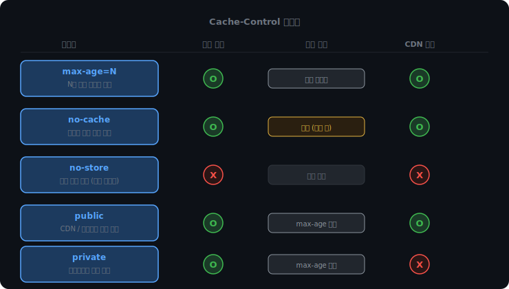
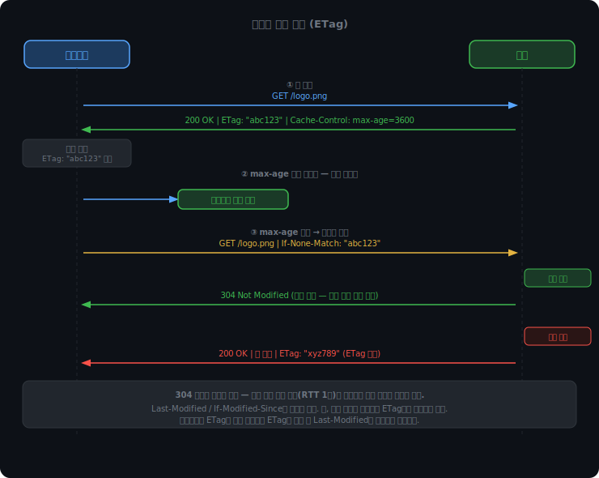
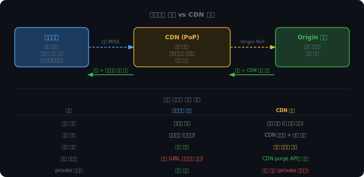

# HTTP 캐싱

웹 페이지를 열면 브라우저는 HTML, CSS, JavaScript, 이미지 등 수십 개의 리소스를 서버에 요청한다. 이 리소스 중 상당수는 자주 바뀌지 않는다. 로고 이미지, 공통 스타일시트, 라이브러리 파일 같은 것들은 한 번 받아두면 한 달이 지나도 그대로다.

그런데도 매 요청마다 서버에서 다시 받아야 한다면 두 가지 문제가 생긴다.

하나는 속도다. 서버까지 갔다 오는 RTT와 파일 전송 시간이 매번 발생한다. 특히 용량이 큰 이미지나 JS 번들은 체감 지연이 크다.

다른 하나는 서버 부하다. 사용자 수천 명이 같은 정적 파일을 반복 요청하면 서버는 동일한 응답을 수천 번 만들어 보낸다. 변한 것도 없는데.

HTTP 캐시는 이 두 문제를 동시에 해결한다. 응답을 저장해두고 다음 요청에 재사용한다. 서버는 "이 파일을 얼마나 믿어도 되는지"를 헤더로 알려주고, 브라우저는 그 정책을 따른다.

<br><br>

## Cache-Control

### 서버가 캐시 정책을 지시한다

캐시 동작은 응답 헤더 `Cache-Control`로 서버가 직접 지정한다.

```
HTTP/1.1 200 OK
Cache-Control: max-age=86400
Content-Type: image/png
```

브라우저는 이 응답을 받는 순간 "86400초(1일) 동안은 이 파일을 다시 요청하지 않아도 된다"고 기록한다. 그 기간 안에 같은 URL을 요청하면 서버에 연결조차 하지 않고 저장된 응답을 꺼내 쓴다.



<br><br>

### 지시어별 의미

`max-age=N`은 N초 동안 해당 응답이 신선하다고 선언한다. 유효 기간 안에는 서버 검증 없이 캐시를 그대로 쓴다.

`no-cache`는 이름이 오해를 부른다. "캐시하지 말라"가 아니라 "저장은 하되, 쓰기 전에 매번 서버에 유효성을 검증하라"는 의미다. 캐시는 있지만 맹목적으로 믿지 않는다.

`no-store`는 저장 자체를 금지한다. 브라우저든 CDN이든 어디에도 응답을 남기지 마라는 지시다. 금융 거래 내역, 의료 기록처럼 기기가 탈취됐을 때 노출되면 안 되는 데이터에 쓴다.

`public`과 `private`은 저장 허용 범위를 제어한다. `public`은 브라우저뿐 아니라 CDN, 포워드 프록시 같은 중간 서버도 캐시할 수 있다. 정적 파일처럼 누가 요청해도 똑같은 응답이 나오는 경우에 쓴다. `private`은 브라우저만 저장할 수 있다. CDN은 여러 사용자가 공유하는 서버이므로, 로그인한 사용자의 프로필이나 장바구니 응답을 CDN에 올려두면 다른 사용자가 그 응답을 받을 수 있다. `private`이 이 사고를 막는다.

<br><br>

## 조건부 요청

### max-age가 지나면 어떻게 되나

캐시가 만료됐다고 해서 파일이 실제로 바뀐 것은 아니다. 이미지 파일은 몇 달째 그대로일 수 있다. 그런데 만료됐다는 이유만으로 전체를 다시 받는 건 낭비다.

조건부 요청은 이 문제를 해결한다. 브라우저가 서버에게 "내가 가진 버전이 이건데, 바뀌었어?"라고 물어보고, 안 바뀌었으면 서버가 바디 없이 짧은 응답만 보낸다.



<br><br>

### ETag

서버는 리소스를 처음 응답할 때 `ETag` 헤더를 함께 보낸다.

```
HTTP/1.1 200 OK
ETag: "abc123"
Cache-Control: max-age=3600
```

ETag는 파일 내용의 지문이다. 내용이 1바이트라도 바뀌면 값이 달라진다. 보통 파일 내용을 해시한 값을 쓴다.

브라우저는 캐시가 만료되면 이 값을 `If-None-Match` 헤더에 담아 재요청한다.

```
GET /logo.png HTTP/1.1
If-None-Match: "abc123"
```

서버는 현재 파일의 ETag를 확인한다. 동일하면 `304 Not Modified`를 응답한다. 바디가 없다. 변경 여부를 확인하는 RTT 비용만 지불하고 기존 캐시를 계속 사용한다. 달라지면 `200 OK`와 함께 새 바디를 전송하고 ETag도 갱신한다.

<br><br>

### Last-Modified

`Last-Modified`는 파일의 마지막 수정 시각을 기준으로 판단한다.

```
Last-Modified: Mon, 29 Jun 2026 10:00:00 GMT
```

브라우저가 재요청할 때 이 시각을 `If-Modified-Since`에 담는다. 서버는 수정 시각을 비교해 `304` 또는 `200`을 결정한다.

ETag보다 정밀도가 낮다. 1초 안에 두 번 수정되면 구분이 안 되고, 내용은 그대로인데 메타데이터만 바뀌어도 시각이 달라진다. 그래서 브라우저는 ETag를 우선 사용하고, ETag가 없을 때 Last-Modified를 폴백으로 쓴다.

<br><br>

### 단계별 시뮬레이터

<iframe src="/DEV_LOG/Network/assets/demo_http_cache.html" width="100%" height="480px" style="border:none;border-radius:12px;display:block"></iframe>

<br><br>

## 브라우저 캐시와 CDN 캐시

캐시가 저장되는 위치는 두 군데다.



브라우저 캐시는 사용자 기기 로컬에 저장된다. 해당 사용자만 쓸 수 있고, 서버에서 직접 제어할 수 없다. 만료 전에 내용을 지우려 해도 서버가 닿을 방법이 없다.

CDN 캐시는 전 세계에 분산된 엣지 서버에 저장된다. 같은 URL을 요청한 여러 사용자가 공유한다. 서버에서 CDN purge API를 호출하면 특정 URL의 캐시를 강제로 삭제할 수 있다.

`private` 지시어가 중요한 이유가 여기서 나온다. CDN은 공유 공간이므로, 개인화된 응답이 올라가면 안 된다.

<br><br>

## 캐시 무효화 전략

### 브라우저 캐시는 건드릴 수 없다

`max-age=86400`으로 응답을 내보낸 뒤 파일을 수정했다. 그런데 사용자 브라우저에는 아직 1일짜리 캐시가 남아있다. 만료될 때까지 사용자는 구버전을 본다. 서버에서 브라우저 캐시를 지우는 방법은 없다.

해결 방법은 URL 자체를 바꾸는 것이다. 브라우저는 URL이 달라지면 무조건 새 요청을 보낸다.

<br><br>

### 캐시 버스팅

파일 내용을 해시해서 파일명에 삽입한다.

```
logo.a3f9b2.png   →   파일 수정   →   logo.c91d4e.png
```

파일이 바뀌면 해시도 바뀌고, URL이 달라진다. 구버전 캐시는 그 URL로 접근할 일이 없으니 자연스럽게 무효화된다. 새 URL이니 브라우저가 새로 요청한다.

이 방식이면 `max-age`를 1년으로 설정해도 안전하다.

```
Cache-Control: max-age=31536000, immutable
```

`immutable`은 "이 파일은 절대 바뀌지 않으니 만료 전에 재검증하지 않아도 된다"는 힌트다. 캐시 버스팅을 전제로 쓴다.

반면 `index.html`처럼 URL이 고정인 파일은 캐시 버스팅을 적용할 수 없다. 이런 파일은 항상 최신 버전을 받아야 하므로 `no-cache`를 쓴다. 저장은 하되 매번 서버에 검증한다. 파일이 바뀌지 않았으면 304로 빠르게 처리된다.

```
Cache-Control: no-cache   ← HTML, 동적 응답
Cache-Control: max-age=31536000, immutable   ← 해시 포함 정적 파일
```

CDN 캐시는 조금 다르다. CDN은 purge API를 제공하므로 파일을 수정한 뒤 즉시 무효화가 가능하다. 그래도 브라우저 캐시까지 제어하려면 결국 URL 변경이 더 확실하다.

