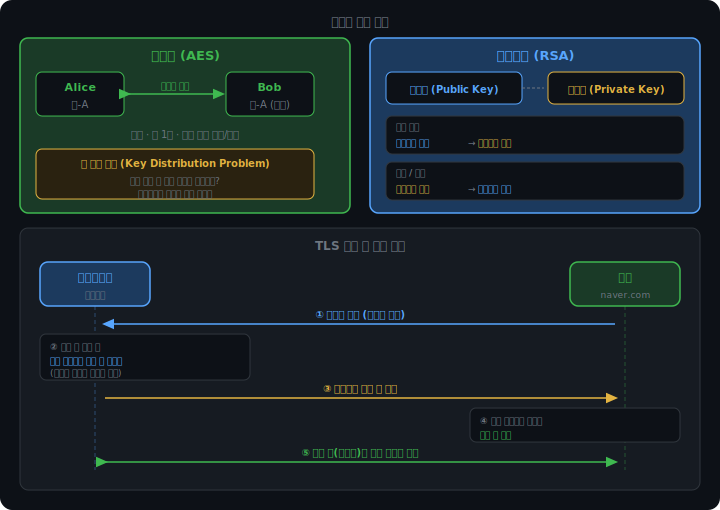
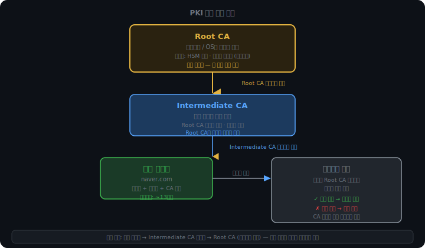
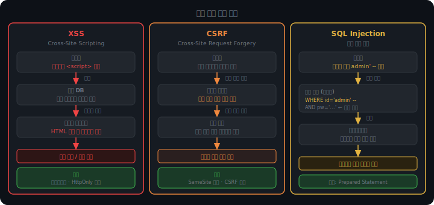

# 보안

인터넷에서 두 기기가 통신할 때 가장 먼저 떠오르는 위협은 도청이다. 누군가 중간에서 패킷을 가로채 데이터를 읽는 것. 하지만 실제 웹 서비스가 마주하는 위협은 훨씬 다양하다.

HTTPS를 쓰면 전송 중 데이터는 보호된다. 그런데 로그인된 사용자를 속여 의도하지 않은 요청을 서버에 보내게 하는 것은 HTTPS와 무관한 문제다. 공격자가 악성 스크립트를 심어 브라우저 안에서 실행되게 하는 것도, SQL 쿼리를 조작해 데이터베이스를 건드리는 것도 마찬가지다.

이 챕터에서는 세 층위를 다룬다. 암호화 기반(어떻게 키를 안전하게 교환하나), 신뢰 기반(이 서버가 진짜라는 것을 어떻게 증명하나), 그리고 애플리케이션 수준의 공격(암호화가 제대로 작동하는 상황에서도 뚫리는 방식들).

<br><br>

## 암호화 기반

### 대칭키와 비대칭키

두 기기가 암호화된 메시지를 주고받으려면 키가 필요하다. 문제는 그 키를 어떻게 공유하느냐다.

대칭키 암호화(AES)는 하나의 키로 잠그고 같은 키로 연다. 연산이 단순해서 빠르다. 그런데 처음 만나는 두 기기가 어떻게 같은 키를 갖게 되나? 인터넷으로 키를 보내면 이미 노출이다. 이것이 키 전달 문제(Key Distribution Problem)다.

비대칭키 암호화(RSA)는 두 개의 키를 쓴다. 공개키(Public Key)와 개인키(Private Key). 공개키로 암호화한 것은 개인키로만 복호화할 수 있다. 공개키는 누구한테나 나눠줘도 된다. 탈취돼도 암호화만 할 수 있고, 복호화는 개인키 없이 불가능하다.

비대칭키는 두 가지 방향으로 쓰인다.

기밀 전송이 목적이면 상대의 공개키로 잠근다. 상대만 개인키로 열 수 있으므로 안전하다.

서명이 목적이면 반대로 쓴다. 개인키로 서명하고 공개키로 검증한다. 개인키는 나만 갖고 있으므로, 내 공개키로 서명이 검증됐다는 것은 내가 만든 것이라는 증명이 된다.

TLS는 이 두 방식을 조합한다. 비대칭키 자체는 느리기 때문에 대용량 데이터 암호화에 쓰기엔 부담이 크다. 그래서 비대칭키로 대칭키(세션 키)를 안전하게 교환하고, 실제 HTTP 데이터는 그 세션 키로 빠르게 암호화한다.



<br><br>

### 해시 함수

해시 함수는 임의 크기의 데이터를 고정 크기의 값으로 변환한다. SHA-256은 입력이 몇 바이트든 항상 256비트 출력을 낸다.

두 가지 핵심 성질이 있다.

단방향성. 해시값에서 원본을 역산할 수 없다. 256비트 출력에서 원래 데이터를 되찾는 것은 현실적으로 불가능하다.

충돌 저항성. 같은 해시값이 나오는 두 개의 다른 입력을 의도적으로 만들어내기가 현실적으로 불가능하다. 입력이 무한하고 출력이 유한하니 수학적으로 충돌은 반드시 존재한다. 하지만 그것을 일부러 찾는 것은 계산적으로 불가능에 가깝다.

서명에서 해시가 필요한 이유는 크기 때문이다. 1GB 파일에 비대칭키 연산을 직접 적용하면 너무 오래 걸린다. 파일을 해시하면 256비트짜리 지문이 나온다. 그 지문에만 서명한다. 검증자도 같은 파일을 해시해서 지문을 꺼내고 서명과 대조한다.

충돌 저항성이 없으면 서명 위조가 가능해진다. 계약서 A와 해시값이 같은 계약서 B를 만들 수 있다면, A의 서명으로 B를 통과시킬 수 있다.

<br><br>

## PKI — 공개키를 어떻게 믿나

### 공개키 진위 문제

TLS에서 서버가 공개키를 클라이언트에 보낸다. 그런데 이 공개키가 진짜 그 서버의 것인지 어떻게 아나?

공격자가 중간에서 자기 공개키를 "나 naver.com이야"라고 보내면? 클라이언트가 그 공개키로 세션 키를 암호화해서 보내면, 공격자는 자기 개인키로 열고 세션 키를 가로챈다. 이후 통신 내용을 전부 볼 수 있다.

이것이 MITM(Man-in-the-Middle) 공격이다. 비대칭 키 교환만으론 막을 수 없다. 공개키의 출처를 신뢰할 방법이 없기 때문이다.

<br><br>

### CA와 인증서

해결은 신뢰할 수 있는 제3자를 두는 것이다. CA(Certificate Authority, 인증 기관)가 그 역할을 한다.

naver.com은 자신의 공개키와 도메인 정보를 CA에 제출한다. CA는 검증 후 "이 공개키는 naver.com의 것이다"라는 문서를 CA의 개인키로 서명한다. 이것이 인증서다.

클라이언트는 서버에서 이 인증서를 받으면 CA의 공개키로 서명을 검증한다. 브라우저에는 신뢰할 수 있는 CA의 공개키가 미리 내장돼 있다. 검증은 로컬에서 이뤄지며 CA 서버에 매번 연결하지 않는다.

공격자가 자기 공개키를 naver.com 인증서인 척 보내도, CA 서명이 없으니 검증에서 실패한다. 브라우저가 경고를 띄운다.

<br><br>

### 신뢰 체인

CA가 하나뿐이라면 그 CA가 해킹당했을 때 그 아래 모든 인증서의 신뢰가 무너진다. 실제 PKI는 계층 구조를 쓴다.

```
Root CA
  └── Intermediate CA
        └── 서버 인증서 (naver.com)
```

Root CA는 수십 개뿐이며, 브라우저와 OS에 공개키가 내장돼 있다. Root CA의 개인키는 HSM(Hardware Security Module)이라는 전용 하드웨어 칩에 보관된다. 키가 칩 안에서만 연산되고 물리적으로 꺼낼 수 없는 구조다. 뜯으려 하면 자동으로 삭제된다. Root CA 서버는 아예 인터넷에 연결되지 않는다.

Intermediate CA는 Root CA가 신뢰를 위임한 기관이다. 실제 인증서 발급은 Intermediate CA가 담당한다. Root CA의 리스크를 격리하는 완충 역할이다.

검증 시 클라이언트는 체인을 따라 올라간다. 서버 인증서를 발급한 Intermediate CA를, 그 Intermediate CA를 신뢰한 Root CA까지. Root CA가 브라우저에 내장된 것이면 신뢰한다.



<br><br>

### 인증서 유효기간

인증서에는 유효기간이 있다. 최근 브라우저들은 13개월 이상 유효기간의 인증서를 신뢰하지 않는다.

이유는 서버 개인키 탈취 시 피해 기간을 제한하기 위해서다. 서버가 해킹당해 개인키가 유출되면, 그 키로 TLS 세션 키를 복호화해 과거 통신을 볼 수 있다. 인증서 유효기간이 10년이면 10년치 통신이 위험하고, 90일이면 90일치로 끝난다. 만료 후 새 키 쌍을 발급받으면 유출된 개인키는 무용지물이 된다.

<br><br>

### TLS Handshake 시뮬레이터

<iframe src="/DEV_LOG/Network/assets/demo_pki_handshake.html" width="100%" height="520px" style="border:none;border-radius:12px;display:block"></iframe>

<br><br>

## 주요 공격 유형

### XSS (Cross-Site Scripting)

서버가 사용자 입력을 검증 없이 HTML에 삽입하면, 악성 스크립트가 다른 사용자의 브라우저에서 실행된다.

댓글 기능을 예로 들면, 공격자가 댓글란에 `<script>` 태그를 포함한 코드를 입력한다. 서버가 이를 그대로 저장했다가 다른 사용자가 그 페이지를 열면, 브라우저는 HTML을 파싱하다 `<script>` 태그를 만나 실행해버린다. 댓글인지 코드인지 구분하지 않는다.

이 스크립트가 `document.cookie`를 공격자 서버로 전송하는 코드라면, 그 페이지를 연 모든 사용자의 쿠키가 탈취된다.

방어는 이스케이핑이다. `<`를 `&lt;`로 변환하면 브라우저가 태그로 해석하지 않고 문자 그대로 표시한다. HttpOnly 쿠키는 JS에서 `document.cookie` 접근 자체를 차단해 탈취를 막는 추가 방어선이다.

<br><br>

### CSRF (Cross-Site Request Forgery)

XSS가 코드 실행이 목적이라면, CSRF는 요청 자체가 목적이다.

브라우저는 특정 도메인에 요청을 보낼 때 해당 도메인의 쿠키를 자동으로 첨부한다. 공격자는 이것을 이용한다.

피해자가 은행 사이트에 로그인된 상태에서 공격자가 만든 페이지를 연다. 그 페이지 안에 은행으로 송금 요청을 보내는 코드가 숨겨져 있다면, 브라우저는 피해자도 모르게 은행 쿠키를 붙여서 요청을 전송한다. 서버는 쿠키를 보고 정상 사용자의 요청으로 판단한다.

방어는 SameSite 쿠키다. `SameSite=Strict`이면 다른 사이트에서 시작된 요청에는 쿠키를 첨부하지 않는다. CSRF 토큰을 서버가 발급해 요청마다 포함시키는 방식도 쓰인다. 무작위 토큰은 공격자가 예측할 수 없다.

<br><br>

### SQL Injection

입력값을 검증 없이 SQL 쿼리에 삽입하면, 쿼리 구조 자체를 공격자가 조작할 수 있다.

로그인을 문자열 조합으로 만든 쿼리로 처리한다고 하자.

```sql
SELECT * FROM users WHERE id='입력값' AND pw='입력값'
```

id 입력란에 `admin' --`을 넣으면 쿼리가 이렇게 바뀐다.

```sql
SELECT * FROM users WHERE id='admin' --' AND pw='입력값'
```

`--` 이후는 SQL 주석이다. 비밀번호 검사 전체가 사라진다. 비밀번호 없이 admin 계정으로 로그인이 된다.

방어는 Prepared Statement다. 쿼리 구조를 먼저 DB에 전송해 파싱을 완료한 다음, 입력값을 별도로 바인딩한다. DB는 이 값을 SQL 코드가 아닌 순수 데이터로 취급한다. `admin' --`을 넣어도 쿼리 구조가 바뀌지 않는다.

<br><br>

### 공격 원리 비교


