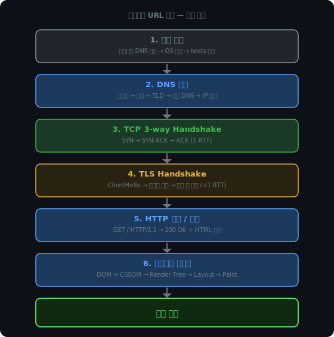
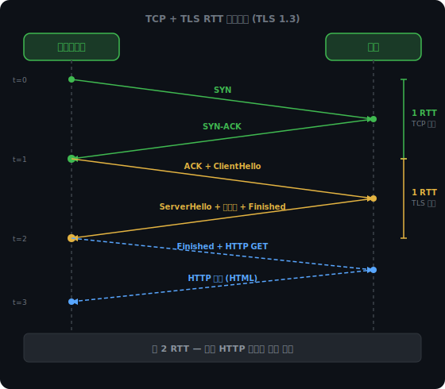
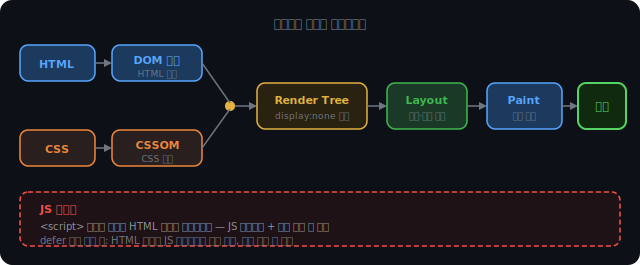

# 브라우저 URL 입력 흐름

주소창에 `https://google.com`을 치고 엔터를 누른다. 화면이 뜨기까지 0.몇 초 안에 무슨 일이 일어나는가.

이 흐름은 단순한 암기 문제가 아니다. DNS가 IP를 만들고, TCP가 연결을 열고, TLS가 암호화 채널을 씌우고, HTTP가 데이터를 주고받고, 브라우저가 그것을 화면으로 그려내는 과정이 한 줄로 이어진다. 각 단계가 왜 이 순서여야 하는지, 앞 단계에서 얻은 것이 다음 단계에서 어떻게 쓰이는지를 따라가면 전체 그림이 잡힌다.



<br><br>

<iframe src="/DEV_LOG/Network/assets/demo_url_journey.html" width="100%" height="530px" style="border:none;border-radius:12px;display:block"></iframe>

<br><br>

## 캐시를 먼저 확인한다

### 브라우저 DNS 캐시와 OS 캐시

엔터를 누르는 순간 브라우저는 DNS 서버에 묻기 전에 이미 알고 있는 IP가 있는지 확인한다. 같은 도메인을 최근에 방문했다면 IP가 캐싱돼 있고, TTL이 유효한 동안은 그것을 재사용한다.

브라우저 캐시에 없으면 OS DNS 캐시로 넘어간다. 운영체제도 DNS 응답을 별도로 저장한다. 브라우저 외에 다른 프로그램들도 DNS를 사용하므로 OS 레벨에서 공유 캐시를 운영하는 것이 효율적이다. 여러 앱이 같은 도메인을 조회할 때 중복 조회를 막는다.

### hosts 파일

OS 캐시도 없으면 DNS 서버에 요청하기 전에 hosts 파일을 확인한다.

```
# /etc/hosts (macOS/Linux)
# C:\Windows\System32\drivers\etc\hosts (Windows)
127.0.0.1   localhost
192.168.0.10  dev.local
```

줄마다 IP 주소와 도메인을 직접 매핑한 텍스트 파일이다. 여기 항목이 있으면 DNS 서버를 전혀 거치지 않고 그 IP를 사용한다. 로컬 개발 서버에 도메인을 붙여서 테스트할 때 자주 쓰인다. `dev.local`을 로컬 IP로 등록해두면 브라우저가 실제 DNS를 건드리지 않고 로컬 서버에 직접 연결된다.

여기서도 IP를 찾지 못하면 비로소 DNS 조회가 시작된다.

<br><br>

## DNS 조회 — "어디로 연결하나"를 결정한다

도메인 이름은 사람이 읽기 위한 것이다. 실제 연결을 맺으려면 IP 주소가 필요하다. DNS는 도메인을 IP로 바꾸는 전화번호부 역할을 한다.

운영체제는 설정된 DNS 리졸버에 `google.com`의 IP를 묻는다. 리졸버는 보통 공유기가 DHCP로 알려준 서버이거나, 사용자가 직접 지정한 8.8.8.8 같은 공개 DNS다.

```
브라우저
  └→ 로컬 리졸버 (재귀 조회)
       ├→ 루트 NS   : "google.com? .com 담당 서버로 가봐"
       ├→ TLD NS    : ".com 담당입니다. google.com 권한 서버 주소는 이것"
       └→ 권한 NS   : "google.com = 142.250.196.100"
            결과를 리졸버에 반환 → 리졸버가 브라우저에 전달 + TTL 동안 캐싱
```

브라우저와 리졸버 사이는 재귀 조회다. 리졸버가 모든 과정을 대신 처리하고 최종 IP만 돌려준다. 리졸버가 루트, TLD, 권한 DNS를 직접 순회하는 구간은 반복 조회다. 각 서버가 "다음 서버로 가봐"라고만 안내하고, 리졸버가 직접 순회한다.

이 결과로 `142.250.196.100` 같은 IP를 얻는다. 이제 "어디로 연결할지"가 생겼다.

<br><br>

## TCP 연결 수립 — 신뢰 있는 채널을 연다

IP를 알았으니 해당 서버와 연결을 맺는다. HTTPS이므로 포트 443번이다.

TCP는 데이터를 교환하기 전에 양쪽이 통신 가능한지 확인하는 절차를 먼저 밟는다. 이것이 3-way Handshake다.

```
클라이언트 → SYN
클라이언트 ← SYN-ACK        ← 1 RTT 완료 (클라이언트가 TCP 수립 확인)
클라이언트 → ACK + ClientHello
```

클라이언트가 SYN-ACK를 받은 순간, 클라이언트 입장에서 TCP 연결이 완료된다. 곧바로 ACK를 보내면서 TLS의 첫 메시지인 ClientHello를 함께 실어 보낸다. 왕복 시간을 낭비하지 않는 최적화다.

왜 2번의 메시지 교환으로 끝내지 않는가. 2번이면 클라이언트가 서버로 보내는 방향만 확인된다. 서버가 클라이언트로 보내는 방향이 뚫렸는지는 클라이언트가 SYN-ACK를 받아야 알 수 있다. 그 확인을 위해 3번이 필요하다.

<br><br>

## TLS Handshake — 암호화 채널과 신원 확인

TCP 연결 위에 TLS 레이어를 추가한다. 목적은 두 가지다. 서버가 진짜 google.com인지 확인하는 것, 그리고 이후 HTTP 데이터를 암호화할 세션 키를 합의하는 것.

TLS 1.3 기준 흐름은 다음과 같다.

```
클라이언트 → ACK + ClientHello
                 (지원 암호 스위트 목록, 클라이언트 랜덤값)

서버        ← ServerHello + 인증서 + Finished
                 (선택한 암호 스위트, 서버 공개키·CA 서명이 담긴 인증서)

클라이언트 → Finished + HTTP GET
```

클라이언트가 인증서를 받으면, 브라우저에 내장된 CA 공개키로 서명을 검증한다. 검증이 통과하면 이 인증서가 신뢰할 수 있는 CA가 발급한 것이고, 따라서 "이 공개키는 진짜 google.com의 것"이라는 신뢰가 생긴다. 공격자가 자기 공개키를 google.com인 척 보내도 CA 서명이 없으니 검증에서 실패한다.

세션 키 합의가 완료되면 이후 HTTP 데이터는 이 대칭 세션 키로 빠르게 암호화된다.



TCP에 1 RTT, TLS에 1 RTT가 더해져 첫 HTTP 요청까지 최소 2 RTT가 소요된다. TLS 1.3은 이전 버전 대비 Handshake를 1 RTT로 줄인 것이다. TLS 1.2는 2 RTT가 추가돼 총 3 RTT였다. 재연결 시에는 0-RTT를 이용해 서버가 이전 세션 정보를 가지고 있으면 첫 메시지에 바로 데이터를 실어 보낼 수 있다.

<br><br>

## HTTP 요청과 응답 — 실제 데이터 교환

암호화 채널이 열렸다. 이제 HTTP 요청을 보낸다. TLS로 암호화되어 있어 중간에서 읽을 수 없다.

```
GET / HTTP/1.1
Host: google.com
Accept: text/html,application/xhtml+xml,...
Accept-Language: ko-KR,ko;q=0.9
```

서버는 HTML 문서로 응답한다.

```
HTTP/1.1 200 OK
Content-Type: text/html; charset=UTF-8
Content-Length: 13824

<!DOCTYPE html>
<html lang="ko">
...
```

이 시점에 받은 것은 HTML 텍스트 하나뿐이다. 이미지, CSS 파일, JS 파일은 아직 없다. 브라우저가 HTML을 파싱하면서 `<link rel="stylesheet">`, ``, `<script>` 태그를 만날 때마다 해당 리소스를 추가로 요청한다.

<br><br>

## 브라우저 렌더링 — HTML에서 화면으로

HTML을 받는다고 바로 화면에 뿌리지 않는다. 브라우저는 파싱과 계산을 거쳐 픽셀을 찍는 파이프라인을 실행한다.

### DOM과 CSSOM 빌드

HTML을 위에서 아래로 파싱해 DOM(Document Object Model) 트리를 만든다. `<html>`, `<body>`, `<div>` 같은 태그가 각각 노드가 되어 트리 구조를 이룬다.

파싱 중 `<link rel="stylesheet">` 태그를 만나면 CSS 파일을 추가로 요청한다. CSS를 받으면 CSSOM(CSS Object Model)을 만든다. DOM이 "무엇이 있는가"라면, CSSOM은 "각 요소가 어떻게 보이는가"다.

DOM과 CSSOM을 합쳐 Render Tree를 만든다. `display:none`이거나 `<head>` 안의 요소처럼 화면에 표시되지 않는 것들은 여기서 제외된다. "실제로 그려야 할 것들"만 남는다.

### JS 블로킹과 defer

HTML 파싱 중 `<script>` 태그를 만나면 파싱이 멈춘다.

JS는 DOM을 직접 수정할 수 있다. 파싱을 계속했다가 JS가 방금 만든 DOM을 뜯어고치면 작업이 무효가 된다. 그래서 브라우저는 스크립트를 만나는 즉시 파일을 다운로드하고 실행할 때까지 HTML 파싱을 중단한다.

```html
<!-- 파싱이 멈춘다 -->
<head>
  <script src="app.js"></script>
</head>
<body>
  <h1>이 내용은 JS 실행 전까지 파싱되지 않는다</h1>
</body>
```

`<head>` 안에 `<script>`가 있으면 `<body>` 전체가 파싱되기 전에 JS가 실행된다. 사용자에게는 JS 파일이 다운로드되고 실행되는 시간 내내 흰 화면이 보인다.

`defer` 속성이 이 문제를 해결한다.

```html
<!-- 파싱을 막지 않는다 -->
<head>
  <script src="app.js" defer></script>
</head>
```

`defer`는 JS 다운로드를 HTML 파싱과 병렬로 진행하고, 파싱이 완전히 끝난 뒤에 실행한다. `<head>`에 `defer`로 선언하면 JS 다운로드가 페이지 로드 초반부터 시작되므로, `<body>` 맨 아래에 배치하는 것보다 다운로드 완료 시점이 빠를 수 있다.



### Layout과 Paint

Render Tree가 완성되면 각 노드의 위치와 크기를 계산한다. 이 단계를 Layout(또는 Reflow)이라 한다. "`<div>`는 x=20, y=100에 위치하고 너비는 300px"처럼 실제 픽셀 좌표가 결정된다.

Layout이 끝나면 Paint 단계에서 계산된 위치에 픽셀을 찍는다. 텍스트, 배경색, 이미지, 테두리가 화면에 그려진다. 여기서 처음으로 사용자가 콘텐츠를 볼 수 있게 된다.

JS나 CSS 변경으로 DOM 구조나 스타일이 바뀌면 Layout과 Paint가 다시 실행된다. 이를 Reflow, Repaint라 한다. 자주 발생하면 성능 문제로 이어진다.
