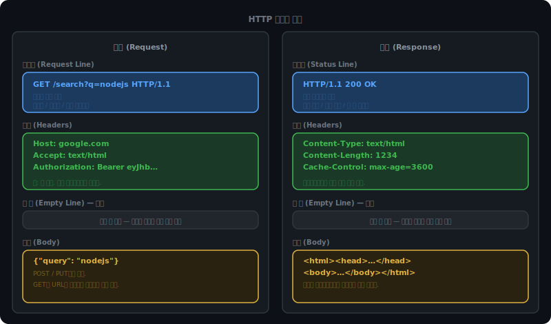
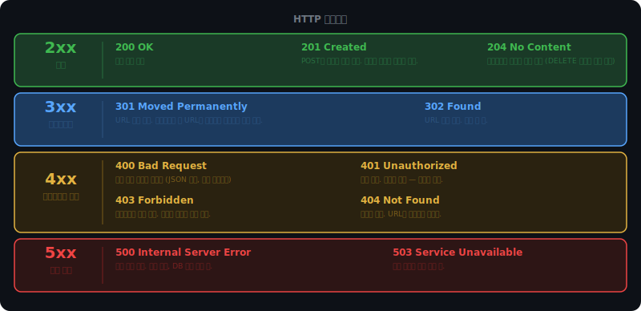

# HTTP 기초

## 클라이언트와 서버가 말하는 방식

브라우저 주소창에 URL을 입력하면 서버와 통신이 시작된다. 이 통신은 HTTP(HyperText Transfer Protocol)라는 규약을 따른다.

HTTP는 텍스트 기반 프로토콜이다. 클라이언트가 요청(Request)을 보내고 서버가 응답(Response)을 돌려준다.

설계 원칙 중 하나가 Stateless다. 서버는 이전 요청을 기억하지 않는다. 두 번째 요청이 들어와도 서버 입장에서는 처음 보는 요청과 다를 게 없다. 요청 하나하나가 처리에 필요한 정보를 전부 담고 있어야 한다.

이렇게 설계한 이유는 확장성이다. 서버가 클라이언트 상태를 저장하지 않으면, 요청이 어느 서버로 가도 상관없다. 서버를 10대로 늘려도 같은 방식으로 처리할 수 있다. 반대로 서버가 상태를 기억하는 구조였다면, 첫 요청을 받은 서버가 다음 요청도 반드시 받아야 한다 — 수평 확장이 어렵다.

로그인 상태처럼 클라이언트별로 다른 정보가 필요한 경우에는 쿠키나 토큰으로 보완한다. 클라이언트가 매 요청마다 토큰을 헤더에 실어 보내면, Stateless 원칙을 깨지 않고도 서버가 "누가 보낸 요청인지" 알 수 있다.

<br><br>

---

<br><br>

## URL 구조

HTTP 요청이 어디를 향하는지 담는 것이 URL이다.

```
https://api.example.com:443/users/42?sort=desc&limit=10#section2
  ↑           ↑           ↑    ↑         ↑                ↑
스킴         호스트      포트  경로     쿼리 파라미터     프래그먼트
```

스킴(scheme)은 어떤 프로토콜을 쓸지 나타낸다. `http` 또는 `https`.

포트는 생략하면 기본값이 적용된다. HTTP는 80, HTTPS는 443. `http://example.com`과 `http://example.com:80`은 같다.

쿼리 파라미터는 `?` 뒤에 붙는다. `key=value` 쌍을 `&`로 이어 붙인다. GET 요청에서 서버에 데이터를 전달하는 주된 방법이다. URL에 노출되고, 브라우저 히스토리와 서버 로그에 남는다. 민감한 정보(비밀번호, 토큰)는 쿼리 파라미터에 넣으면 안 된다.

프래그먼트(`#` 이후)는 서버에 전달되지 않는다. 브라우저가 페이지 내 특정 위치로 스크롤하는 데만 쓴다.

<br><br>

---

<br><br>

## 메시지 구조

HTTP 메시지는 요청이든 응답이든 구조가 같다. 시작줄, 헤더, 빈 줄, 바디 — 네 부분으로 구성된다.



<br><br>

### 시작줄

요청과 응답에서 시작줄이 담는 내용이 다르다.

요청 시작줄(Request Line):

```
GET /search?q=nodejs HTTP/1.1
 ↑         ↑           ↑
메서드    경로         버전
```

응답 시작줄(Status Line):

```
HTTP/1.1 200 OK
   ↑      ↑   ↑
  버전   코드 메시지
```

<br><br>

### 헤더

키: 값 형태로 구성된다. 요청과 응답 모두 헤더를 가진다. 대소문자를 구분하지 않는다(`content-type`과 `Content-Type`은 같다).

요청 헤더에서 자주 보이는 것들:

- `Host` — 요청 대상 서버 도메인. HTTP/1.1부터 필수다. 하나의 IP에 여러 도메인이 연결된 환경(가상 호스팅)에서 어떤 사이트에 접근하는지 구분하기 위해 필수화됐다.
- `Content-Type` — 바디에 담긴 데이터 형식. 서버가 바디를 어떻게 파싱할지 결정한다.
- `Authorization` — 인증 토큰. `Bearer <jwt>` 형태가 일반적.
- `Accept` — 클라이언트가 받아들일 수 있는 응답 형식 목록. 서버는 이를 참고해 응답 포맷을 선택한다.
- `User-Agent` — 요청을 보낸 클라이언트 소프트웨어 정보. `Mozilla/5.0 ...` 형태.

응답 헤더:

- `Content-Type` — 바디에 담긴 데이터 형식
- `Content-Length` — 바디 크기 (바이트). 클라이언트가 바디를 어디서 끊어야 하는지 알 수 있다.
- `Cache-Control` — 캐시 정책 (`max-age=3600`, `no-store` 등)
- `Location` — 3xx 리다이렉트 시 이동할 URL
- `Set-Cookie` — 클라이언트에게 쿠키를 설정하도록 지시

<br><br>

### Content-Type

바디에 어떤 형식의 데이터가 담겨있는지 알리는 헤더다. 요청과 응답 모두에서 쓰인다.

`application/json` — API 통신에서 가장 많이 쓰인다. JSON 형식의 데이터.

```
Content-Type: application/json

{"name": "Alice", "age": 25}
```

`application/x-www-form-urlencoded` — HTML `<form>`의 기본 인코딩 방식이다. `key=value` 쌍을 `&`로 연결한다. URL 쿼리 파라미터 형식과 같다.

```
Content-Type: application/x-www-form-urlencoded

name=Alice&age=25&city=Seoul
```

`multipart/form-data` — 파일 업로드에 쓰인다. 바디를 여러 파트로 나누고 각각 다른 Content-Type을 가질 수 있다. boundary 문자열이 파트를 구분한다.

```
Content-Type: multipart/form-data; boundary=----WebKitFormBoundary7MA4

------WebKitFormBoundary7MA4
Content-Disposition: form-data; name="name"

Alice
------WebKitFormBoundary7MA4
Content-Disposition: form-data; name="avatar"; filename="photo.jpg"
Content-Type: image/jpeg

(바이너리 데이터)
------WebKitFormBoundary7MA4--
```

브라우저 form 태그는 기본적으로 `application/x-www-form-urlencoded`를 쓴다. `enctype="multipart/form-data"`를 지정해야 파일을 포함할 수 있다. `fetch()`나 `axios`로 API를 호출할 때는 JSON을 직접 지정한다.

<br><br>

### 빈 줄과 바디

헤더와 바디 사이에 빈 줄(CRLF 2개)이 반드시 들어간다. HTTP 파서는 이 빈 줄을 헤더 끝 신호로 인식한다. 빈 줄이 없으면 파서가 헤더를 어디서 끊어야 할지 모른다.

바디는 선택사항이다. GET 요청은 바디가 없다. URL 자체에 필요한 정보가 담겨있기 때문이다. POST와 PUT은 바디에 데이터를 넣어 보낸다.

기술적으로 HTTP 명세가 GET의 바디를 금지하지는 않는다. 그러나 서버가 무시하도록 설계돼 있고, 캐시나 프록시가 바디를 날려버릴 수 있다. 관례상 GET에는 바디를 쓰지 않는다.

<br><br>

---

<br><br>

## HTTP 메서드

메서드는 서버에 "이 요청이 무엇을 하려는 것인지" 알려준다.

| 메서드 | 의미 | 바디 |
|--------|------|------|
| GET | 데이터 조회 | 없음 |
| POST | 데이터 생성 | 있음 |
| PUT | 리소스 전체 교체 | 있음 |
| PATCH | 리소스 일부 수정 | 있음 |
| DELETE | 데이터 삭제 | 없음 |
| HEAD | 헤더만 조회 (바디 없음) | 없음 |
| OPTIONS | 허용 메서드 조회 | 없음 |

<br><br>

### PUT vs PATCH

둘 다 수정이지만 범위가 다르다.

PUT은 리소스 전체를 교체한다. 빠진 필드는 null로 덮어쓴다.

```
현재 유저: { "name": "Alice", "email": "alice@example.com", "age": 25 }

PUT /users/1
{ "name": "Alice" }

결과: { "name": "Alice", "email": null, "age": null }
```

PATCH는 보낸 필드만 수정한다. 나머지는 그대로 유지된다.

```
PATCH /users/1
{ "email": "new@example.com" }

결과: { "name": "Alice", "email": "new@example.com", "age": 25 }
```

이메일 하나만 바꾸는 상황에서 PUT을 쓰면 나머지 필드가 날아간다. PATCH를 써야 한다.

<br><br>

### HEAD

GET과 동일한 요청이지만 응답 바디를 받지 않는다. 헤더만 돌아온다.

```
HEAD /files/dataset.csv HTTP/1.1
Host: storage.example.com

→ HTTP/1.1 200 OK
  Content-Length: 52428800
  Content-Type: text/csv
  Last-Modified: Tue, 10 Jun 2025 08:00:00 GMT
  (바디 없음)
```

파일을 실제로 다운받지 않고 크기(`Content-Length`)를 먼저 확인할 때 쓴다. 다운로드 전에 "이 파일이 얼마나 큰지" 확인하거나, URL이 유효한지(200인지 404인지) 확인하는 데 활용된다. 실제 데이터를 전송하지 않으니 네트워크 비용이 없다.

<br><br>

### OPTIONS

서버가 특정 엔드포인트에서 허용하는 메서드 목록을 물어본다.

```
OPTIONS /api/users HTTP/1.1
Host: api.example.com

→ HTTP/1.1 204 No Content
  Allow: GET, POST, PUT, DELETE, OPTIONS
```

실제로 이 메서드가 직접 쓰이는 경우보다는 브라우저가 자동으로 보내는 경우가 많다. 다른 도메인의 API를 호출할 때 브라우저는 실제 요청 전에 OPTIONS로 "이 요청 허용할 거야?"를 먼저 물어본다. 이것이 CORS preflight 요청이다.

<br><br>

---

<br><br>

## 멱등성과 안전성

HTTP 메서드를 이해할 때 쌍으로 따라오는 두 가지 개념이 있다.

안전(Safe): 서버 상태를 변경하지 않는다. GET과 HEAD가 안전한 메서드다.

멱등(Idempotent): 같은 요청을 여러 번 보내도 결과가 동일하다. 첫 번째 요청과 열 번째 요청이 서버 상태에 미치는 영향이 같으면 멱등이다.

안전한 메서드는 자동으로 멱등이기도 하다. 서버 상태를 바꾸지 않으니 몇 번을 보내도 결과가 같다. 반대는 성립하지 않는다. DELETE는 멱등이지만 안전하지 않다. 서버 상태를 실제로 바꾸기 때문이다.

| 메서드 | 안전 | 멱등 |
|--------|------|------|
| GET | ✅ | ✅ |
| HEAD | ✅ | ✅ |
| DELETE | ❌ | ✅ |
| PUT | ❌ | ✅ |
| POST | ❌ | ❌ |
| PATCH | ❌ | ❌ (보통) |

DELETE가 멱등인 이유를 헷갈릴 수 있다. 두 번째 DELETE는 404를 반환하는데 멱등이라고? 멱등의 기준은 상태코드가 아니라 서버 상태다. "리소스가 없다"는 서버 상태는 첫 번째 삭제 후나 두 번째 삭제 후나 동일하다.

POST /users를 100번 보내면 유저가 100명 생긴다. 요청은 동일했지만 서버 상태가 매번 달라졌다. 이것이 비멱등이다.

<br><br>

### 재시도 안전성

멱등성이 실용적으로 중요한 이유는 재시도다. 네트워크 오류로 응답을 못 받았을 때, 멱등 메서드는 안전하게 재시도할 수 있다. GET이나 PUT은 몇 번 재시도해도 결과가 같다.

POST는 재시도하면 리소스가 중복 생성된다. 결제 API에서 POST를 재시도하면 이중 결제가 발생한다. 이 문제를 해결하기 위해 실제 API에서는 멱등성 키(idempotency key)를 헤더로 넘겨 중복 요청을 서버 측에서 걸러낸다. Stripe 같은 결제 API가 이 방식을 쓴다.

```
POST /payments HTTP/1.1
Idempotency-Key: a3f9d2b8-4c1e-41d0-9e7a-6f2c3d5e8b1a

{ "amount": 50000, "currency": "KRW" }
```

서버는 이 키를 저장해두고, 같은 키로 요청이 다시 오면 새로 처리하지 않고 이전 결과를 그대로 반환한다.

<iframe src="/DEV_LOG/Network/assets/demo_idempotency.html" width="100%" height="580" frameborder="0" style="border-radius:10px;border:1px solid #334155;display:block;" onload="this.style.height=(this.contentDocument||this.contentWindow.document).documentElement.scrollHeight+'px'"></iframe>

<br><br>

---

<br><br>

## HTTP 상태코드

서버는 응답 시작줄에 상태코드를 담아 결과를 알린다. 세 자리 숫자이고, 앞자리가 대분류를 나타낸다.



<br><br>

### 301 vs 302

둘 다 리다이렉트지만 브라우저의 캐싱 동작이 다르다.

301(영구 이전)은 브라우저가 새 URL을 캐싱한다. 이후 요청은 서버에 물어보지 않고 바로 새 URL로 간다. HTTP → HTTPS 강제 전환이나 도메인 이전에 사용한다. 한 번 캐싱되면 서버에서 301을 제거해도 브라우저가 여전히 리다이렉트한다. 캐시가 만료될 때까지.

302(임시 이전)는 캐싱하지 않는다. 다음 요청도 원래 URL로 오고, 서버가 그때마다 새 URL을 알려준다. 로그인 후 원래 페이지로 돌려보내는 것처럼 목적지가 상황에 따라 달라질 때 사용한다.

<br><br>

### 204 No Content

성공했지만 응답 바디가 없다는 뜻이다.

DELETE 요청이 성공했을 때 자주 쓰인다. 삭제됐으니 보내줄 리소스가 없다. 200 OK에 빈 바디를 보내는 것보다 204로 명확하게 "바디가 없음"을 표현하는 게 낫다.

PUT으로 업데이트하고 업데이트된 리소스를 응답에 포함하지 않을 때도 쓴다. 클라이언트가 이미 데이터를 갖고 있고 서버 응답이 필요 없는 경우다.

<br><br>

### 401 vs 403

```
로그인 없이 /admin 접근
→ 401 Unauthorized  (누군지 모름. 로그인부터 해라.)

일반 유저로 로그인 후 /admin 접근
→ 403 Forbidden  (누군지 알지만 권한이 없다.)
```

401은 인증(Authentication) 문제고, 403은 인가(Authorization) 문제다. 이름이 Unauthorized인데 사실 Authentication 실패고, Forbidden이 Authorization 실패라서 이름과 개념이 뒤집혀 있다. HTTP 초창기의 설계 실수가 명칭으로 굳어진 것이다.

<iframe src="/DEV_LOG/Network/assets/demo_auth_scenario.html" width="100%" height="540" frameborder="0" style="border-radius:10px;border:1px solid #334155;display:block;" onload="this.style.height=(this.contentDocument||this.contentWindow.document).documentElement.scrollHeight+'px'"></iframe>

<br><br>

### 429 Too Many Requests

클라이언트가 정해진 시간 안에 너무 많은 요청을 보냈다. Rate limiting(속도 제한)에 걸린 것이다.

API 서버는 특정 클라이언트가 초당 또는 분당 보낼 수 있는 요청 수를 제한한다. 서버 자원을 보호하고, 한 클라이언트가 다른 클라이언트의 서비스를 방해하지 못하게 하기 위해서다.

```
HTTP/1.1 429 Too Many Requests
Retry-After: 60
X-RateLimit-Limit: 100
X-RateLimit-Remaining: 0
X-RateLimit-Reset: 1749302400

{ "error": "Rate limit exceeded" }
```

`Retry-After` 헤더가 몇 초 뒤에 재시도하면 되는지 알려준다. 클라이언트는 이 값을 보고 기다렸다가 재요청한다.

<br><br>

### 4xx와 5xx의 차이

4xx는 클라이언트가 잘못된 요청을 보낸 것이다. 같은 요청을 다시 보내도 같은 결과가 나온다. 요청을 수정해야 한다.

5xx는 요청은 맞는데 서버가 처리하지 못한 것이다. 같은 요청을 나중에 다시 보내면 성공할 수 있다.

500은 서버 코드가 터진 것이다. 예상치 못한 예외, DB 연결 실패, 널 포인터 역참조 등이다. 응답 바디에 스택 트레이스를 그대로 실어보내면 내부 구조가 노출되므로 프로덕션에서는 일반 메시지로 감싼다.

503은 서버가 살아있지만 요청을 처리할 수 없는 상태다. 과부하로 요청 큐가 꽉 찼거나, 점검 중이거나, 의존하는 서비스(DB, 외부 API)가 죽었을 때다. 503도 `Retry-After` 헤더와 함께 온다.
