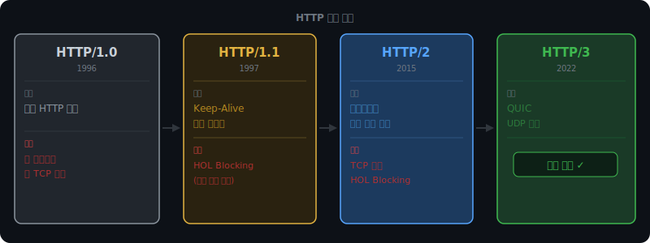
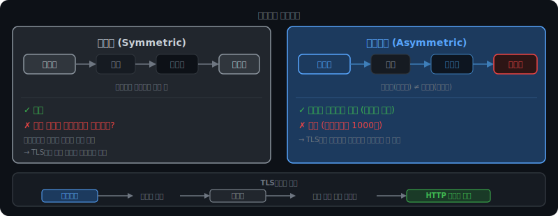
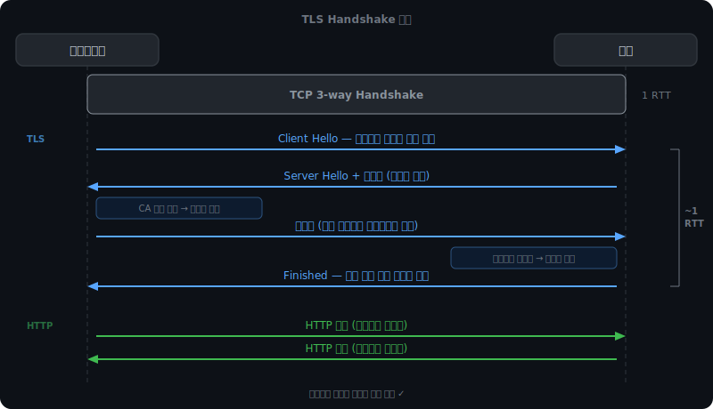

# HTTP 진화와 HTTPS

## HTTP/1.0의 문제

HTTP/1.0은 요청마다 TCP 연결을 새로 맺고 끊었다. TCP 연결을 맺는 데는 3-way Handshake가 필요하다. 파일이 수십 개인 웹페이지에서 이 비용이 파일 수만큼 반복됐다.

```
HTTP/1.0:
[연결 → 요청 → 응답 → 종료] [연결 → 요청 → 응답 → 종료] [연결 → 요청 → 응답 → 종료]
     CSS 파일                      JS 파일                     이미지
```

<br><br>

---

<br><br>

## HTTP/1.1 — Keep-Alive

HTTP/1.1은 Keep-Alive로 이 문제를 해결했다. TCP 연결 하나를 맺고, 그 연결을 재사용해서 여러 요청을 처리한다.

```
HTTP/1.1:
[연결 → 요청 → 응답 → 요청 → 응답 → 요청 → 응답 → 종료]
               CSS          JS          이미지
```

연결 비용을 한 번만 치른다.

<br><br>

### HOL Blocking

Keep-Alive가 연결 재사용 문제는 해결했지만, 새 문제가 생겼다. 응답이 요청 순서대로 와야 한다는 제약이다.

CSS가 크면, JS와 이미지가 서버에서 이미 준비됐어도 CSS 응답이 먼저 오기 전까지 전달할 수 없다.

```
요청: [CSS 요청] → [JS 요청] → [이미지 요청]

서버: JS, 이미지 준비됐지만 CSS 먼저 보내야 함
      CSS 파일이 클수록 JS, 이미지가 오래 대기

결과: JS와 이미지가 준비됐는데도 CSS 뒤에 줄 세워짐
```

이것이 HTTP 레벨 Head-of-Line(HOL) Blocking이다. 앞에 있는 요청이 막히면 뒤 전체가 막힌다.

브라우저는 이 한계를 우회하기 위해 도메인당 TCP 연결을 여러 개(보통 6개) 병렬로 열었다. 근본 해결은 아니었다.

<br><br>

---

<br><br>

## HTTP/2 — 멀티플렉싱



HTTP/2는 하나의 TCP 연결 안에서 요청과 응답을 동시에 처리한다. 핵심 개념이 스트림과 프레임이다.

<br><br>

### 스트림과 프레임

요청과 응답을 프레임이라는 작은 단위로 쪼갠다. 각 프레임에 스트림 ID를 붙인다. TCP 연결이라는 파이프 안에 여러 스트림의 프레임이 섞여서 흘러간다.

```
TCP 연결 안에서:

Stream 1 (CSS):    [1-1][1-2][1-3]
Stream 2 (JS):          [2-1]
Stream 3 (이미지):             [3-1]

실제 전송 순서:  [1-1][2-1][3-1][1-2][1-3]

받는 쪽: 스트림 ID 보고 각각 재조합
  ID=1 → CSS 완성
  ID=2 → JS 완성
  ID=3 → 이미지 완성
```

JS가 준비되면 CSS 프레임 사이에 끼워 넣을 수 있다. 더 이상 CSS 완료를 기다릴 필요 없다.

<br><br>

### HPACK — 헤더 압축

HTTP/1.1은 매 요청마다 수백 바이트의 헤더를 통째로 보낸다. Host, User-Agent, Cookie 같은 헤더가 요청마다 반복된다.

HTTP/2의 HPACK은 이미 보낸 헤더를 기억한다. 이후 요청에서 같은 헤더는 생략하고 바뀐 것만 보낸다. 반복 헤더 오버헤드가 거의 0에 가까워진다.

<br><br>

### 서버 푸시

클라이언트가 HTML을 요청하면 서버가 "어차피 CSS도 필요할 거야"라고 판단해서 요청 없이 먼저 보내준다. 왕복 대기 없이 리소스를 미리 전달한다. 실제로는 캐시 관련 문제로 많이 쓰이지 않아 HTTP/2 사양에서 deprecated됐다.

<br><br>

### HTTP/2가 해결 못한 문제

스트림이 논리적으로 독립적이어도, 물리적으로는 하나의 TCP 연결 위를 지나간다. TCP 패킷 하나가 유실되면 TCP가 재전송될 때까지 그 연결 위의 모든 바이트를 대기시킨다. 스트림 2와 3의 데이터가 이미 도착했어도, TCP 레벨에서 막혀 애플리케이션에 올릴 수 없다.

이것이 TCP 레벨 HOL Blocking이다. HTTP 레벨 문제는 해결했지만 TCP 레벨 문제는 남았다.

<iframe src="/DEV_LOG/Network/assets/demo_hol_blocking.html" width="100%" height="560" frameborder="0" style="border-radius:10px;border:1px solid #334155;display:block;" onload="this.style.height=(this.contentDocument||this.contentWindow.document).documentElement.scrollHeight+'px'"></iframe>

<br><br>

---

<br><br>

## HTTP/3 — QUIC

TCP 레벨 HOL Blocking의 근본 원인은 TCP 자체다. TCP는 연결 전체에 걸쳐 순서를 보장하도록 설계됐다. 이 제약을 없애려면 TCP를 버려야 한다.

HTTP/3는 TCP 대신 UDP 위에서 동작한다. UDP는 순서 보장도 재전송도 없는 단순한 프로토콜이다. 그 위에 QUIC이 필요한 것만 직접 구현했다.

```
HTTP/1.1:  HTTP  →  TCP  →  IP
HTTP/2:    HTTP  →  TCP  →  IP
HTTP/3:    HTTP  →  QUIC →  UDP  →  IP
```

QUIC이 TCP에서 가져온 것:
- 신뢰성 재전송 — 유실된 패킷만, 해당 스트림만
- 혼잡 제어
- 암호화 (TLS 내장)

TCP에서 버린 것:
- 연결 전체에 걸친 순서 보장

스트림 1의 패킷이 유실되면 스트림 1만 재전송을 기다린다. 스트림 2와 3은 자기 시퀀스 번호로 독립적으로 처리해서 계속 진행한다.

<br><br>

### 0-RTT

한 번 연결했던 서버에 재접속할 때 Handshake를 생략하고 바로 데이터를 전송한다.

```
TCP + TLS:     Handshake(1RTT) + TLS(1~2RTT) → 데이터
QUIC 첫 접속:  Handshake + TLS 동시 처리(1RTT) → 데이터
QUIC 재접속:   0RTT → 데이터 (이전 세션 정보 재사용)
```

이전 연결에서 교환한 암호화 파라미터를 저장해뒀다가 바로 쓴다.

<br><br>

---

<br><br>

## HTTPS와 TLS

HTTP는 평문 프로토콜이다. 패킷을 중간에 가로채면 내용이 그대로 보인다. 같은 Wi-Fi를 쓰는 사람이 네트워크 트래픽을 캡처하면 로그인 정보, 쿠키, 결제 정보를 읽을 수 있다.

HTTPS는 HTTP + TLS다. TLS가 암호화 레이어를 추가해서 패킷을 가로채도 내용을 읽을 수 없게 한다.

<br><br>

### 대칭키와 비대칭키



대칭키는 암호화와 복호화에 같은 키를 쓴다. 빠르다. 문제는 처음에 이 키를 상대방에게 어떻게 전달하느냐다. 인터넷으로 보내면 중간에 탈취될 수 있다.

비대칭키는 공개키와 개인키 쌍으로 동작한다.

- 공개키: 누구에게나 공개해도 된다. 암호화에 사용한다.
- 개인키: 서버만 보유한다. 절대 공개하지 않는다. 복호화에 사용한다.

공개키로 잠근 것은 개인키로만 열 수 있다. 공개키로는 열 수 없다. 이게 핵심 성질이다. 공개키를 누가 가져가도 개인키 없이는 복호화할 수 없다.

비대칭키는 느리다. 대칭키보다 1000배 이상 느린 연산을 쓴다.

<br><br>

### TLS Handshake



TCP 연결이 맺어지면 TLS Handshake가 시작된다.

먼저 클라이언트가 Client Hello를 보낸다. 자신이 지원하는 암호화 방식 목록이 담겨있다.

서버는 Server Hello로 사용할 방식을 선택하고, 인증서를 함께 전송한다. 인증서 안에 서버의 공개키와 CA 서명이 있다.

클라이언트는 CA 공개키(브라우저에 내장)로 인증서의 서명을 검증한다. 서명이 유효하면 이 공개키가 진짜 서버 거임을 확인한 것이다.

클라이언트가 대칭키를 생성하고 서버의 공개키로 암호화해서 전송한다.

서버는 개인키로 복호화해서 대칭키를 꺼낸다. 이제 양쪽이 같은 대칭키를 갖게 됐다.

이후 모든 HTTP 데이터는 이 대칭키로 암호화해서 주고받는다.

비대칭키는 대칭키를 안전하게 교환하는 데만 쓰고, 실제 데이터는 빠른 대칭키로 처리한다. 비대칭키만 쓰면 너무 느리고, 대칭키만 쓰면 키 교환 과정에서 탈취 위험이 있어서 둘을 혼합한다.

<iframe src="/DEV_LOG/Network/assets/demo_tls_keyexchange.html" width="100%" height="560" frameborder="0" style="border-radius:10px;border:1px solid #334155;display:block;" onload="this.style.height=(this.contentDocument||this.contentWindow.document).documentElement.scrollHeight+'px'"></iframe>

<br><br>

### CA와 인증서

공개키를 받았을 때 그게 진짜 그 서버의 공개키인지 어떻게 확인하나. 공격자가 서버인 척하고 자신의 공개키를 보낼 수 있다.

CA(Certificate Authority)가 이 문제를 해결한다. CA는 신뢰할 수 있는 제3기관이다.

서버는 CA에게 신원을 증명하고 공개키에 CA의 서명을 받는다. 이것이 인증서다. CA 개인키로 서명한 것은 CA 공개키로 검증할 수 있다. 브라우저에는 신뢰할 수 있는 CA 목록과 CA 공개키가 미리 내장돼 있다.

클라이언트는 CA에 매번 물어볼 필요 없이 로컬에서 서명을 검증해서 공개키의 진위를 확인한다.

인증서에는 유효기간이 있다. 보통 1년이다. 만료되면 브라우저가 경고를 띄운다. 유효기간을 짧게 두는 이유는 개인키가 탈취됐을 때 피해 기간을 제한하기 위해서다.

<br><br>

---

<br><br>

## Content-Length vs Chunked Transfer Encoding

서버가 응답을 보낼 때 클라이언트는 "이 응답이 어디서 끝나는지" 알아야 한다.

Content-Length 방식은 응답 크기를 헤더에 명시한다.

```
HTTP/1.1 200 OK
Content-Length: 1234

(1234바이트 데이터)
```

응답을 전부 생성한 뒤 크기를 알 수 있을 때 쓴다. 정적 파일 전송에 적합하다.

Chunked Transfer Encoding은 크기를 미리 모를 때 쓴다. 데이터를 청크(덩어리) 단위로 쪼개서 만들면서 바로 보낸다. 마지막 청크로 "끝"을 표시한다.

```
HTTP/1.1 200 OK
Transfer-Encoding: chunked

4\r\n        ← 청크 크기 (16진수)
Wiki\r\n     ← 청크 데이터
6\r\n
pedia \r\n
0\r\n        ← 크기 0 = 종료
\r\n
```

서버가 동적으로 페이지를 생성하거나, 스트리밍 응답을 보낼 때 쓴다. 전체를 메모리에 쌓지 않고 생성하는 즉시 전송할 수 있다.
