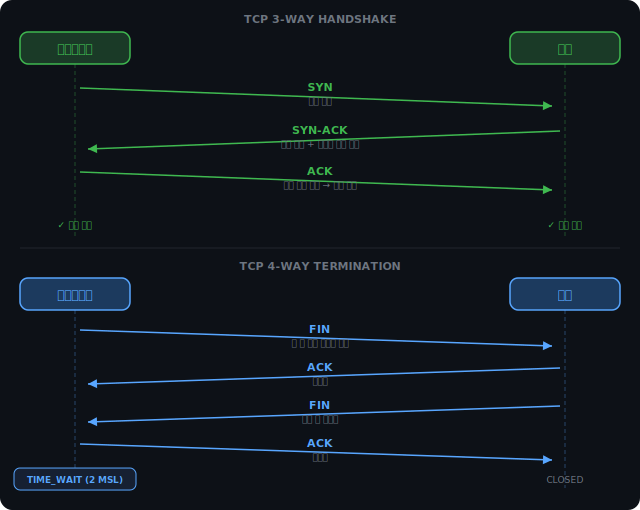
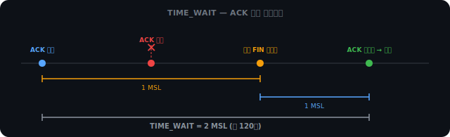
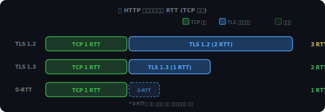

# TCP — 연결과 신뢰성

## IP 주소만으로는 부족한 이유

IP 주소는 어느 컴퓨터인지를 가리킨다. 그런데 하나의 컴퓨터에서 브라우저, 스포티파이, 슬랙이 동시에 네트워크를 쓰고 있다면, 들어온 패킷이 어느 프로세스 것인지 어떻게 아는가.

포트(port)가 이 역할을 한다. NIC(네트워크 카드)로 들어온 패킷을 OS가 포트 번호를 보고 해당 프로세스에 전달한다.

```
IP 주소  →  어느 컴퓨터
포트 번호 →  그 컴퓨터의 어느 프로세스
```

브라우저와 스포티파이가 같은 IP를 쓰더라도, 포트 번호가 다르면 OS는 각 패킷을 정확한 프로세스에 전달할 수 있다.

<br><br>

### well-known 포트와 임시 포트

서버 측 포트는 관례로 고정돼 있다.

| 포트 | 프로토콜 |
|------|----------|
| 80   | HTTP     |
| 443  | HTTPS    |
| 22   | SSH      |
| 3306 | MySQL    |

0~1023 번대를 well-known 포트라 한다. 운영체제 수준에서 바인딩하려면 관리자 권한이 필요하다.

클라이언트 쪽은 다르다. 브라우저가 서버에 요청을 보낼 때, 브라우저 자체의 포트 번호는 OS가 49152~65535 범위에서 랜덤으로 배정한다. 이를 임시 포트(ephemeral port)라 한다. 서버가 응답을 돌려줄 때 이 포트 번호를 목적지로 삼는다.

TCP 연결 하나는 이 4개로 식별된다.

```
{출발지 IP, 출발지 Port, 목적지 IP, 목적지 Port}
```

4-tuple 중 하나라도 다르면 별개의 연결이다. 같은 서버에 브라우저 탭 두 개를 열어도 임시 포트가 달라서 OS가 구분할 수 있다.

<br><br>

---

<br><br>

## TCP 3-way Handshake

HTTP 요청을 보내기 전에 TCP는 먼저 연결을 맺는다. 데이터를 신뢰성 있게 전달하려면 양쪽이 준비됐는지 먼저 확인해야 하기 때문이다.



<br><br>

### 왜 2번이 아닌 3번인가

TCP는 양방향(full-duplex) 통신이다. 클라이언트→서버, 서버→클라이언트 두 방향 모두 작동해야 연결이 유효하다.

2번(SYN, SYN-ACK)으로 끝낸다고 가정해보자.

```
클라이언트  ──── SYN ────▶  서버
클라이언트  ◀── SYN-ACK ──  서버
              (여기서 끝?)
```

클라이언트는 SYN-ACK를 받는 순간 두 가지를 동시에 확인한다. SYN이 서버에 도달했고(클라이언트→서버 방향 확인), 서버 응답이 돌아왔다(서버→클라이언트 방향 확인). 클라이언트 입장에서 양방향이 모두 확인됐다.

문제는 서버다. 서버는 SYN을 받았고 SYN-ACK를 보냈다. 서버→클라이언트 방향으로 SYN-ACK를 "보낸" 것이지, "도달했음"을 확인한 게 아니다. 서버 입장에서 자신이 보낸 응답이 클라이언트에게 실제로 닿았는지 알 수 없다.

3번째 ACK가 서버에 도달해야 서버는 "내가 보낸 SYN-ACK가 잘 도착했구나"를 알고, 서버→클라이언트 방향이 뚫렸음을 확인한다.

| 단계 | 서버가 확인한 것 | 클라이언트가 확인한 것 |
|------|----------------|----------------------|
| SYN | 클라이언트→서버 작동 | — |
| SYN-ACK | — | 클라이언트→서버 + 서버→클라이언트 모두 작동 |
| ACK | 서버→클라이언트 작동 | — |

2-way로 끝내면 서버만 한쪽 방향을 확인 못 한 채 연결을 시작하게 된다. TCP가 3-way인 이유는 단순히 "3번 교환하면 충분해서"가 아니라, 양쪽이 양방향을 각각 확인하는 최소한의 교환이 3번이기 때문이다.

<br><br>

<iframe src="/DEV_LOG/Network/assets/demo_tcp_3way.html" width="100%" height="500" frameborder="0" style="border-radius:10px;border:1px solid #334155;display:block;" onload="this.style.height=(this.contentDocument||this.contentWindow.document).documentElement.scrollHeight+'px'"></iframe>

<br><br>

---

<br><br>

## TCP 4-way Termination

연결을 끊을 때는 4단계가 필요하다. 연결은 3번인데 종료는 4번인 이유가 있다.


<br><br>

### FIN의 의미 — 즉각 종료가 아니다

FIN 패킷은 "나 더 이상 보낼 데이터가 없어"를 의미한다. "즉시 연결을 끊자"가 아니다.

클라이언트가 FIN을 보냈을 때, 서버가 응답 데이터를 아직 다 보내지 못한 상황이 있을 수 있다. 클라이언트의 FIN은 "나는 다 보냈어"이지 "너도 지금 당장 멈춰"가 아니다.

그래서 각 방향이 독립적으로 닫힌다.

```
클라이언트  ──── FIN ────▶  서버    "나는 다 보냈어"
클라이언트  ◀──── ACK ───  서버    "알겠어"
                 (서버가 아직 보낼 데이터가 있을 수 있음)
클라이언트  ◀──── FIN ───  서버    "나도 다 보냈어"
클라이언트  ──── ACK ────▶  서버    "알겠어"
```

연결은 3-way인데 종료가 4-way인 이유는 여기에 있다. 연결 시에는 SYN과 SYN-ACK를 한 패킷에 합쳐서 3번만에 됐지만, 종료 시에는 서버의 ACK와 FIN이 별개로 나올 수 있어서 4번이 필요하다.

실제로는 서버에 보낼 데이터가 없으면 OS가 ACK와 FIN을 한 패킷에 합쳐 보내는 경우도 있다. 그러면 3번 교환처럼 보인다. 프로토콜은 4-way지만, 구현 최적화로 줄어드는 경우다.

<br><br>

### TIME_WAIT — 120초를 기다리는 이유

마지막 ACK를 보내고 나서 클라이언트는 바로 닫지 않는다. 일정 시간 TIME_WAIT 상태를 유지한다.



마지막 ACK가 유실되면 서버는 FIN을 재전송한다. 만약 클라이언트가 이미 닫혀 있다면 이 FIN을 받을 수 없고, 서버는 ACK를 영원히 기다리게 된다.

네트워크에서 패킷이 살아있을 수 있는 최대 시간을 MSL(Maximum Segment Lifetime)이라 한다. 보통 60초다.

TIME_WAIT가 2 MSL인 이유는 최악의 경우를 커버하기 때문이다.

```
클라이언트 ACK 전송          →  최대 1 MSL 이동 (유실 가능)
서버가 재전송한 FIN          ←  최대 1 MSL 이동
─────────────────────────────────────
합계 최대 2 MSL = TIME_WAIT 기간
```

2 MSL 동안 대기하면 "이 시간 안에 날아다니는 패킷은 전부 처리됐다"고 볼 수 있다.

<br><br>

---

<br><br>

## TLS Handshake — RTT 단위로 보기

TCP 연결이 완료되면 HTTPS는 TLS Handshake를 시작한다. 암호화된 통신 채널을 수립하는 과정이다.

TLS는 CH3에서 개념(대칭키/비대칭키 혼합, CA 인증서)을 정리했다. 여기서는 실제로 몇 번의 왕복이 일어나는지, TLS 버전별로 어떻게 다른지를 본다.

<br><br>

### TLS 1.2 — 2 RTT

TCP 연결 완료 후 TLS 1.2는 두 번의 왕복이 더 필요하다.

첫 번째 RTT에서 클라이언트가 ClientHello를 보낸다. 지원하는 TLS 버전, 암호화 알고리즘 목록(cipher suites), 클라이언트 랜덤값이 담긴다. 서버는 ServerHello로 응답하면서 선택한 알고리즘과 인증서를 함께 보낸다.

두 번째 RTT에서 핵심 교환이 일어난다. 클라이언트가 pre-master secret을 서버 공개키로 암호화해서 전송한다.

여기서 자주 나오는 혼동이 있다. "대칭키를 공개키로 암호화해서 보내면 되지 않나?" pre-master secret은 대칭키가 아니다. 랜덤 숫자다. 이걸 보낸 뒤, 양쪽이 (pre-master secret + 클라이언트 랜덤 + 서버 랜덤)이라는 동일한 재료로 각자 대칭키를 계산한다. 대칭키 자체는 네트워크를 통해 전송되지 않는다.

```
클라이언트                              서버
대칭키 = f(pre-master, 클랜덤, 서랜덤)
                                       대칭키 = f(pre-master, 클랜덤, 서랜덤)
→ 같은 재료, 같은 함수 → 같은 대칭키
```

대칭키를 직접 보내지 않는 이유는 미래 보안 때문이다. 서버 개인키가 나중에 탈취되면, 과거에 캡처해 둔 트래픽을 전부 복호화할 수 있게 된다. pre-master secret 방식은 대칭키 자체가 전송된 적이 없어서 개인키 탈취로 과거 통신이 노출되지 않는다.

서버가 Finished 메시지를 보내면 암호화 세션이 시작된다.

<iframe src="/DEV_LOG/Network/assets/demo_tls_handshake.html" width="100%" height="680" frameborder="0" style="border-radius:10px;border:1px solid #334155;display:block;" onload="this.style.height=(this.contentDocument||this.contentWindow.document).documentElement.scrollHeight+'px'"></iframe>

<br><br>

### TLS RTT 계산 — 2.5가 아닌 이유

TLS 1.2가 2 RTT라는 계산에서 자주 나오는 실수가 있다. 서버 Finished를 받은 후 클라이언트가 ACK를 보내야 하지 않나, 그러면 0.5 RTT가 더 추가되지 않나라는 생각이다.

TCP는 모든 수신에 대해 ACK를 보내는 게 맞다. 하지만 TLS 레벨에서 "연결 완료"를 판단하는 기준은 서버 Finished를 수신한 시점이다. 클라이언트는 Server Finished를 받는 순간 HTTP 요청을 바로 보낼 수 있다. 그 HTTP 요청 패킷 자체가 TCP ACK를 포함한다. 별도의 ACK 대기 단계가 없다.

RTT는 "요청을 보내고 응답을 받는 한 번의 왕복"으로 센다. TLS 1.2 Handshake는 딱 두 번의 왕복이다.

<br><br>

### TLS 1.3 — 1 RTT로 줄인 방법

TLS 1.2의 핵심 낭비는 TCP가 완전히 연결된 뒤에야 TLS를 시작한다는 점이다.

TLS 1.3은 TCP의 세 번째 메시지(ACK)에 ClientHello를 실어 보낸다. TCP 연결 확인과 TLS 시작을 한 패킷에 합친다.

```
TLS 1.2:
SYN → SYN-ACK → ACK           (TCP 1 RTT)
ClientHello → ServerHello      (TLS RTT 1)
KeyExchange → Server Finished  (TLS RTT 2)
─────────────────────────────────────────────
총 3 RTT

TLS 1.3:
SYN → SYN-ACK
ACK + ClientHello → ServerHello + Finished  (TCP + TLS 동시 처리)
─────────────────────────────────────────────
총 2 RTT
```

서버도 ServerHello와 Finished를 한 번에 보낼 수 있도록 프로토콜이 설계됐다.

<br><br>

### 0-RTT — 재연결에서의 최적화

이전에 연결했던 서버라면 이전 세션에서 교환한 암호화 파라미터를 저장해 둘 수 있다. 재연결 시 TCP ACK를 보낼 때 이미 암호화된 HTTP 요청을 함께 실어 보낸다. TLS Handshake 자체가 없어진다.

단, 0-RTT는 재전송 공격(Replay Attack)에 취약하다. 암호화된 요청을 중간에 가로채 그대로 재전송하면 서버가 같은 요청을 두 번 처리할 수 있다. 이 때문에 0-RTT는 멱등한 GET 요청에만 쓰고, 결제나 주문 같은 POST에는 별도 처리가 필요하다.



<iframe src="/DEV_LOG/Network/assets/demo_rtt_simulator.html" width="100%" height="640" frameborder="0" style="border-radius:10px;border:1px solid #334155;display:block;" onload="this.style.height=(this.contentDocument||this.contentWindow.document).documentElement.scrollHeight+'px'"></iframe>

