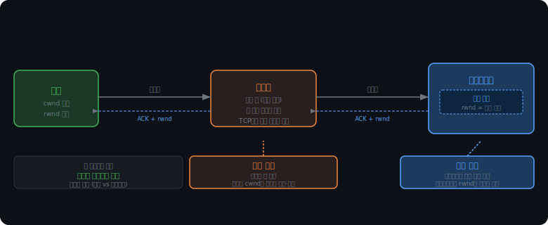
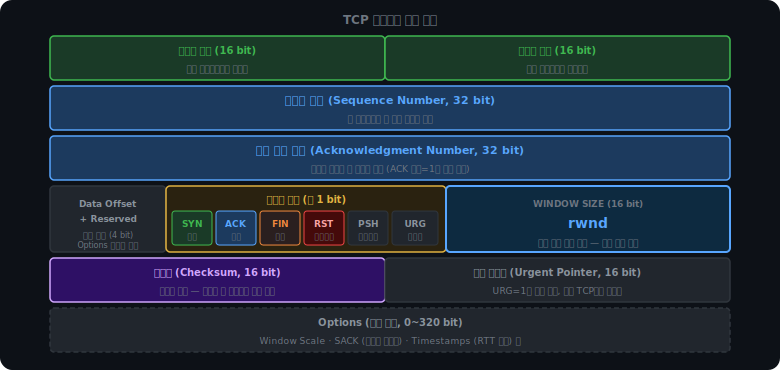
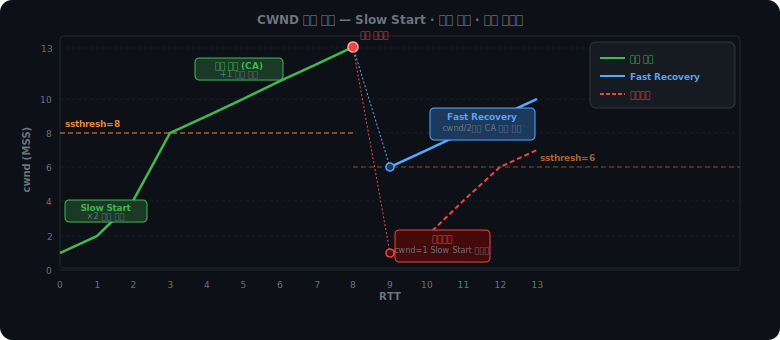

# TCP — 흐름 제어와 혼잡 제어

TCP가 데이터를 마구 쏘면 두 곳이 망가질 수 있다. 수신자의 버퍼, 그리고 네트워크 중간의 라우터다. 두 문제는 발생 위치가 다르고, 해결 방식도 다르다.

수신자 버퍼 문제는 서버가 클라이언트보다 훨씬 빠른 상황에서 생긴다. 10Gbps 서버가 있는 힘껏 쏘면 구형 노트북의 수신 버퍼가 넘친다. 버려진 패킷은 재전송되고, 재전송도 버려진다. 이를 막는 것이 흐름 제어다.

라우터 문제는 다르다. 전 세계 TCP 연결 수백만 개가 동시에 같은 라우터를 통과한다. 라우터의 큐가 꽉 차면 들어오는 패킷을 버린다. 그런데 라우터는 TCP에게 "나 지금 막혔어"라고 직접 알리지 않는다. 조용히 버릴 뿐이다. TCP는 이 신호를 간접적으로 감지해서 스스로 속도를 줄여야 한다. 이것이 혼잡 제어다.



두 메커니즘은 독립적으로 동작하지만, 실제 한 번에 전송할 수 있는 양은 둘 중 작은 쪽이 결정한다.

```
실제 전송량 = min(rwnd, cwnd)
```

rwnd는 수신자가 알려주는 값이고, cwnd는 송신자가 네트워크 상태를 추정해 스스로 관리하는 값이다.

<br><br>

---

<br><br>

## TCP 세그먼트 내부

흐름 제어와 혼잡 제어를 이해하려면 TCP가 데이터를 어떻게 식별하는지를 먼저 알아야 한다. ACK가 "텍스트"가 아니라 헤더 안의 숫자와 비트라는 사실이 전부를 설명한다.



TCP는 데이터를 연속된 바이트 스트림으로 본다. 파일 하나를 전송한다면 그 파일의 모든 바이트에 번호가 붙어 있다. 이 번호가 seq(Sequence Number)다. 세그먼트를 만들 때 첫 번째 바이트의 번호를 seq 필드에 넣어 보낸다.

```
파일 전체:  [바이트 0 ~ 바이트 4379]

세그먼트 1: 바이트 0~1459    →  seq = 0
세그먼트 2: 바이트 1460~2919 →  seq = 1460
세그먼트 3: 바이트 2920~4379 →  seq = 2920
```

수신자는 seq를 보고 이 청크가 전체 스트림의 어디에 끼워져야 하는지 안다. 네트워크에서 패킷이 순서 없이 도착해도 seq가 있으면 올바른 순서로 재조립할 수 있다.

ACK num(Acknowledgment Number)은 "다음에 받아야 하는 바이트 번호"다. "마지막으로 받은 것"이 아니라는 점이 중요하다.

```
seq 0~1459 수신 → ACK num = 1460  (0~1459 받았어, 다음엔 1460번 줘)
seq 1460~2919 수신 → ACK num = 2920
```

그리고 ACK num은 누적(cumulative)이다. ACK num=4380이 왔다면, 그 이하 모든 바이트가 수신됐다는 뜻이다. 이 덕분에 중간에 ACK 패킷이 유실돼도 뒤에 더 큰 ACK num이 도착하면 자동으로 커버된다.

헤더에는 1비트짜리 플래그 필드들도 있다. SYN, ACK, FIN이 각각 독립된 비트다. SYN-ACK가 하나의 패킷인 이유는 두 비트를 동시에 1로 세울 수 있기 때문이다. 3-way Handshake의 두 번째 단계가 "연결 수락 + 역방향 연결 요청"을 한 패킷에 담는 것이 여기서 가능하다.

체크섬(Checksum) 필드는 세그먼트 무결성을 보장한다. 수신 측이 헤더와 데이터를 같은 방식으로 계산해 헤더 값과 비교한다. 불일치하면 세그먼트 전체를 버린다. 이것이 TCP에서 "부분 유실"이 없는 이유다. 세그먼트 안의 특정 바이트만 깨질 수 없다. 물리 계층에서 비트가 하나라도 오염되면 체크섬 불일치로 세그먼트 전체가 드랍된다. TCP 입장에서 세그먼트는 온전히 전달됐거나 아예 없거나 둘 중 하나다.

ACK가 언제 전송되는지도 여기서 이해된다. NIC로 패킷이 들어오면 IP 레이어가 처리하고, 그 다음 TCP 레이어가 seq를 확인해 수신 버퍼에 적재한다. ACK는 이 순간, 즉 TCP 레이어가 버퍼에 넣자마자 나간다. 앱이 데이터를 읽기 전이다.

```
패킷 수신 흐름:

NIC 도착
  ↓
IP 레이어: 목적지 IP 확인, TCP 세그먼트 꺼냄
  ↓
TCP 레이어: seq 확인, 수신 버퍼에 적재  ← 여기서 ACK 전송
  ↓
앱: 버퍼에서 순서대로 읽기
```

앱이 느려서 버퍼를 늦게 읽어도 TCP는 이미 "받았어"를 확인했다. 이 구조가 TCP 레벨 HOL Blocking의 정확한 위치를 설명한다. 수신 버퍼에는 세그먼트 3, 4, 5가 모두 도착해 ACK도 나갔지만, 세그먼트 3이 없으면 앱은 3번 자리에서 대기한다. 4, 5는 버퍼에 있는데 앱에 전달되지 못한다. QUIC이 이 문제를 해결하는 방식은 스트림별로 독립된 seq를 두는 것이다. 스트림 A의 구멍이 스트림 B의 전달을 막지 않는다.

<br><br>

---

<br><br>

## 흐름 제어

수신자가 처리할 수 있는 속도보다 빠르게 데이터가 들어오면 버퍼가 넘친다. 넘친 데이터는 버려지고, 버려진 데이터는 재전송되고, 재전송도 버려진다. 이 낭비를 막는 것이 흐름 제어다.

클라이언트는 ACK를 보낼 때 rwnd(Receive Window) 필드에 현재 수신 버퍼의 남은 공간을 담아 보낸다. 서버는 이 값을 보고 한 번에 보낼 수 있는 양을 제한한다.

```
클라이언트 ACK: ACK num=1460, rwnd=3000
               → "받았어. 그리고 내 버퍼 남은 공간은 3000 byte야."

서버: 3000 byte까지만 보낸다.
```

앱이 버퍼에서 데이터를 읽어 공간이 생기면 다음 ACK에 더 큰 rwnd가 담겨 온다. 서버는 그만큼 더 보낸다. 반대로 앱이 바빠서 버퍼를 못 읽으면 rwnd가 줄어들고 서버도 속도를 늦춘다. 자동으로 수신자 처리 속도에 맞게 조절된다.

TCP는 하나 보내고 ACK 기다리고 하나 보내는 방식이 아니다. rwnd(와 뒤에서 다룰 cwnd) 범위 안에서 여러 세그먼트를 동시에 전송한다. ACK가 돌아오면 윈도우가 오른쪽으로 이동하면서 새 세그먼트를 추가로 보낼 수 있다. 이것이 슬라이딩 윈도우다. 이 구조 덕분에 RTT 동안 한 개만 주고받는 것이 아니라 윈도우 크기만큼의 데이터를 파이프라인으로 전송할 수 있다.

<iframe src="/DEV_LOG/Network/assets/demo_sliding_window.html" width="100%" height="440" frameborder="0" style="border-radius:10px;border:1px solid #334155;display:block;" onload="this.style.height=(this.contentDocument||this.contentWindow.document).documentElement.scrollHeight+'px'"></iframe>

<br><br>

### Zero Window Probe

수신 버퍼가 꽉 차면 클라이언트가 rwnd=0을 담은 ACK를 보낸다. 서버는 전송을 멈춘다. 여기서 잠재적인 데드락이 생긴다.

클라이언트는 데이터를 받아야 ACK를 보낸다. 서버가 보내지 않으면 클라이언트도 보내지 않는다. 앱이 버퍼를 읽어 공간이 생겨도 클라이언트가 이를 알릴 방법이 없다. "rwnd 생겼어"를 담은 ACK를 보내려면 뭔가를 받아야 하는데, 서버는 rwnd=0이라 보내지 않는 상태다. 서버는 영원히 rwnd 업데이트를 받지 못한다.

이를 막는 것이 ZWP(Zero Window Probe)다. 서버가 일정 간격으로 1 byte짜리 세그먼트를 전송한다. 아무 의미 없는 1 byte지만, TCP 수신자는 데이터를 받으면 반드시 ACK를 보내야 한다. 그 ACK에 현재 rwnd가 담겨 온다. 0이면 다음 probe까지 기다리고, 0이 아니면 전송을 재개한다.

<iframe src="/DEV_LOG/Network/assets/demo_zero_window_probe.html" width="100%" height="480" frameborder="0" style="border-radius:10px;border:1px solid #334155;display:block;" onload="this.style.height=(this.contentDocument||this.contentWindow.document).documentElement.scrollHeight+'px'"></iframe>

누적 ACK와 ACK 유실에 대해서도 짚어둬야 한다. ACK num은 누적값이므로, ACK 패킷이 중간에 유실돼도 그 뒤에 더 큰 ACK num이 도착하면 자동으로 커버된다. ACK num=2920이 유실돼도 ACK num=4380이 오면 서버는 0~4379 전체가 수신됐음을 안다.

<iframe src="/DEV_LOG/Network/assets/demo_cumulative_ack.html" width="100%" height="460" frameborder="0" style="border-radius:10px;border:1px solid #334155;display:block;" onload="this.style.height=(this.contentDocument||this.contentWindow.document).documentElement.scrollHeight+'px'"></iframe>

세그먼트 유실과 ACK 유실은 다르다. 세그먼트 유실은 데이터 자체가 도달하지 못한 것이다. ACK num이 앞으로 나가지 못하고 같은 값이 반복되는 것이 신호다. ACK 유실은 데이터는 도달했고 ACK 패킷만 중간에 사라진 것이다. 데이터는 수신 버퍼에 멀쩡히 있다. 뒤에 오는 더 큰 ACK num이 이를 커버한다.

<iframe src="/DEV_LOG/Network/assets/demo_ack_loss.html" width="100%" height="440" frameborder="0" style="border-radius:10px;border:1px solid #334155;display:block;" onload="this.style.height=(this.contentDocument||this.contentWindow.document).documentElement.scrollHeight+'px'"></iframe>

<br><br>

---

<br><br>

## 혼잡 제어

라우터는 혼잡해도 TCP에게 알리지 않는다. ECN(Explicit Congestion Notification)같은 확장이 없는 기본 TCP에서 라우터가 할 수 있는 건 패킷을 버리는 것뿐이다. TCP는 이 간접 신호를 읽어 스스로 속도를 줄여야 한다.

TCP가 혼잡을 감지하는 신호는 두 가지다. 타임아웃(RTO)은 패킷을 보냈는데 ACK가 일정 시간 내에 돌아오지 않는 상황이다. 네트워크가 심각하게 막혀서 패킷도, ACK도 통과하지 못하는 상태다. 중복 ACK 3개는 같은 ACK num이 세 번 연속 오는 것이다. ACK가 오고 있다는 건 네트워크가 완전히 막히지 않았다는 뜻이다. 특정 세그먼트 하나만 유실됐고 그 이후 세그먼트들은 수신 버퍼에 쌓이는 중이다.

중복 ACK가 왜 3개인지는 reordering 때문이다. 인터넷에서 패킷은 항상 순서대로 도착하지 않는다. 4번 패킷이 3번보다 먼저 도착할 수 있다. 이 경우 수신자는 3을 기다리며 ACK num을 올리지 못하고 중복 ACK를 보낸다. 잠시 후 3이 도착하면 정상이다. 즉 1~2개의 중복 ACK는 유실이 아닌 reordering일 가능성이 있다. 3개가 쌓이면 경험적으로 reordering이 아니라 유실이다. 1이나 2에서 반응하면 정상적인 상황에서 불필요하게 속도를 줄이게 된다.

두 신호의 심각도가 다르기 때문에 TCP의 반응 강도도 다르다.

```
타임아웃:       심각. ACK조차 돌아오지 않음. cwnd = 1로 초기화.
중복 ACK 3개:   가벼움. 네트워크는 흐르는 중. cwnd = 현재값 / 2.
```

혼잡 제어를 위한 송신 측 윈도우가 cwnd(Congestion Window)다. rwnd는 수신자가 알려주는 값이지만, cwnd는 송신자가 네트워크 상태를 추정해 스스로 조절하는 값이다. 네트워크를 직접 볼 수 없으므로 신호를 보고 추론한다.

연결이 처음 시작될 때 송신자는 이 네트워크의 대역폭이 얼마나 되는지 전혀 모른다. 처음부터 크게 쏘면 과부하가 걸릴 수 있고, 너무 작게 쏘면 대역폭을 낭비한다. 그래서 Slow Start — 작게 시작하되 빠르게 키운다.

```
시작: cwnd = 1 MSS

ACK 하나 받을 때마다: cwnd += 1 MSS
→ RTT마다 cwnd만큼 ACK가 돌아오면 cwnd가 두 배

RTT 1:  cwnd = 1  (세그먼트 1개 전송)
RTT 2:  cwnd = 2  (세그먼트 2개 전송)
RTT 3:  cwnd = 4
RTT 4:  cwnd = 8
```

이름이 Slow Start인 이유는 출발점(cwnd=1)이 작아서다. 증가 방식 자체는 지수다. 지수 증가를 그대로 두면 금세 네트워크를 터뜨리기 때문에, ssthresh(Slow Start Threshold)라는 임계값을 둔다. cwnd가 ssthresh에 도달하면 혼잡 회피(Congestion Avoidance) 구간으로 전환되고, 이후에는 RTT마다 +1 MSS씩 선형으로 증가한다.

```
cwnd < ssthresh:  Slow Start  (지수 증가)
cwnd ≥ ssthresh:  혼잡 회피   (선형 증가 +1 MSS/RTT)
```

ssthresh의 초기값은 구현에 따라 다르지만, 손실이 발생하면 그 시점 cwnd의 절반으로 낮춘다. 즉 손실이 발생한 cwnd가 24라면 다음 ssthresh는 12가 된다. 이것이 AIMD(Additive Increase, Multiplicative Decrease)의 MD 부분이다. 선형으로 올리고, 손실 발생 시 절반으로 줄인다. AI는 혼잡 회피 구간의 +1씩 증가를 뜻한다.

이 비대칭이 의도적이다. 천천히 올리고 빠르게 양보함으로써, 같은 병목 구간을 공유하는 여러 TCP 연결이 공정하게 대역폭을 나누는 방향으로 수렴한다. 한 연결이 공격적으로 점유하려 해도 손실 신호에 cwnd가 절반이 되면 다른 연결이 치고 올라올 수 있다. 결국 장기적으로 각 연결의 cwnd가 비슷한 수준에서 진동한다.



<br><br>

### Fast Retransmit과 Fast Recovery

중복 ACK 3개가 감지되면 타임아웃을 기다리지 않고 유실된 세그먼트를 즉시 재전송한다. 이것이 Fast Retransmit이다. TCP 타임아웃(RTO)은 통상 수백 ms에서 1초 이상으로 설정된다. 가벼운 유실 하나 때문에 이 시간을 통째로 낭비하는 것은 비효율적이다. 중복 ACK가 오고 있다는 것 자체가 네트워크가 흐르고 있다는 증거이므로, 유실된 세그먼트만 즉시 재전송하고 전송을 계속할 수 있다.

<iframe src="/DEV_LOG/Network/assets/demo_segment_loss.html" width="100%" height="540" frameborder="0" style="border-radius:10px;border:1px solid #334155;display:block;" onload="this.style.height=(this.contentDocument||this.contentWindow.document).documentElement.scrollHeight+'px'"></iframe>

Fast Retransmit 이후 cwnd를 어떻게 조절하느냐가 Fast Recovery다. 타임아웃과의 차이가 핵심이다.

```
타임아웃:
  ssthresh = cwnd / 2
  cwnd = 1
  → Slow Start 재시작 (cwnd=1에서 지수 증가)

Fast Recovery (중복 ACK 3개):
  ssthresh = cwnd / 2
  cwnd = ssthresh
  → 혼잡 회피 바로 진입 (선형 증가 계속)
```

타임아웃은 ACK조차 돌아오지 않는 심각한 상황이므로 네트워크가 얼마나 막혔는지 알 수 없다. cwnd=1부터 다시 시작하는 것이 안전하다. 반면 중복 ACK 상황은 ACK가 계속 오고 있으므로 네트워크는 작동 중이다. cwnd를 절반으로 줄인 자리에서 바로 선형 증가를 재개해도 된다. Slow Start 구간 전체를 건너뛸 수 있다. 이것이 "Fast"인 이유다.

시뮬레이터에서 RTT를 진행하고 두 종류의 손실 이벤트를 직접 트리거해볼 수 있다. 타임아웃과 중복 ACK 이후 cwnd 회복 속도의 차이를 그래프로 확인한다.

<iframe src="/DEV_LOG/Network/assets/demo_cwnd_simulator.html" width="100%" height="560" frameborder="0" style="border-radius:10px;border:1px solid #334155;display:block;" onload="this.style.height=(this.contentDocument||this.contentWindow.document).documentElement.scrollHeight+'px'"></iframe>

<br><br>

---

<br><br>

UDP는 흐름 제어도 혼잡 제어도 없다. 이 단순함이 어떤 상황에서 장점이 되는지, 그리고 UDP 위에서 QUIC이 어떻게 신뢰성을 직접 구현하는지가 다음 주제다.
