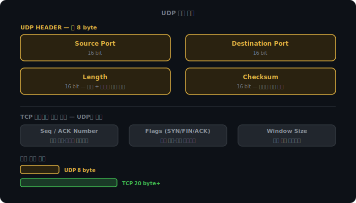
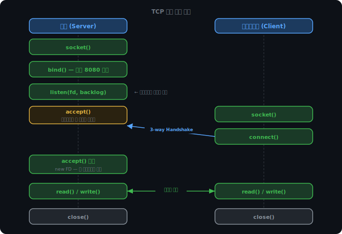

# UDP와 소켓

지난 두 챕터 동안 TCP를 다뤘다. 연결 수립, 신뢰성 보장, 흐름 제어, 혼잡 제어 — 모두 TCP의 이야기다. 그런데 인터넷 트래픽의 상당 부분은 TCP가 아닌 다른 프로토콜로 움직인다. DNS 조회, 유튜브 스트리밍, 게임 위치 업데이트 — 이것들은 TCP를 쓰지 않는다. 그리고 앱 코드에서 TCP든 UDP든 직접 건드리는 게 아니라 소켓이라는 인터페이스를 통해 접근한다.

UDP부터 보고, 그 다음에 소켓을 본다.

<br><br>

---

<br><br>

## UDP

TCP에서 핵심 세 가지를 제거하면 UDP가 된다.

| | TCP | UDP |
|--|-----|-----|
| 연결 수립 | 3-way Handshake | 없음 |
| 전송 보장 | 재전송·순서 보장 | 없음 |
| 흐름/혼잡 제어 | rwnd·cwnd | 없음 |

"불안정"보다 "비신뢰적(unreliable)"이 정확한 표현이다. 악의적으로 망가뜨린다는 뜻이 아니라, 신뢰성 메커니즘 자체가 설계에 없다는 뜻이다.

### DNS, 스트리밍, 게임에서 UDP를 쓰는 이유

DNS는 단발성 소형 요청이다. "google.com 아이피 뭐야?"라고 묻고 한 줄 답변을 받는 게 전부다. 이걸 TCP로 하면 3-way Handshake → 요청 → 응답 → 4-way Termination이다. 연결 수립 비용이 답변보다 크다. UDP는 던지고 받으면 끝이다.

스트리밍과 게임은 이유가 다르다. TCP로 영상을 스트리밍한다고 하면, 3초 시점 프레임이 유실됐을 때 TCP는 재전송을 시도한다. 재전송된 패킷이 6초 뒤에 도착하면 이미 지나간 장면이다. 재전송을 기다리는 것보다 스킵하고 4초로 넘어가는 게 낫다. 게임도 같다. 100ms 전 위치 데이터가 재전송돼 200ms 뒤에 도착하면 플레이어는 이미 딴 곳에 있다.

공통 원리는 하나다. 늦게 오는 데이터가 안 오는 것보다 나쁜 상황이면 UDP를 쓴다.

### UDP 헤더 구조

UDP 헤더는 TCP 헤더의 절반도 안 된다.



Source Port, Destination Port, Length, Checksum — 4개 필드, 8바이트가 전부다. Checksum이 있다는 점은 주의할 것. 연결 관리는 안 해도 도착한 데이터가 깨졌는지는 알아야 한다. 유실을 허용한다는 것과 깨진 데이터를 허용한다는 것은 다른 이야기다.

<br><br>

---

<br><br>

## 소켓이란

TCP든 UDP든, 앱이 직접 프로토콜을 다루는 게 아니다. TCP 세그먼트를 만들고 ACK를 관리하는 로직은 커널 안에 있다. 앱은 커널이 열어주는 창구를 통해 요청할 뿐이다. 그 창구가 소켓이다.

```
앱 코드  →  소켓 (FD)  →  커널 (TCP/UDP)  →  NIC  →  네트워크
```

소켓은 파일 디스크립터 번호 하나다. 리눅스는 "모든 것은 파일"이라는 철학을 가져서, 소켓에 데이터를 쓸 때도 `write(fd, data)`, 읽을 때도 `read(fd, buf)`를 쓴다. 파이프나 일반 파일과 인터페이스가 같다.

`socket()`, `bind()`, `listen()`, `accept()`, `connect()` — 이것들은 모두 시스템 콜이다. 앱이 이 함수들을 호출하면 커널로 제어가 넘어가고, 커널이 TCP/UDP 처리를 담당한다.

소켓을 생성할 때 프로토콜을 지정한다.

```c
socket(AF_INET, SOCK_STREAM, 0)  // TCP
socket(AF_INET, SOCK_DGRAM, 0)   // UDP
```

이 시점부터 TCP 소켓인지 UDP 소켓인지가 결정된다. 그리고 두 프로토콜은 통신 흐름이 완전히 다르다.

<br><br>

---

<br><br>

## TCP 소켓 통신 흐름

TCP는 연결 지향이다. 데이터를 주고받기 전에 반드시 연결을 수립해야 한다.



각 단계를 본다.

`socket()` — 소켓 FD를 생성한다. 포트도, 연결도 없다. 커널에서 소켓 구조체를 할당받고 번호를 돌려받는 것이다.

`bind()` — 포트 번호를 예약한다. "나는 8080 포트야"라고 커널에 등록한다. 서버만 필요하다. 클라이언트가 어느 포트로 요청을 보낼지 알아야 하기 때문이다.

`listen()` — 수신 대기 상태로 전환한다. 클라이언트가 없어도 이 단계를 실행한다. 서버는 손님이 오기 전에 먼저 문을 열어 놓는다.

`accept()` — 연결이 완성될 때까지 블로킹된다. 클라이언트가 `connect()`를 호출하면 3-way Handshake가 진행되고, 완료되면 새 파일 디스크립터를 반환하며 블로킹이 해제된다.

`accept()`가 새 FD를 반환하는 이유가 있다. 원래 listening socket(포트 8080)은 계속 새 연결을 받아야 한다. 이미 연결된 클라이언트와의 데이터 통신을 별도 FD로 분리해야 listening socket이 막히지 않는다. 클라이언트 1000명이 동시 접속해도 FD 1000개가 생기는 것이지 포트가 늘어나는 게 아니다. 연결 구분은 `(클라 IP, 클라 포트, 서버 IP, 서버 포트)` 4-tuple로 한다. 서버 포트는 항상 8080이다.

`connect()` — 클라이언트가 서버에 연결을 요청한다. 이 호출 내부에서 3-way Handshake가 발생한다.

<br><br>

### backlog와 SYN Flood

`listen(fd, backlog)`에서 두 번째 인자 backlog는 연결 대기 큐의 크기다.

클라이언트가 SYN을 보내면, 서버는 SYN-ACK를 돌려주고 ACK를 기다린다. ACK가 아직 안 온 연결들이 이 큐에 쌓인다. `listen(fd, 128)`이면 그 상태로 대기 가능한 연결이 128개라는 뜻이다.

SYN Flood 공격은 이 큐를 노린다.

```
공격자 → SYN 수천 개 전송, ACK는 영원히 안 보냄
서버   → backlog 큐가 SYN 대기로 꽉 참
결과   → 실제 클라이언트 연결 거부 (DoS)
```

방어는 SYN Cookie다. ACK를 받기 전까지는 큐에 아무것도 넣지 않는다. 대신 SYN-ACK에 암호화된 시퀀스 번호를 실어 보낸다. ACK가 왔을 때 시퀀스 번호를 검증해서 정상 클라이언트인지 확인한다. 큐 없이 처리할 수 있으니 SYN Flood에 면역이다.

<br><br>

---

<br><br>

## UDP 소켓 흐름

UDP 소켓에는 `listen()`과 `accept()`가 없다.

```
TCP 서버:  socket() → bind() → listen() → accept() → read/write → close()
UDP 서버:  socket() → bind() → recvfrom()
```

이유는 단순하다. `listen()`은 연결 대기, `accept()`는 연결 수락인데, UDP에는 연결이라는 개념이 없다. 패킷이 오면 그냥 받으면 된다.

클라이언트도 마찬가지다.

```
TCP 클라:  socket() → connect() → read/write → close()
UDP 클라:  socket() → sendto()
```

`sendto()`는 데이터와 함께 목적지 IP:포트를 그때그때 넘긴다. 클라이언트는 `bind()`도 생략할 수 있다. `sendto()` 시점에 커널이 ephemeral port를 자동으로 배정한다.

여러 클라이언트가 동시에 패킷을 보내면 어떻게 구분하는가. TCP는 `accept()`마다 새 FD가 생기지만, UDP는 소켓 하나로 전부 처리한다. `recvfrom()`이 데이터와 함께 발신자 IP:포트를 돌려준다.

```python
data, (client_ip, client_port) = recvfrom(1024)
```

TCP 소켓과 UDP 소켓을 같은 포트에 동시에 열 수도 있다. 커널이 IP 헤더의 프로토콜 필드를 보고 TCP 패킷은 TCP 소켓으로, UDP 패킷은 UDP 소켓으로 라우팅한다.

<iframe src="./assets/demo_socket_flow.html" width="100%" height="640px" style="border:none;border-radius:12px;display:block"></iframe>

<br><br>

---

<br><br>

## DNS와 TC 플래그

DNS가 UDP 53 포트를 기본으로 쓰는 이유는 단발성 소형 요청이기 때문이다. 그런데 항상 UDP로만 동작하는 건 아니다.

UDP 패킷 하나에 담을 수 있는 데이터 크기에는 한계가 있다. 응답이 그 한계를 넘으면 DNS 서버는 TC(Truncation) 비트를 1로 세팅하고 잘린 응답을 보낸다. TC=1을 받은 클라이언트는 자동으로 TCP 53으로 재요청한다.

TC=1이 발생하는 경우는 두 가지다.

Zone Transfer는 DNS 서버끼리 레코드를 동기화할 때 발생한다. 도메인에 딸린 레코드 수백 개를 통째로 복사하므로 UDP 한 패킷에 담기지 않는다.

DNSSEC은 DNS 위변조 방지를 위한 디지털 서명이다. 응답마다 서명 데이터가 붙어서 크기가 수배로 커진다. 평범한 쿼리도 DNSSEC이 활성화된 도메인이면 TC=1이 나올 수 있다.

<iframe src="./assets/demo_dns_tc.html" width="100%" height="560px" style="border:none;border-radius:12px;display:block"></iframe>

<br><br>

---

<br><br>

## UDP에서 신뢰성이 필요하면

게임에서 위치 업데이트는 유실돼도 다음 패킷으로 대체된다. 그런데 아이템 구매나 스킬 사용은 반드시 서버에 전달되어야 한다.

이럴 때는 앱 레벨에서 직접 구현한다. 시퀀스 번호를 붙이고, 상대방에게 ACK를 받고, 타임아웃이 지나면 재전송하는 로직을 앱 코드에 넣는 것이다. TCP가 커널에서 하는 일을 앱 레이어에서 구현한다.

QUIC이 정확히 이 방식이다. UDP 위에서 신뢰성 전송, 스트림 다중화, 혼잡 제어를 직접 구현했다. 커널의 TCP 스택에 묶이지 않아서 0-RTT 연결, 스트림별 독립 재전송 같은 기능을 추가할 수 있었다.

게임에서는 채널을 분리하는 방식을 많이 쓴다. 위치·애니메이션처럼 유실이 허용되는 데이터는 UDP 날 것으로, 중요 이벤트는 UDP에 앱 레벨 ACK를 얹거나 별도 TCP 채널을 열어서 처리한다.

그 UDP 패킷 하나가 로컬 캐시에서 시작해 루트 DNS, TLD, 권한 DNS를 순서대로 거쳐야 비로소 IP 주소 하나가 돌아온다.
