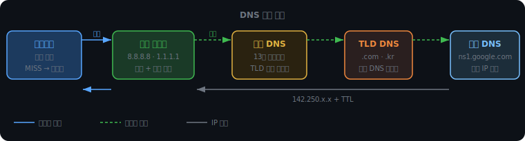
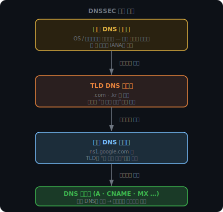

# DNS

HTTP 요청을 보내려면 IP 주소가 필요하다. 그런데 사람이 기억하는 건 `google.com` 같은 도메인이지, `142.250.196.46` 같은 숫자가 아니다. 이 간극을 메우는 것이 DNS(Domain Name System)다.

단순히 이름을 IP로 바꾸는 변환기처럼 보이지만, 실제로는 전 세계 수십억 개의 도메인 정보를 유지하는 분산 데이터베이스 시스템이다. 어떻게 단일 서버 없이 이 규모를 감당하는지가 DNS 설계의 핵심이다.

<br><br>

---

<br><br>

## google.com을 치면 무슨 일이 일어나는가

DNS만의 이야기가 아니라, 브라우저 주소창에서 서버에 도달하기까지의 전체 흐름을 먼저 잡아두는 게 좋다.

```
1. google.com 입력
   브라우저가 로컬 캐시를 확인한다.

2. DNS 서버 IP는 DHCP가 알려준다
   와이파이에 연결되는 순간, 공유기(또는 ISP)가 DHCP 응답으로
   내 IP 주소, 게이트웨이, DNS 서버 IP(예: 8.8.8.8)를 함께 전달한다.
   DNS 서버 주소는 도메인이 아닌 IP이므로 DNS 없이 접근 가능하다.

3. DNS 조회 (UDP)
   8.8.8.8에 UDP 패킷으로 "google.com IP 알려줘" 요청.
   응답으로 142.250.x.x 반환.

4. 그 IP로 연결
   google.com 웹페이지라면 TCP(HTTPS), 화상통화라면 UDP(WebRTC).
   어떤 프로토콜을 쓰는지는 서비스가 결정한다.

5. 라우터가 IP 헤더만 보고 포워딩
   중간 라우터들은 TCP/DNS 페이로드를 열지 않는다.
   IP 헤더의 목적지 주소만 보고 다음 홉으로 전달한다.
```

3번이 이 챕터의 주제다.

<br><br>

---

<br><br>

## DNS 조회 계층

DNS는 하나의 거대한 서버가 아니다. 책임을 계층으로 분산시킨 구조다.



### 로컬 캐시 확인

브라우저는 가장 먼저 자신의 메모리 캐시를 본다. 없으면 OS 캐시, 없으면 로컬 리졸버로 넘긴다.

### 로컬 리졸버 (Recursive Resolver)

8.8.8.8이나 1.1.1.1 같은 퍼블릭 DNS, 또는 ISP가 운영하는 DNS 서버다. 브라우저 입장에서는 여기에 물어보면 끝이다. 끝까지 알아봐 주는 대리인 역할이다.

전 세계 수십억 개의 DNS 요청을 단일 서버 하나로 처리할 수는 없다. 물리적으로 가까운 리졸버가 응답 속도를 줄이고, 리졸버마다 독립적으로 캐싱하므로 루트/TLD/권한 DNS의 부하도 분산된다.

### 루트 DNS

전 세계에 13개 클러스터(A~M)가 존재한다. `google.com`의 IP를 직접 알지는 못하지만, `.com`을 담당하는 TLD DNS 서버 주소를 안다. NS 레코드로 반환한다.

### TLD DNS

`.com`, `.kr`, `.net` 등 최상위 도메인별 서버다. `google.com`의 IP는 모르지만, 구글이 직접 운영하는 권한 DNS 서버(ns1.google.com)를 NS 레코드로 알려준다.

### 권한 DNS (Authoritative DNS)

여기에 실제 답이 있다. 구글이 직접 관리하는 서버로, `google.com = 142.250.x.x` 같은 최종 IP를 A 레코드로 반환한다.

<br><br>

### 재귀적 조회 vs 반복적 조회

두 방식의 차이는 "누가 다음 서버에 요청을 보내느냐"다.

재귀적 조회에서는 로컬 리졸버가 끝까지 책임진다. 브라우저는 리졸버에게 한 번만 물어보고 결과를 기다린다.

반복적 조회에서는 클라이언트가 직접 각 서버를 방문한다. 루트에서 "TLD 가봐", TLD에서 "권한 DNS 가봐"라는 답변을 받으며 클라이언트가 직접 순회한다.

실제 구현은 둘을 혼합해서 쓴다. 브라우저 ↔ 로컬 리졸버 구간은 재귀적이고, 로컬 리졸버가 루트/TLD/권한 DNS를 도는 구간은 반복적이다. 리졸버가 여러 사용자의 요청을 캐싱하면 루트 DNS 부하를 크게 줄일 수 있기 때문이다.

<iframe src="/DEV_LOG/Network/assets/demo_dns_query.html" width="100%" height="480px" style="border:none;border-radius:12px;display:block"></iframe>

<br><br>

---

<br><br>

## DNS 레코드 타입

권한 DNS는 IP만 저장하는 게 아니다. 도메인에 대한 여러 종류의 정보를 레코드 형태로 저장한다.

| 레코드 | 역할 | 예시 |
|--------|------|------|
| A | 도메인 → IPv4 | `google.com → 142.250.x.x` |
| AAAA | 도메인 → IPv6 | `google.com → 2607:f8b0::...` |
| CNAME | 도메인 → 도메인 (별명) | `www.google.com → google.com` |
| NS | 권한 DNS 서버 위치 | `google.com NS ns1.google.com` |
| MX | 이메일 수신 서버 | `example.com MX mail.example.com` |
| TXT | 자유 텍스트 | 도메인 소유권 인증, SPF 설정 |

CNAME은 실제 서비스에서 자주 쓰인다. 예를 들어 `shop.example.com`을 AWS 로드밸런서(`aws-lb-abc.amazonaws.com`)에 CNAME으로 연결해두면, AWS 쪽 IP가 바뀌어도 내가 건드릴 게 없다. 리졸버가 CNAME을 보면 한 번 더 조회해서 최종 IP를 찾아준다.

NS 레코드는 조회 흐름에서 이미 본 것과 같다. TLD DNS가 "이 도메인의 권한 DNS는 ns1.google.com이야"라고 알려줄 때 쓰는 레코드다.

MX의 숫자는 우선순위다. 숫자가 낮을수록 먼저 시도하며, 메인 서버가 다운되면 다음 MX 서버로 자동 전환된다.

<br><br>

---

<br><br>

## TTL과 캐싱

리졸버가 권한 DNS에서 IP를 받아올 때, IP만 오는 게 아니다.

```
google.com  A  142.250.x.x  TTL=300
```

TTL(Time To Live)은 이 캐시를 얼마나 신뢰할지를 초 단위로 알려준다. 300이면 5분 동안 이 IP를 그대로 쓰고, 이후엔 다시 권한 DNS에 물어봐야 한다.

TTL이 필요한 이유는 도메인의 IP가 바뀔 수 있기 때문이다. 서버를 이전하거나 CDN 엣지를 교체하면 IP가 달라진다. TTL 없이 영구 캐싱하면 전 세계 리졸버들이 틀린 IP를 가리키게 된다.

TTL 선택에는 트레이드오프가 있다. 값이 크면 권한 DNS 부하가 줄고 응답이 빠르지만, IP를 바꿨을 때 전파가 느리다. 서버 이전을 앞두고 TTL을 미리 줄여두는 이유가 여기 있다.

<iframe src="/DEV_LOG/Network/assets/demo_dns_ttl.html" width="100%" height="420px" style="border:none;border-radius:12px;display:block"></iframe>

<br><br>

---

<br><br>

## DNS 보안

### DNS Cache Poisoning

리졸버가 권한 DNS에 물어보는 사이, 공격자가 가짜 응답을 더 빠르게 보낼 수 있다.

```
리졸버: 권한 DNS야, google.com IP 알려줘
공격자: (권한 DNS보다 먼저) "google.com = 66.66.66.66 (피싱 서버)"
리졸버: (구분 못 하고) 캐싱
```

리졸버 캐시가 한 번 오염되면, 그 리졸버를 쓰는 수천만 명이 피싱 서버로 안내된다. 이것이 DNS Cache Poisoning이다.

막으려면 응답이 정말 권한 DNS에서 왔는지 검증해야 한다.

<br><br>

### DNSSEC

DNSSEC은 권한 DNS가 응답에 디지털 서명을 붙이는 방식이다. TLS에서 CA가 인증서에 서명하는 것과 같은 원리다.

```
권한 DNS: "google.com = 142.250.x.x"
          + [개인키로 만든 서명]

리졸버: 서명을 공개키로 검증 → 해시 일치? 신뢰 / 불일치? 버림
```

공격자는 개인키 없이 서명을 위조할 수 없다. 가짜 응답을 보내도 검증에서 걸린다.

그렇다면 공개키 자체가 가짜이면? 이를 막기 위해 신뢰 체인을 구성한다.



루트 DNS의 공개키는 OS와 브라우저에 하드코딩되어 있다. 루트가 TLD의 공개키를 서명으로 보증하고, TLD가 권한 DNS의 공개키를 서명으로 보증한다. 루트 하나만 신뢰하면 체인 전체가 검증된다.

단점이 있다. DNSSEC을 적용하면 응답에 서명과 공개키가 붙어 크기가 크게 늘어난다. UDP 512바이트 한계를 넘으면 TC 플래그가 세팅되고 TCP로 재요청해야 한다. 검증 연산 비용도 추가된다. 이 오버헤드 때문에 아직 보급률이 낮다.

<br><br>

---

<br><br>

## Round Robin DNS

하나의 도메인에 IP를 여러 개 등록하면, 리졸버가 요청마다 순서를 바꿔가며 반환한다.

```
google.com  A  142.250.1.1
google.com  A  142.250.1.2
google.com  A  142.250.1.3
```

첫 번째 요청자는 .1.1, 두 번째는 .1.2, 세 번째는 .1.3 — 트래픽이 분산된다. 별도 장비 없이 DNS 레벨에서 구현하는 단순한 로드밸런싱이다.

치명적인 약점이 있다. DNS는 서버가 살아 있는지 모른다. 세 대 중 한 대가 다운돼도 DNS는 그 IP를 계속 반환한다. 그리고 이미 캐싱된 IP는 TTL이 만료될 때까지 정정되지 않는다.

그래서 실제 서비스는 Round Robin DNS를 단독으로 쓰지 않는다. 뒤에 Health Check 기능이 있는 로드밸런서를 붙여서 죽은 서버로의 트래픽을 차단한다.

<br><br>

---

<br><br>

`142.250.x.x`라는 IP 주소가 어떤 규칙으로 만들어졌는지, 그리고 라우터가 이 숫자만 보고 전 세계 어느 서버로든 패킷을 보낼 수 있는 원리가 다음 주제다.
