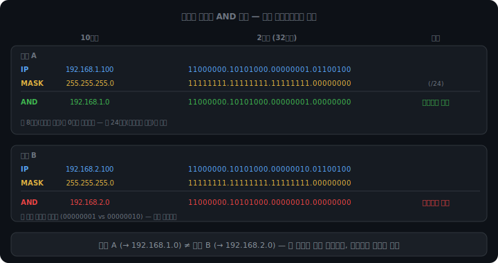
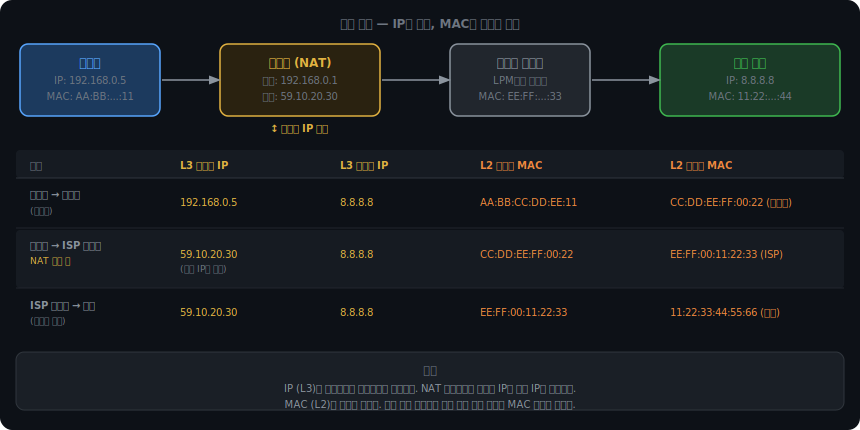
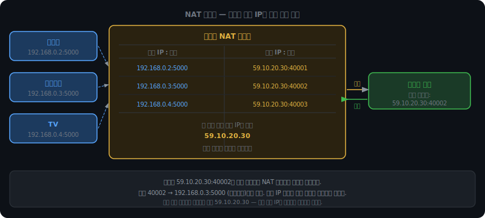
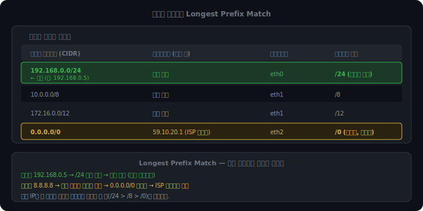
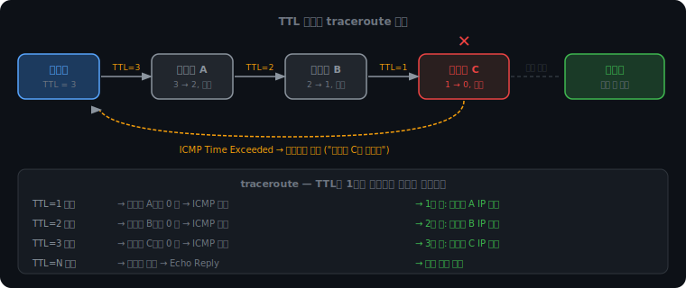

# IP 주소체계와 라우팅

인터넷에서 메시지를 보내려면 두 가지가 필요하다. 상대방이 어디 있는지 알아야 하고, 거기까지 어떻게 가는지 알아야 한다. IP 주소체계는 전자를, 라우팅은 후자를 담당한다.

TCP와 UDP는 연결 품질과 전송 신뢰성을 책임지지만, 그 아래에서 패킷이 실제로 어디로 가야 하는지를 결정하는 것은 IP 레이어의 일이다. 이 챕터는 그 기반 구조를 다룬다.

<br><br>

## IPv4 주소 구조

### 32비트라는 설계

IPv4 주소는 32비트다. 우리가 보는 `192.168.0.1` 형식은 32비트를 8비트씩 4덩어리로 나눠 10진수로 표현한 것이다. 각 덩어리가 0~255 범위를 가지는 이유가 여기 있다.

```
192      .   168      .   0        .   1
11000000 . 10101000  . 00000000  . 00000001
```

전체 주소 공간은 2³² = 4,294,967,296개, 약 43억 개다.

1983년 인터넷 설계 당시에는 이 정도면 충분할 것으로 봤다. 인터넷에 연결된 컴퓨터가 수백만 대 수준이었고, 네트워크는 주로 대학과 연구기관의 전유물이었다.

그 예측은 완전히 빗나갔다.

스마트폰 보급으로 모든 사람이 손에 기기를 하나씩 들게 됐고, IoT가 확산되면서 냉장고와 전구도 IP 주소를 원하게 됐다. 전 세계 인구가 80억인데 43억 개의 주소로는 모든 기기를 수용할 수 없다.

### 예약 대역

43억이라는 숫자도 실제로는 그대로 쓸 수 없다. 일부 대역이 특수 목적으로 묶여 있기 때문이다.

| 대역 | 용도 |
|------|------|
| 10.0.0.0/8 | 사설 IP |
| 172.16.0.0/12 | 사설 IP |
| 192.168.0.0/16 | 사설 IP |
| 127.0.0.0/8 | 루프백 (자기 자신) |
| 0.0.0.0/8 | 미지정 주소 |
| 255.255.255.255 | 브로드캐스트 |

사설 IP 대역이 핵심이다. 이 주소들은 전 세계가 약속해서 인터넷 라우팅에 쓰지 않는 주소다. 전 세계 어느 집에서나 `192.168.0.1`을 공유기 주소로 써도 충돌이 없는 이유가 이것이다. 어차피 그 주소는 외부로 나가지 않는다.

### IPv6

주소 부족 문제를 근본적으로 해결하기 위해 나온 것이 IPv6다. 128비트를 사용해 2¹²⁸개의 주소를 제공한다. 지구의 모래알 수보다 많다.

```
2001:0db8:85a3:0000:0000:8a2e:0370:7334
```

그런데 IPv6가 등장한 지 30년이 넘었는데도 인터넷의 상당 부분이 여전히 IPv4를 쓴다. 이유는 뒤에 나올 NAT 덕분에 IPv4의 수명이 크게 연장됐기 때문이다.

<br><br>

## 루프백과 DHCP

### 루프백 — 자기 자신에게 보내기

서버 개발을 할 때 브라우저에서 `http://localhost:8080`에 접속하면 내가 방금 실행한 서버에 연결된다. 이 동작이 가능한 이유가 루프백 인터페이스다.

`127.0.0.1`(또는 `localhost`)로 보내는 패킷은 실제 네트워크 카드(NIC) 바깥으로 나가지 않는다. OS는 NIC 외에 `lo`라는 가상 네트워크 인터페이스를 하나 더 갖고 있다. 커널이 패킷의 목적지를 보고 `127.x.x.x`이면 NIC 대신 `lo`로 방향을 꺾는다.

```
앱 A (클라이언트)
  ↓ 소켓 write
커널 네트워크 스택
  ↓ "목적지 127.0.0.1 — NIC로 내보내지 않음"
lo (가상 인터페이스, 소프트웨어로만 존재)
  ↓ 루프백
커널 네트워크 스택
  ↓
앱 B (서버, localhost:8080 리슨 중)
```

물리 케이블을 타지 않으니 당연히 네트워크 연결이 없어도 동작한다. 속도도 물리 네트워크보다 빠르다. 같은 기기 안에서 두 프로세스가 소켓으로 통신할 때도 이 경로를 탄다.

### DHCP — IP 주소 자동 배정

IP 주소가 기기마다 수동으로 설정해야 한다고 생각해보자. 회사 건물에 직원 수백 명이 각자 노트북을 들고 다니는데, IT 팀이 사람마다 앉아서 IP를 입력해줘야 한다. 충돌이 생기지 않도록 대장도 따로 관리해야 한다. 현실적으로 불가능하다.

DHCP(Dynamic Host Configuration Protocol)는 이 과정을 자동화한다. 기기가 네트워크에 연결될 때 DHCP 서버(보통 공유기)에게 주소를 요청하고 받는다.

```
기기:   "나 IP 필요해" (브로드캐스트 — IP 없으니 어디로 보낼지 모름)
공유기: "192.168.0.5 써. 유효기간 24시간. 게이트웨이는 192.168.0.1"
기기:   "알겠어"
공유기: "기록해뒀음"
```

DHCP는 IP 주소뿐 아니라 게이트웨이 주소와 DNS 서버 주소도 함께 전달한다. 스마트폰이 와이파이에 연결되는 순간 인터넷을 바로 쓸 수 있는 이유가 이 세 가지를 한 번에 받기 때문이다.

임대 시간이 있으므로 IP 주소는 바뀔 수 있다. 같은 스마트폰이어도 껐다 켜면 다른 IP를 받을 수 있다. 항상 같은 IP가 필요한 서버는 수동으로 고정 IP를 설정하거나, DHCP 서버에서 MAC 주소를 보고 항상 같은 IP를 주도록 예약한다.

IP 주소는 논리적 주소라 바뀔 수 있는 반면, NIC에 하드웨어로 박힌 MAC 주소는 변하지 않는다. 이 차이가 ARP가 필요한 이유다.

<br><br>

## 서브넷 마스크와 CIDR

### 왜 네트워크를 나누는가

인터넷에 연결된 기기가 수십억 대인데, 이 모든 기기가 하나의 거대한 네트워크에 들어있다고 생각해보자. 누군가가 패킷을 전송할 때마다 브로드캐스트로 "이 IP 누구야?" 하면, 수십억 기기가 동시에 그 신호를 수신하게 된다. 네트워크는 그 즉시 마비된다.

네트워크를 잘게 나누는 이유가 여기 있다. 브로드캐스트 신호가 닿는 범위(브로드캐스트 도메인)를 제한하면, 집 안 기기들끼리만 브로드캐스트를 주고받고 그 신호가 인터넷으로 나가지 않는다.

서브넷 마스크는 IP 주소 안에서 "어디까지가 네트워크 식별자이고, 나머지가 기기 식별자냐"를 정의하는 도구다.

### 두 가지 정보가 섞인 IP 주소

`192.168.1.100`이라는 주소 하나에는 두 개의 정보가 들어 있다.

- 네트워크 부분 — 어느 네트워크에 속해 있냐
- 호스트 부분 — 그 네트워크 안에서 어느 기기냐

서브넷 마스크 `255.255.255.0`을 이진수로 보면 구조가 보인다.

```
255.255.255.0
= 11111111.11111111.11111111.00000000
```

1이 24개, 0이 8개. 앞 24비트가 네트워크 부분, 뒤 8비트가 호스트 부분이다.

### AND 연산으로 네트워크 주소 추출

IP 주소와 서브넷 마스크를 AND 연산하면 네트워크 주소만 남는다. 1인 자리는 IP 값을 그대로 통과시키고, 0인 자리는 강제로 0으로 날린다.

```
IP:     192.168.1.100
MASK:   255.255.255.0  (/24)
AND:    192.168.1.0    ← 이 기기가 속한 네트워크 주소
```

```
IP:     192.168.2.100
MASK:   255.255.255.0  (/24)
AND:    192.168.2.0    ← 다른 네트워크 주소
```

결과가 `192.168.1.0`과 `192.168.2.0`으로 다르다. 두 기기는 다른 네트워크이므로, 서로 직접 통신할 수 없고 라우터를 거쳐야 한다.



### CIDR 표기법

서브넷 마스크를 매번 `255.255.255.0`으로 쓰는 건 번거롭다. CIDR(Classless Inter-Domain Routing) 표기법은 앞 몇 비트가 네트워크 부분인지를 슬래시 뒤에 바로 쓴다.

```
192.168.1.0/24   → 앞 24비트 네트워크, 뒤 8비트 호스트 → 호스트 2⁸ = 256개
10.0.0.0/8       → 앞 8비트 네트워크, 뒤 24비트 호스트 → 호스트 2²⁴ = 1600만개
172.16.0.0/12    → 앞 12비트 네트워크, 뒤 20비트 호스트 → 호스트 2²⁰ = 100만개
```

실제 사용 가능한 호스트 수는 2개를 뺀다. 네트워크 주소(전부 0)와 브로드캐스트 주소(전부 1)는 기기에 할당할 수 없다.

<br><br>

## 패킷이 목적지에 닿기까지

노트북(`192.168.0.5`)에서 구글(`8.8.8.8`)로 패킷을 보낼 때 어떤 일이 일어나는지, 레이어별로 정확하게 따라가본다.



### 1단계 — 목적지가 같은 네트워크인가

OS가 가장 먼저 하는 일이다. `8.8.8.8`과 내 IP `192.168.0.5`를 서브넷 마스크 `255.255.255.0`으로 각각 AND한다.

```
192.168.0.5  AND 255.255.255.0  =  192.168.0.0  (내 네트워크)
8.8.8.8      AND 255.255.255.0  =  8.8.8.0      (목적지 네트워크)
```

결과가 다르다. 다른 네트워크이므로 내가 직접 전달할 수 없다. 게이트웨이(공유기)에 넘겨야 한다.

### 2단계 — 공유기 MAC 주소 획득 (ARP)

패킷을 공유기로 보내려면 공유기의 MAC 주소가 필요하다. IP 주소는 L3 개념이지만, 이더넷 프레임을 만드는 것은 L2 작업이기 때문이다.

ARP 캐시에 공유기 MAC이 있으면 그걸 쓰고, 없으면 ARP Request를 브로드캐스트로 날려 공유기 MAC을 받아온다.

### 3단계 — 이더넷 프레임 전송

L2와 L3 헤더가 만들어진다. 여기서 핵심이 있다.

```
L3 (IP 헤더):  출발지 = 192.168.0.5   목적지 = 8.8.8.8
L2 (이더넷):   출발지 = 노트북 MAC     목적지 = 공유기 MAC
```

IP 목적지는 최종 목적지(구글)이지만, MAC 목적지는 바로 다음 홉(공유기)이다. 이 두 레이어가 가리키는 곳이 다른 것은 설계상 의도적이다. IP는 전체 여정, MAC은 한 홉만 본다.

### 4단계 — 공유기에서 NAT 변환

공유기가 프레임을 받는다. IP 헤더를 열어보면 출발지가 사설 IP `192.168.0.5`다. 이 주소는 인터넷에서 라우팅되지 않으므로, 공유기가 공인 IP로 교체한다.

```
변환 전: 출발지 = 192.168.0.5:5000
변환 후: 출발지 = 59.10.20.30:40001
```

이 변환 정보를 NAT 테이블에 기록한다. 나중에 구글의 응답이 `59.10.20.30:40001`로 오면, 이 테이블을 역으로 조회해서 원래 기기(`192.168.0.5:5000`)에 전달한다.

### 5~7단계 — 인터넷을 가로지르는 라우팅

공유기는 라우팅 테이블을 보고 이 패킷을 ISP 라우터로 넘긴다. ISP 라우터는 또 자신의 라우팅 테이블을 보고 다음 라우터로 넘긴다. 이 과정이 수십 번 반복된다.

각 홉에서 L2 프레임은 다시 만들어진다. MAC 주소가 다음 라우터 것으로 바뀌는 것이다. 하지만 L3 IP 헤더의 목적지는 `8.8.8.8` 그대로 유지된다. MAC은 홉마다 바뀌고, IP는 끝까지 유지된다.

### 8단계 — 응답이 돌아오는 길

구글이 응답을 보낼 때 목적지는 `59.10.20.30:40001`이다. 구글은 사설 IP를 모른다. 공유기까지 도달한 응답을 공유기가 NAT 테이블을 역조회해서 `192.168.0.5`에게 전달한다.

<br><br>

## ARP

### 왜 MAC 주소가 필요한가

"IP 주소만 쓰면 되는데 왜 MAC 주소가 따로 있는가"라는 질문이 자연스럽다.

IP 주소는 논리적 주소다. 네트워크에 접속할 때마다 바뀔 수 있고, 같은 기기도 와이파이를 바꾸면 다른 IP를 받는다. 반면 MAC 주소는 NIC 제조 당시 하드웨어에 새겨지는 물리적 주소다.

이더넷 스위치는 IP를 모른다. 스위치는 L2 장비이기 때문에 MAC 주소만 보고 어느 포트로 프레임을 내보낼지 결정한다. IP는 L3 이상에서만 의미가 있다.

즉, 물리 네트워크 위에서 실제로 전기 신호를 전달하려면 반드시 MAC 주소가 필요하다. IP만으로는 실제 전선 위에서 프레임을 전달할 수 없다.

### 닭달걀 문제와 해결

MAC 주소를 모르는데 어떻게 MAC 주소를 물어보는 프레임을 보낼 수 있을까.

이더넷에는 특수 목적의 브로드캐스트 MAC 주소가 있다.

```
FF:FF:FF:FF:FF:FF
```

이 주소를 목적지 MAC으로 설정한 프레임은 같은 네트워크의 모든 기기가 수신한다. 스위치가 이 주소를 보면 연결된 모든 포트로 프레임을 내보낸다.

```
ARP Request (브로드캐스트):
  출발지 MAC: AA:BB:CC:DD:EE:11  (노트북 MAC)
  목적지 MAC: FF:FF:FF:FF:FF:FF  (전체)
  내용:       "192.168.0.1을 쓰는 기기야, 네 MAC 주소 알려줘"

공유기(192.168.0.1):  "저 요청 내 것이네"
스마트폰(192.168.0.3): "내 것 아니네, 무시"
TV(192.168.0.4):      "내 것 아니네, 무시"

ARP Reply (유니캐스트):
  출발지 MAC: BB:CC:DD:EE:FF:22  (공유기 MAC)
  목적지 MAC: AA:BB:CC:DD:EE:11  (노트북에게만)
  내용:       "나야, MAC은 BB:CC:DD:EE:FF:22"
```

응답은 유니캐스트다. 요청한 기기에게만 직접 보낸다.

### ARP 캐시

매 패킷마다 ARP를 하면 비효율적이다. OS는 받은 MAC 주소를 ARP 캐시에 저장한다. 다음에 같은 IP로 보낼 때 캐시를 먼저 확인하고, 있으면 ARP 없이 바로 사용한다. 캐시에는 만료 시간이 있어 오래된 항목은 자동으로 삭제된다.

터미널에서 `arp -a`를 실행하면 현재 ARP 캐시를 볼 수 있다. 공유기의 IP와 MAC이 이미 등록되어 있을 것이다.

### 다른 네트워크로 갈 때

목적지가 다른 네트워크라면, 목적지 기기의 MAC이 아닌 게이트웨이(공유기)의 MAC을 ARP로 묻는다.

ARP Request는 브로드캐스트이기 때문에 같은 네트워크 밖으로 나가지 못한다. 라우터는 브로드캐스트를 차단한다. 다른 네트워크에 있는 기기 MAC을 직접 물을 방법이 없다.

그래서 OS의 판단은 이렇다.

```
목적지가 다른 네트워크
  → 내가 직접 보낼 수 없음
  → 게이트웨이한테 넘겨야 함
  → 게이트웨이 MAC을 ARP로 물어봄
  → 프레임: 목적지 MAC = 공유기, 목적지 IP = 최종 목적지
```

IP 목적지와 MAC 목적지가 다른 것은 이 때문이다.

<iframe src="/DEV_LOG/Network/assets/demo_arp.html" width="100%" height="420px" style="border:none;border-radius:12px;display:block"></iframe>

<br><br>

## NAT

### 주소 부족 문제를 우회하는 방법

공인 IP가 43억 개인데 세상의 기기는 그보다 많다. 이 문제를 근본 해결하려면 IPv6로 전환해야 하지만, 전 세계 네트워크 장비를 동시에 바꾸는 건 사실상 불가능하다.

NAT(Network Address Translation)는 이 문제를 우회하는 현실적인 방법이다. 아이디어는 단순하다. 집 안 기기들은 사설 IP를 쓰되, 인터넷으로 나갈 때만 공유기의 공인 IP로 교체하는 것이다.

### 포트로 기기를 구분하는 방법

공인 IP가 하나면 응답이 왔을 때 어느 기기에게 줘야 하는지 어떻게 아는가.

이때 쓰는 것이 포트 번호다. 공유기는 기기마다 다른 포트 번호를 배정해 NAT 테이블에 기록한다.

```
내부 (사설 IP:포트)         외부 (공인 IP:포트)
192.168.0.2:5000     ↔    59.10.20.30:40001
192.168.0.3:5000     ↔    59.10.20.30:40002
192.168.0.4:5000     ↔    59.10.20.30:40003
```

IP는 같지만 포트가 다르다. 구글에서 응답이 `59.10.20.30:40002`로 오면, 공유기는 테이블에서 이 포트를 찾아 `192.168.0.3`(스마트폰)에게 전달한다.



### NAT의 한계 — 외부에서 먼저 연결할 수 없다

NAT가 편리하지만 근본적인 제약이 하나 있다. 외부에서 먼저 사설 IP 기기로 연결을 시작할 수 없다.

공유기의 NAT 테이블은 내부 기기가 요청을 보낼 때 항목이 생성된다. 외부에서 갑자기 `59.10.20.30:50000`으로 패킷이 오면, 공유기는 이 포트에 해당하는 테이블 항목이 없으니 어디로 전달해야 할지 모른다.

이 때문에 집 서버, 게임 서버, P2P 통신이 까다로워진다. 일반적인 해결 방법은 포트 포워딩이다. 공유기 설정에서 특정 포트로 오는 트래픽을 항상 특정 사설 IP로 전달하도록 고정하는 것이다.

NAT 덕분에 IPv4가 지금까지 버틸 수 있었지만, NAT가 초래하는 복잡성이 IPv6 전환을 오히려 늦추는 역설적인 상황이 됐다.

<iframe src="/DEV_LOG/Network/assets/demo_nat.html" width="100%" height="480px" style="border:none;border-radius:12px;display:block"></iframe>

<br><br>

## 라우팅

### 라우터는 어떻게 경로를 아는가

패킷이 집 공유기를 떠나 구글까지 가는 동안 수십 개의 라우터를 거친다. 각 라우터는 패킷을 받을 때마다 "이걸 어느 방향으로 내보낼까"를 결정한다. 이 결정의 근거가 라우팅 테이블이다.

```
목적지 네트워크      게이트웨이 (다음 홉)    인터페이스
192.168.0.0/24    직접 연결              eth0  ← 같은 네트워크, 바로 전달
10.0.0.0/8        직접 연결              eth1
0.0.0.0/0         59.10.20.1 (ISP)      eth2  ← 나머지 전부
```

라우팅 테이블의 각 행이 하나의 규칙이다. 목적지 IP와 규칙을 비교해서 매칭되는 것을 찾는다.

### 디폴트 라우트

인터넷에 존재하는 모든 네트워크 주소를 테이블에 담는 것은 불가능하다. 라우팅 테이블이 무한히 커야 한다.

그래서 `0.0.0.0/0`이라는 특수 규칙을 둔다. 비트 길이가 0이므로, 어떤 IP든 이 규칙에는 반드시 매칭된다. 다른 어떤 규칙에도 걸리지 않을 때 최후의 수단으로 사용한다. 이것이 디폴트 라우트다.

집 공유기의 디폴트 라우트는 ISP 라우터를 가리킨다. 공유기는 집 안 네트워크(`192.168.0.0/24`)만 자기가 직접 처리하고, 나머지는 ISP한테 던진다. ISP 라우터는 더 많은 네트워크를 알고 있고, 모르는 건 또 그 위의 라우터에게 던진다.

### Longest Prefix Match — 더 구체적인 규칙이 이긴다

목적지 IP가 여러 규칙에 동시에 매칭될 수 있다. 예를 들어 `192.168.0.5`는 `192.168.0.0/24`에도 걸리고 `0.0.0.0/0`에도 걸린다.

이때는 프리픽스 길이가 긴 규칙, 즉 더 구체적인 규칙이 우선한다.

```
목적지: 192.168.0.5

  192.168.0.0/24   매칭  (프리픽스 길이 24)
  0.0.0.0/0        매칭  (프리픽스 길이 0)

  → /24가 더 길다 → 192.168.0.0/24 규칙 사용
```

직관적으로 이해하면, 길이가 길수록 더 좁은 범위를 가리킨다. `/24`는 256개의 주소에만 해당되지만, `/0`은 모든 주소에 해당된다. 더 좁은 범위를 가리키는 규칙이 더 정확한 경로를 갖고 있으므로 우선하는 것이다.



<br><br>

## TTL과 ICMP

### 라우팅 루프가 왜 생기는가

각 라우터는 독립적으로 자신의 라우팅 테이블을 갖는다. 이 테이블은 정적으로 설정되거나, 인접 라우터들과 정보를 주고받아 동적으로 업데이트된다.

문제는 이 업데이트가 동시에 일어나지 않는다는 것이다. 네트워크 장애가 발생하거나, 라우터 설정이 잘못되거나, 업데이트 전파 중에 잠시 불일치가 생기면 루프가 형성될 수 있다.

```
라우터 A의 테이블: "8.8.8.8은 라우터 B로"
라우터 B의 테이블: "8.8.8.8은 라우터 C로"
라우터 C의 테이블: "8.8.8.8은 라우터 A로"  ← 잘못된 상태
```

이 상태에서 `8.8.8.8`로 향하는 패킷이 오면, A → B → C → A → B → C → ... 무한 반복된다.

루프가 생긴 패킷은 스스로 멈추지 않는다. 아무도 폐기하지 않으면 영원히 돌아다니며 대역폭을 소모한다. 이런 패킷이 하나만 있어도 문제가 크지 않지만, 여러 패킷이 루프에 빠지면 대역폭이 순식간에 포화된다. 실제로 초기 인터넷에서 이런 문제가 심각했다.

### TTL — 수명이 있는 패킷

TTL(Time To Live)은 IP 헤더에 있는 1바이트 숫자 필드다. 패킷이 라우터를 하나 통과할 때마다 이 숫자가 1 감소한다. 그리고 0이 되면 그 라우터가 패킷을 폐기한다.

```
출발 시 TTL = 64

라우터 A: TTL 64 → 63  (전달)
라우터 B: TTL 63 → 62  (전달)
...
라우터 X: TTL 1  → 0   (폐기! ICMP 메시지 출발지로 전송)
```

루프를 감지해서 끊는 것이 아니다. 그냥 최대 홉 수를 제한하는 것이다. 루프에 빠진 패킷도 결국 TTL이 0이 되면 사라진다.

TTL 초기값은 OS마다 다르게 설정한다.

| OS | 기본 TTL |
|----|---------|
| Linux | 64 |
| Windows | 128 |
| Cisco 라우터 | 255 |

초기값이 다른 이유는 역사적 관례다. `ping` 결과에서 TTL 값을 보면 상대방 OS를 추정할 수 있다. 내가 `ping`을 쳤을 때 TTL이 55로 돌아오면, 목적지가 Linux(초기값 64)이고 9홉 거리에 있다는 뜻이다.

### ICMP — 네트워크 상태 메시지 프로토콜

TTL이 0이 된 라우터는 패킷을 폐기하고 출발지에 알림을 보낸다. 이 알림을 전달하는 프로토콜이 ICMP(Internet Control Message Protocol)다.

ICMP는 TCP나 UDP와 같은 레벨의 L3 프로토콜이지만, 성격이 완전히 다르다. TCP/UDP가 애플리케이션 데이터를 전달하기 위한 프로토콜이라면, ICMP는 네트워크 장치들이 서로 상태를 알리기 위한 프로토콜이다.

주요 ICMP 메시지 타입:

| 타입 | 이름 | 의미 |
|------|------|------|
| 0 | Echo Reply | ping 응답 |
| 3 | Destination Unreachable | 목적지 도달 불가 |
| 8 | Echo Request | ping 요청 |
| 11 | Time Exceeded | TTL이 0이 돼서 패킷 폐기 |

`ping`은 Echo Request(타입 8)를 보내고 Echo Reply(타입 0)를 기다리는 것이다. 목적지가 살아있으면 Reply가 오고, 없으면 오지 않거나 Destination Unreachable이 온다.

ICMP는 IP 헤더 안에 감싸여 전달된다. IP 프로토콜 번호 필드가 1이면 ICMP 패킷이다.

### traceroute — TTL을 역이용한 경로 탐색

ICMP Time Exceeded의 특성을 활용하면 패킷이 지나는 경로를 알 수 있다. TTL이 0이 된 라우터가 자신의 IP 주소를 담아 출발지에 ICMP를 보내기 때문이다.

traceroute는 이것을 역이용한다. TTL을 1부터 시작해서 하나씩 늘려가며 패킷을 보낸다.

```
TTL = 1:
  패킷이 첫 번째 라우터(공유기)에서 TTL=0
  → 공유기가 ICMP Time Exceeded 반환 → "1번 홉: 192.168.0.1"

TTL = 2:
  첫 번째 라우터는 통과, 두 번째 라우터에서 TTL=0
  → 두 번째 라우터가 ICMP Time Exceeded 반환 → "2번 홉: 59.10.20.1"

TTL = 3:
  두 번째까지 통과, 세 번째에서 TTL=0
  → ...

TTL = N:
  패킷이 목적지까지 도달
  → 목적지가 Echo Reply 반환 → 경로 탐색 완료
```

결과는 이렇게 보인다.

```
$ traceroute 8.8.8.8

1  192.168.0.1      1 ms   (공유기)
2  59.10.20.1       5 ms   (ISP 라우터)
3  112.188.10.1     8 ms
4  * * *                   (ICMP 차단 라우터)
5  72.14.209.81    30 ms
6  8.8.8.8         31 ms   (목적지)
```

4번 홉이 `* * *`인 것은, 이 라우터가 보안 정책으로 ICMP 응답을 차단하기 때문이다. 패킷은 실제로 이 라우터를 통과했지만, 라우터가 Time Exceeded 메시지를 출발지로 보내지 않는다. traceroute 입장에선 응답이 없으니 타임아웃이 난 것으로 표시한다.

traceroute가 실용적으로 쓰이는 상황은, "특정 서버가 느리거나 응답이 없을 때" 어느 구간에서 지연이 발생하는지 진단하는 것이다. 각 홉의 응답 시간을 보면 문제 구간이 내 네트워크인지, ISP 내부인지, 서버 근처인지 알 수 있다.


