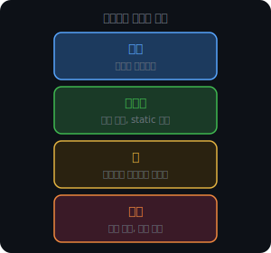
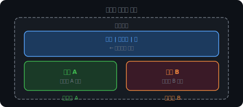
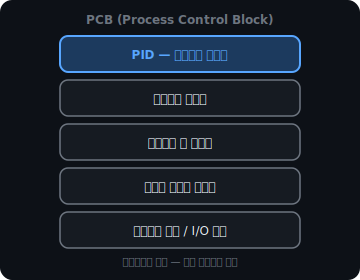
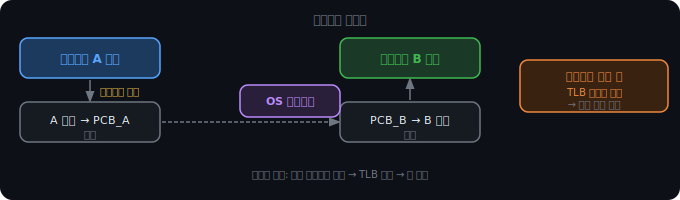
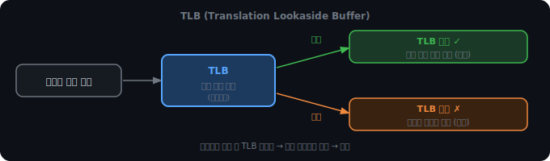
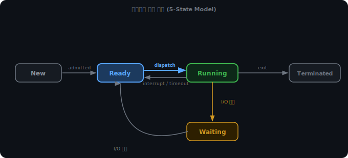
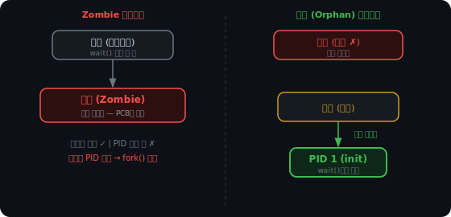

# 프로세스와 스레드, 그리고 컨텍스트 스위칭

# 프로그램이 실행된다는 것

프로그램을 실행하면 운영체제는 그 프로그램을 메모리에 올린다. 이 순간부터 그 프로그램은 프로세스가 된다.

각 프로세스는 네 가지 메모리 영역을 독립적으로 가진다.

여기서 핵심은 독립적으로라는 부분이다.

크롬을 열면 탭마다 별도 프로세스가 뜨는데, 어느 탭이 죽어도 다른 탭이 살아있는 이유가 이것이다. 프로세스들은 서로의 메모리를 건드릴 수 없다.

## 왜 격리가 가능한가

각 프로세스는 자신이 메모리 전체를 독점하고 있다고 착각한다. 운영체제가 페이징을 통해 가상 주소를 실제 물리 주소로 매핑해주기 때문이다.

같은 가상 주소라도 프로세스마다 다른 물리 메모리를 가리킨다. 충돌이 없다.

 

 

 

---

 

 

 

# 스레드는 왜 나왔는가

프로세스가 독립적이고 안전하다면 다 프로세스로 만들면 되지 않을까. 문제는 두 가지다.

- 프로세스 간 통신이 비싸다. 격리된 만큼 정보를 주고받으려면 운영체제를 거쳐야 한다.
- 새 프로세스를 만드는 것 자체가 무겁다.

그래서 나온 것이 스레드다. 프로세스 안에서 실행되는 더 작은 실행 단위로, 일부 메모리를 함께 쓴다.

스택을 독립으로 두는 이유가 있다. 스레드마다 자신만의 함수 호출 흐름이 있기 때문이다. A 스레드가 `func1()`을 호출하는 동안 B 스레드는 `func2()`를 호출할 수 있어야 한다. 스택을 공유하면 이게 불가능하다.

코드, 데이터, 힙을 공유한다는 건 스레드들이 같은 변수, 같은 객체를 바라본다는 뜻이다. 통신이 빠르고 메모리도 아낄 수 있다. 대신 이 공유된 자원에 여러 스레드가 동시에 접근하면 문제가 생긴다. 이건 다음 챕터에서 다룬다.

 

 

 

---

 

 

 

# 컨텍스트 스위칭

CPU는 한 번에 하나의 프로세스만 실행한다. 그런데 우리는 여러 프로그램이 동시에 돌아가는 것처럼 느낀다. CPU가 매우 빠르게 실행 대상을 바꾸기 때문이다. 이 전환 과정을 컨텍스트 스위칭이라고 한다.

전환할 때 운영체제는 현재 프로세스의 상태를 PCB(Process Control Block)에 저장한다. PCB는 커널 메모리에 존재하는 자료구조로, 프로세스 하나당 하나씩 만들어진다.

프로세스를 바꿀 때는 현재 프로세스의 PCB를 저장하고, 다음 프로세스의 PCB를 불러온다. 이 저장과 복원 자체가 비용이다.

## 프로세스 스위칭이 스레드 스위칭보다 비싼 이유

PCB 저장/복원만으로도 비용인데, 프로세스 전환에는 추가 비용이 하나 더 있다. TLB 때문이다.

TLB(Translation Lookaside Buffer)는 가상 주소 → 물리 주소 변환을 캐싱하는 하드웨어다. 메모리에 접근할 때마다 페이지 테이블 전체를 뒤지면 느리니까, 자주 쓰는 변환 결과를 TLB에 올려두고 빠르게 조회한다.

프로세스를 바꾸면 이전 TLB 내용이 쓸모없어진다. 프로세스마다 가상 주소 공간이 다르기 때문이다. TLB를 비워야 하고, 이후 새 프로세스가 메모리에 접근할 때마다 TLB 미스가 연속으로 발생한다.

스레드는 다르다. 같은 프로세스 안에 있으니 주소 공간을 공유한다. TLB를 비울 필요가 없다. 스택 포인터와 레지스터만 교체하면 된다.

참고로 최신 CPU 일부는 ASID(Address Space Identifier)라는 태그를 TLB 항목에 붙여서 프로세스 전환 시에도 TLB를 완전히 비우지 않는 방식을 쓴다. 프로세스가 바뀌어도 다른 프로세스의 TLB 항목과 구분할 수 있기 때문이다. 다만 이는 하드웨어 지원이 필요하고, 모든 환경에서 쓸 수 있는 방식은 아니다.

 

 

 

---

 

 

 

# 프로세스의 생애

프로세스는 생성부터 종료까지 다섯 가지 상태를 오간다.

New는 프로세스가 생성 중인 상태다. 아직 Ready 큐에 올라가지 않았다.

Ready는 CPU를 받을 준비가 된 상태다. 실행할 수 있지만 CPU가 배정되지 않아 기다리고 있다.

Running은 CPU를 점유해 명령을 실행하는 상태다.

Waiting은 I/O나 이벤트를 기다리는 상태다. CPU를 줘도 아무것도 할 수 없다. read() 시스템 콜로 파일을 읽으면, 디스크 컨트롤러가 데이터를 가져오는 동안 프로세스는 Waiting 상태가 된다. CPU는 다른 프로세스를 실행하러 간다. 완료되면 컨트롤러가 인터럽트로 알리고, 커널이 이 프로세스를 다시 Ready로 올린다.

Terminated는 실행이 끝난 상태다. 자원은 거의 다 해제됐지만 PCB가 남아있다.

Ready와 Waiting은 둘 다 CPU를 받지 못하지만 이유가 다르다. Ready는 CPU만 있으면 바로 실행 가능하다. Waiting은 I/O 결과가 없으면 CPU가 있어도 진행할 수 없다.

 

## Terminated가 즉시 사라지지 않는 이유

프로세스가 종료되면 메모리, 파일 디스크립터 같은 자원은 즉시 해제된다. 그런데 PCB는 남는다. 종료 코드(exit code)를 보관하기 위해서다.

부모 프로세스는 wait() 시스템 콜로 자식의 exit code를 수거한다. 부모가 wait()을 호출하기 전까지 자식의 PCB는 커널에 남아있어야 한다. 이 상태가 Terminated다. 부모가 wait()을 호출하면 PCB가 완전히 제거되고 프로세스가 소멸한다.

 

## Zombie와 고아

부모가 wait()을 호출하지 않으면 자식의 PCB가 계속 쌓인다. 이것이 Zombie 프로세스다. PCB는 수 KB에 불과해서 메모리 낭비보다 PID 고갈이 진짜 문제다. Linux 기본값에서 PID는 최대 32768개다. Zombie가 쌓이면 새 프로세스를 만들 수 없게 된다.

반대로 자식이 살아있는데 부모가 먼저 죽으면 고아(Orphan) 프로세스가 된다. OS는 이 고아를 PID 1(init/systemd)에 즉시 재입양한다. init은 설계상 자식 프로세스를 지속적으로 wait()하는 구조라서, 고아가 종료되면 init이 수거한다.

Zombie는 부모가 살아있어서 OS가 개입할 수 없다. 고아는 부모가 없으니 OS가 init으로 위임한다.

 

 

 

---

 

 

 

# 정리

|  | 프로세스 | 스레드 |
|---|---|---|
| 메모리 | 완전 독립 | 코드/데이터/힙 공유, 스택 독립 |
| 격리 | 강함 (한 쪽 죽어도 안전) | 약함 (공유 메모리 오염 시 전체 위험) |
| 생성 비용 | 높음 | 낮음 |
| 컨텍스트 스위칭 | 느림 (TLB 플러시 발생) | 빠름 (TLB 유지) |
| 통신 | IPC 필요 | 공유 메모리로 직접 |

프로세스는 안전하지만 무겁다. 스레드는 가볍지만 공유 자원을 어떻게 다루느냐가 문제가 된다. 그 문제가 Race Condition이고, 이를 해결하려다 또 다른 문제가 생기는 것이 데드락이다.
