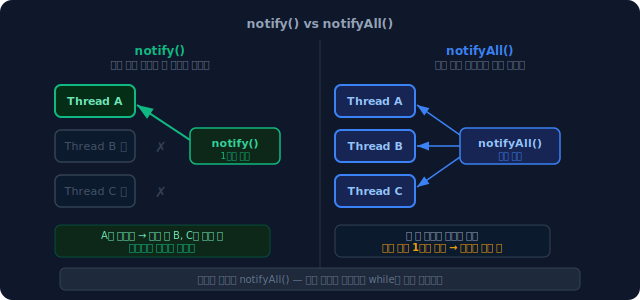
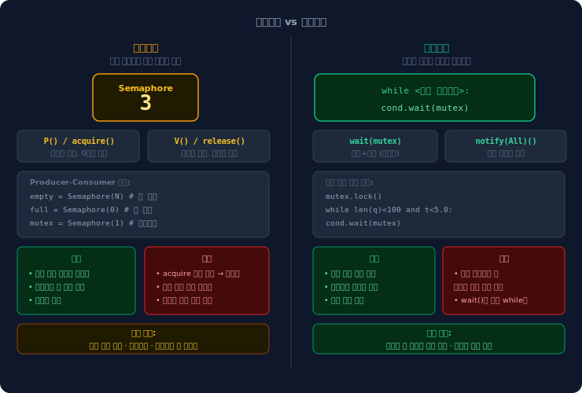
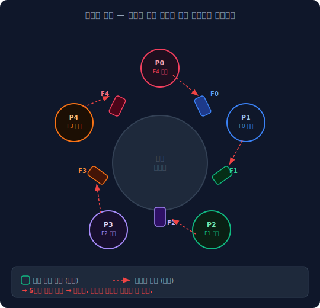
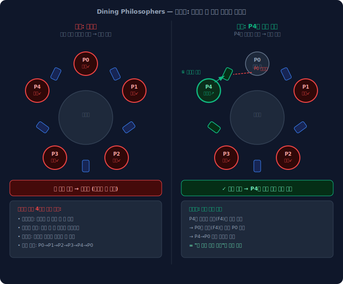

# 모니터와 조건변수

## 뮤텍스만으로 부족한 순간

뮤텍스는 임계 구역을 보호한다. 한 번에 하나의 스레드만 들어오게 막는 것.

그런데 때로는 단순히 "들어오면 안 돼"가 아니라 "조건이 될 때까지 기다려야 해"가 필요하다.

유튜브를 생각해보자. 영상을 다운받는 스레드와 화면에 재생하는 스레드가 따로 돌고 있다. 인터넷이 느려서 버퍼가 비어있다면, 재생 스레드는 다운로드 스레드가 데이터를 채울 때까지 기다려야 한다.

재생 스레드가 기다리는 방법이 두 가지 있다.

하나는 계속 확인하는 것이다. CPU를 점유한 채 루프를 돌면서 버퍼가 찼는지 반복 확인한다. 이것을 바쁜 대기(busy-waiting)라고 한다. CPU가 계속 실행되고 있으니 다른 스레드가 그 시간을 쓸 수 없다.

다른 하나는 데이터가 들어올 때까지 그냥 잠드는 것이다. 다운로드 스레드가 데이터를 넣으면 재생 스레드를 깨워준다. CPU는 그동안 다른 일을 할 수 있다.

뮤텍스만으로 "잠들고 깨어나기"를 구현하면 문제가 생긴다.

```python
mutex.lock()
while buffer is empty:
    mutex.unlock()     # 먼저 반납하고
    sleep()            # 그 다음 잠든다
data = buffer.pop()
mutex.unlock()
```

unlock과 sleep 사이에 틈이 생긴다. 그 틈에 다운로드 스레드가 치고 들어와 데이터를 넣고 신호를 보내면, 재생 스레드는 아직 잠들지도 않은 상태라 신호를 받지 못한다. 이후 잠들지만 다시 깨워줄 사람이 없다.

이것이 신호 유실(missed signal) 문제다. 조건변수는 이 틈을 없애기 위해 나왔다.

<br><br>

---

<br><br>

## 모니터: 락을 언어가 관리한다

뮤텍스를 쓰면 개발자가 직접 `lock()`과 `unlock()`을 작성해야 한다. 임계 구역 안에서 예외가 발생하거나 `unlock()`을 빠뜨리면 그 스레드가 락을 영원히 쥔 채로 데드락이 난다.

모니터는 임계 구역의 진입과 탈출을 언어 수준에서 자동으로 처리한다. Java의 `synchronized`가 대표적이다.

```java
class VideoBuffer {
    private List<byte[]> buffer = new ArrayList<>();

    synchronized void put(byte[] data) {
        // 진입 시 자동 lock
        buffer.add(data);
        // 탈출 시 자동 unlock (예외가 나도 unlock됨)
    }

    synchronized byte[] take() {
        return buffer.remove(0);
    }
}
```

Java의 모든 객체는 내부에 모니터를 하나씩 가지고 있다. `synchronized`를 붙이면 해당 객체의 모니터를 이용해 자동으로 락과 언락이 처리된다. 이것을 내재적 락(intrinsic lock)이라고 부른다.

Python에서는 `threading.Lock()`이 뮤텍스에 해당하고, `threading.Condition()`이 모니터에 해당한다.

```python
import threading

lock = threading.Lock()
cond = threading.Condition(lock)   # 뮤텍스를 내부에 감싸서 조건변수까지 제공
```

모니터는 락의 자동화만이 아니다. 조건변수까지 내장하고 있다. 이 둘을 하나로 묶어놓은 것이 모니터의 핵심이다.

<br><br>

---

<br><br>

## 조건변수: 잠들고 깨어나는 메커니즘

조건변수는 세 가지 연산으로 동작한다.

| 연산 | 역할 |
|------|------|
| `wait(mutex)` | 뮤텍스 반납 + 잠든다 (이 두 동작을 원자적으로) |
| `notify()` | 대기 중인 스레드 하나를 깨운다 |
| `notifyAll()` | 대기 중인 스레드 전부를 깨운다 |

유튜브 예시에 적용하면 이렇게 된다.

```python
# 재생 스레드
mutex.lock()
while buffer is empty:
    cond.wait(mutex)      # 뮤텍스 반납 + 잠든다 (원자적)
data = buffer.pop()
mutex.unlock()
play(data)

# 다운로드 스레드
mutex.lock()
buffer.append(data)
cond.notify()             # 자고 있는 재생 스레드를 깨운다
mutex.unlock()
```

뮤텍스만 있을 때와 비교하면 `unlock() + sleep()` 두 줄이 `wait(mutex)` 한 줄로 바뀌었다. 이 차이가 신호 유실 문제를 없앤다.

`wait()`에서 깨어나면 자동으로 뮤텍스를 다시 획득한다. 개발자가 `lock()`을 다시 호출할 필요가 없다.

<br><br>

---

<br><br>

## wait()이 원자적이어야 하는 이유

`wait()`이 "뮤텍스 반납"과 "잠든다"를 원자적으로 처리하는 데는 이유가 있다. 두 동작 사이에 틈이 생기면 신호 유실이 발생한다.

아래 데모에서 두 경우를 단계별로 비교할 수 있다.

<iframe src="/DEV_LOG/OS/assets/demo_signal_loss.html" width="100%" height="640" frameborder="0" style="border-radius:10px;border:1px solid #334155;display:block;" onload="this.style.height=(this.contentDocument||this.contentWindow.document).documentElement.scrollHeight+'px'"></iframe>

원자적이지 않은 경우, 재생 스레드가 뮤텍스를 반납하고 아직 잠들기 전에 다운로드 스레드가 신호를 보낸다. 신호는 잠든 스레드에게만 전달된다. 아직 깨어있는 재생 스레드는 신호를 받지 못하고, 이후 잠들지만 깨워줄 사람이 없다.

`wait()`은 반납과 잠듦을 한 동작으로 묶어 이 틈을 없앤다. OS 내부에서는 스레드를 대기 큐에 먼저 등록한 뒤 뮤텍스를 반납하는 순서로 구현된다. 대기 큐에 이미 있는 상태이므로, 반납 직후에 신호가 와도 정상적으로 수신된다.

<br><br>

---

<br><br>

## while이 if보다 안전한 이유

`wait()`에서 깨어났다고 해서 반드시 조건이 맞는 것은 아니다. 두 가지 경우가 있다.

첫째, 소비자가 여럿일 때. `notifyAll()`로 소비자 A와 B를 모두 깨웠는데 버퍼에는 아이템이 하나뿐이라면, A가 먼저 꺼낸 뒤 B는 꺼낼 것이 없다.

둘째, 허위 깨어남(Spurious Wakeup). POSIX 표준은 `wait()`가 아무 신호 없이도 깨어날 수 있다고 명시한다. Linux의 futex 구현이나 신호 인터럽트 처리 방식 때문에 발생할 수 있다. 애플리케이션 코드는 항상 이를 방어해야 한다.

두 경우 모두 "깨어났다 ≠ 조건 만족"인 상황이다.

```python
# if를 쓰면: wait() 리턴 후 곧바로 pop()으로 간다
if buffer is empty:
    cond.wait(mutex)
data = buffer.pop()    # 버퍼가 여전히 비어있을 수 있음

# while을 쓰면: wait() 리턴 후 조건을 다시 확인한다
while buffer is empty:
    cond.wait(mutex)
data = buffer.pop()    # 조건이 확실히 만족됨
```

`if`를 쓰면 `wait()`이 리턴됐을 때 조건 확인 없이 바로 다음 줄로 간다. `while`을 쓰면 반드시 처음으로 돌아가 조건을 다시 확인한다. JDK 공식 문서와 POSIX 표준 모두 조건변수를 쓸 때 `while`로 감싸라고 명시한다.

<br><br>

---

<br><br>

## Producer-Consumer 전체 흐름

조건변수의 역할이 if vs while 비교에서 가장 잘 드러난다. 아래 데모에서 두 버전을 단계별로 따라갈 수 있다.

<iframe src="/DEV_LOG/OS/assets/demo_monitor_condvar.html" width="100%" height="660" frameborder="0" style="border-radius:10px;border:1px solid #334155;display:block;" onload="this.style.height=(this.contentDocument||this.contentWindow.document).documentElement.scrollHeight+'px'"></iframe>

if 버전에서는 두 소비자가 모두 깨어날 때, 이미 if를 지나쳤기 때문에 두 번째 소비자가 빈 버퍼에서 꺼내려다 오류가 발생한다. while 버전에서는 첫 번째 소비자가 꺼낸 뒤, 두 번째 소비자가 while 조건을 다시 확인하고 버퍼가 비어있으면 다시 잠든다.

<br><br>

---

<br><br>

## notify vs notifyAll



`notify()`는 대기 중인 스레드 중 하나를 임의로 깨운다. 누가 깨어날지는 OS가 결정하며 보장이 없다. 호출 시점에 대기 중인 스레드가 없으면 신호는 사라진다.

`notifyAll()`은 전부 깨운다. 깨어난 스레드들은 뮤텍스를 두고 경쟁한다. 하나가 뮤텍스를 잡고 처리하면 나머지는 다시 조건을 확인하고, 조건이 안 맞으면 다시 잠든다. 불필요한 컨텍스트 스위칭이 늘어나는 단점이 있다.

선택 기준은 하나다. 아이템 하나가 들어왔을 때 처리할 수 있는 소비자가 한 명뿐이라면 `notify()`, 여럿이 처리할 수 있다면 `notifyAll()`이다.

확신이 없다면 `notifyAll()`이 안전하다. 잘못 깨어난 스레드는 `while`이 다시 잠재운다. `notify()`를 잘못 쓰면 처리할 수 있는 스레드를 빼놓고 처리 못 하는 스레드만 깨울 수 있지만, `notifyAll()`은 그런 위험이 없다.

<br><br>

---

<br><br>

## 세마포어와 조건변수의 차이

세마포어도 Producer-Consumer를 구현할 수 있다. 그렇다면 왜 조건변수를 따로 쓰는가.

세마포어는 숫자(자원 개수)를 기다린다.

```python
empty = Semaphore(BUFFER_SIZE)   # 빈 슬롯 개수
full  = Semaphore(0)             # 채워진 슬롯 개수
mutex = Semaphore(1)             # 임계 구역 보호

# 생산자
empty.acquire()   # 빈 슬롯이 생길 때까지 대기
mutex.acquire()
buffer.append(item)
mutex.release()
full.release()

# 소비자
full.acquire()    # 채워진 슬롯이 생길 때까지 대기
mutex.acquire()
item = buffer.pop()
mutex.release()
empty.release()
```

이 코드에서 `empty.acquire()`와 `mutex.acquire()` 순서를 바꾸면 데드락이 발생한다. 세마포어를 여러 개 조합할 때 획득 순서를 잘못 잡으면 CH2에서 본 순환 대기가 만들어진다.

조건변수는 이런 조합 순서 문제가 없다. 뮤텍스 하나와 조건변수를 사용하고, 기다리는 조건은 `while` 안에 임의의 표현식으로 적는다.

```python
# 100개가 쌓이거나 5초가 지나면 배치 처리
while len(queue) < 100 and elapsed < 5.0:
    cond.wait(mutex)
```

세마포어로는 이런 복합 조건을 카운터 하나로 표현할 수 없다. 조건변수는 `while` 안에 어떤 불리언 표현이든 넣을 수 있어 표현력이 훨씬 높다.



| | 세마포어 | 조건변수 |
|--|---------|---------|
| 기다리는 대상 | 정수 카운터 (자원 개수) | 임의의 조건 |
| 복합 조건 표현 | 어렵다 | 자유롭다 |
| 뮤텍스 결합 | 개발자가 직접 관리 | 자동으로 결합 |
| 획득 순서 실수 | 데드락 위험 | 없음 |

<br><br>

---

<br><br>

## 고전 동기화 문제

동기화 개념이 실제 문제에서 어떻게 얽히는지 보여주는 세 가지 고전 예시다. 이 문제들은 새로운 개념이 아니라, 지금까지 배운 것들이 실제로 어떻게 쓰이는지 보여주는 틀이다.

<br><br>

### Producer-Consumer

유튜브 버퍼링, 로그 배치 처리, 네트워크 패킷 처리 등 데이터를 만드는 쪽과 소비하는 쪽의 속도가 다를 때 등장한다. 위에서 이미 다뤘으므로 핵심만 요약한다.

- 버퍼가 비면 소비자가 기다린다 — `cond.wait()`
- 버퍼가 차면 생산자가 기다린다 — `cond.wait()` (버퍼 크기 제한 시)
- 항상 `while`로 조건을 감싼다

<br><br>

### Readers-Writers

데이터베이스에 여러 스레드가 접근한다. 읽기는 데이터를 바꾸지 않으므로 여럿이 동시에 해도 된다. 쓰기는 데이터를 바꾸므로 혼자만 해야 한다.

뮤텍스 하나로 모든 접근을 감싸면 읽기끼리도 줄을 서야 한다. 읽기가 대부분인 시스템에서는 불필요한 병목이다.

해결책은 현재 읽고 있는 스레드 수를 카운트하는 것이다.

```
read_count = 0
read_mutex = Mutex()    # read_count 자체를 보호
write_mutex = Mutex()   # 쓰기 접근 제어

리더 진입:
  read_mutex.lock()
  read_count += 1
  if read_count == 1:
      write_mutex.lock()   # 첫 번째 리더가 라이터 진입 막음
  read_mutex.unlock()
  # 읽기 수행 (여러 리더 동시 가능)

리더 탈출:
  read_mutex.lock()
  read_count -= 1
  if read_count == 0:
      write_mutex.unlock() # 마지막 리더가 라이터 허용
  read_mutex.unlock()

라이터:
  write_mutex.lock()       # 모든 리더와 라이터가 없을 때까지 대기
  # 쓰기 수행
  write_mutex.unlock()
```

아래 데모에서 read_count가 어떻게 변화하며 라이터를 막고 허용하는지 단계별로 확인할 수 있다.

<iframe src="/DEV_LOG/OS/assets/demo_readers_writers.html" width="100%" height="580" frameborder="0" style="border-radius:10px;border:1px solid #334155;display:block;" onload="this.style.height=(this.contentDocument||this.contentWindow.document).documentElement.scrollHeight+'px'"></iframe>

이 구현은 리더에게 유리하다. 리더가 계속 들어오면 라이터는 영원히 기다릴 수 있다. 실제 DB 엔진에서는 라이터 우선 정책이나 공정 큐를 추가로 적용한다.

현대 언어에서는 이를 읽기-쓰기 락(Read-Write Lock)이라는 별도 구현체로 제공한다. Java의 `ReentrantReadWriteLock`, Python의 `threading.RLock` 기반 구현이 그 예다.

<br><br>

### Dining Philosophers



철학자 5명이 원형 테이블에 앉아 있다. 각자 왼쪽과 오른쪽에 포크가 하나씩 있고, 식사를 하려면 양쪽 포크 두 개가 모두 필요하다. 포크는 총 5개다.

5명이 동시에 왼쪽 포크를 집으면 어떻게 될까. 모두가 오른쪽 포크를 기다리며 영원히 멈춘다.

데드락의 4가지 조건이 모두 성립한다.

- 상호 배제: 포크는 한 명만 쥘 수 있다
- 점유와 대기: 왼쪽을 쥔 채 오른쪽을 기다린다
- 비선점: 다른 철학자의 포크를 강제로 빼앗을 수 없다
- 순환 대기: P0→P1→P2→P3→P4→P0 순환

해결책은 여러 가지다. 가장 단순한 것이 순환 대기를 끊는 것이다.



철학자 한 명의 집는 순서를 반대로 한다. P4가 오른쪽 포크를 먼저 잡으면 P0이 왼쪽 포크를 잡으려 해도 막힌다. P4→P0 방향의 사이클이 사라지고 데드락이 풀린다.

CH2의 "락 획득 순서를 통일하라"는 규칙과 정확히 같은 원리다. 게임 서버의 아이템 교환 데드락을 플레이어 ID 순서로 락을 잡아 해결하는 것과 구조가 동일하다.

또 다른 해결책은 동시에 식사를 시도하는 철학자 수를 4명으로 제한하는 것이다. 포크가 5개이므로 4명이 모두 왼쪽 포크를 잡아도 오른쪽 포크가 하나 남는다. 세마포어 하나로 구현한다.

<br><br>

---

<br><br>

## 정리

| | 역할 | 관계 |
|--|--|--|
| 뮤텍스 | 임계 구역 보호 | 단독 사용 가능 |
| 조건변수 | 조건 될 때까지 잠들고 깨어나기 | 항상 뮤텍스와 함께 |
| 모니터 | 뮤텍스 + 조건변수를 언어가 캡슐화 | Java `synchronized` + `wait()/notify()` |

뮤텍스가 "동시에 들어오는 것을 막는" 도구라면, 조건변수는 "올바른 타이밍을 기다리는" 도구다.

조건변수를 쓸 때 두 가지 규칙은 항상 지켜야 한다. 조건 확인은 반드시 `while`로 감싸고, 뮤텍스를 잡은 상태에서만 `wait()`을 호출한다. 이 두 규칙이 지켜지면 신호 유실도, 허위 깨어남도, 비어있는 버퍼에서 꺼내는 실수도 없다.
