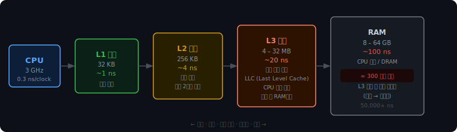

# 캐시 메모리 계층과 지역성

## 클록과 메모리 장벽

CPU 안에는 수정 발진기(crystal oscillator)가 있다. 이 부품이 1초에 수십억 번 규칙적인 전기 펄스를 만들어낸다. 펄스 하나가 1클록 사이클이고, CPU는 이 박동에 맞춰 모든 연산을 동기화한다.

3GHz면 1초에 30억 번 박동. 1클록은 0.33나노초다.

명령어마다 필요한 클록이 다르다.

```
정수 덧셈           1 클록
부동소수점 나눗셈   20 – 40 클록
분기 예측 실패      10 – 20 클록 페널티
RAM에서 읽기        300 클록 이상
```

RAM 읽기가 300클록인 이유는 물리적 구조의 차이에 있다.

CPU 내부의 레지스터와 캐시는 SRAM으로 만들어진다. SRAM은 플립플롭(flip-flop) 회로로 상태를 유지한다. 읽기 위해 하는 일이 전압 확인이 전부라 1나노초 안에 끝난다.

RAM은 DRAM이다. DRAM은 전하를 아주 작은 축전기(capacitor)에 충전해서 비트를 표현한다. 이 전하는 시간이 지나면 자연히 새어나가서 주기적으로 다시 충전(refresh)해야 한다. 읽으려면 축전기의 전하를 감지 증폭기(sense amplifier)로 끌어내는 물리적 과정이 필요하고, 이게 100나노초 걸린다. 거기다 RAM은 CPU 다이 바깥에 있어서 버스를 타고 신호가 이동하는 시간도 더해진다.

결과적으로 `total += arr[i]` 한 줄을 실행하려면, 덧셈 자체는 1클록인데 `arr[i]`를 RAM에서 꺼내오는 데만 300클록을 기다려야 한다. CPU는 그 시간 동안 아무것도 못 하고 논다.

이 현상을 메모리 장벽(Memory Wall)이라고 부른다. CPU는 매년 공정 개선과 클록 증가로 빨라졌지만, DRAM의 물리적 접근 속도는 그 속도를 따라오지 못했다. 1990년대부터 지금까지 CPU와 RAM의 속도 격차는 계속 벌어졌고, 이 격차가 현대 컴퓨터 아키텍처에서 캐시를 필수 구조로 만든 이유다.

<br><br>

---

<br><br>

## 캐시 계층



캐시를 크게 하나만 만들면 어떨까. L1을 1GB로 만드는 것이다.

물리적으로 불가능하다. SRAM은 크기와 속도가 반비례한다. 캐시가 커질수록 신호가 더 긴 경로를 이동하고, 더 많은 셀 중에서 원하는 데이터를 찾는 비교 회로가 복잡해진다. 1GB SRAM을 만들면 접근 시간이 수십 나노초로 늘어나 RAM과 속도 차이가 없어진다.

비용도 문제다. SRAM은 DRAM보다 셀 하나에 트랜지스터가 6배 필요하다. 32KB L1 캐시가 CPU 다이 면적의 상당 부분을 차지하는데, GB 단위로 만드는 건 현실적으로 불가능하다.

그래서 선택한 방법이 계층이다.

| 계층 | 크기 | 접근 시간 | 위치 |
|------|------|----------|------|
| L1 캐시 | 32 KB | ~1 ns | 코어 전용, CPU 다이 내부 |
| L2 캐시 | 256 KB | ~4 ns | 코어 전용 (또는 2코어 공유) |
| L3 캐시 | 4 – 32 MB | ~20 ns | 전체 코어 공유, LLC |
| RAM | 8 – 64 GB | ~100 ns | CPU 외부, DRAM |

L1에서 히트하면 1ns. 없으면 L2, 없으면 L3, 없으면 RAM까지 간다. L3는 Last Level Cache(LLC)라고도 부른다. 마지막 캐시 단계라는 뜻이고, 여기서도 없으면 CPU 다이 바깥으로 나가야 한다.

<br><br>

---

<br><br>

## 지역성

캐시는 RAM보다 수천 배 작다. 전부 올릴 수 없으니, 올려둘 데이터를 선택해야 한다.

CPU는 두 가지 관찰을 바탕으로 예측한다.

### 시간 지역성 (Temporal Locality)

최근에 접근한 데이터는 곧 다시 접근할 가능성이 높다.

```python
total = 0
for i in range(1000):
    total += arr[i]
```

`total`은 루프 1000번 동안 매번 읽고 쓴다. 한 번 L1에 올려두면 1000번 내내 히트다.

### 공간 지역성 (Spatial Locality)

최근에 접근한 주소 근처도 곧 접근할 가능성이 높다.

`arr[0]`을 읽었으면 `arr[1]`, `arr[2]`도 곧 읽을 가능성이 높다. 프로그램 코드도 마찬가지다. 라인 10을 실행했으면 라인 11이 바로 다음이다.

<br><br>

---

<br><br>

## 캐시 라인

캐시는 데이터를 바이트 하나씩 올리지 않는다. 64바이트 덩어리를 통째로 올린다. 이 단위를 캐시 라인(cache line)이라고 한다.

`arr[0]`을 읽으면, 실제로는 `arr[0]`부터 `arr[15]`까지(4바이트 int 기준 16개)가 한 번에 캐시로 올라온다. 공간 지역성을 활용해 "어차피 주변도 쓸 거니까 미리 가져오는" 것이다.

64바이트는 경험적으로 최적화된 크기다. 너무 작으면 인접 데이터를 충분히 올리지 못해 미스가 잦다. 너무 크면 쓰지도 않을 데이터를 잔뜩 올려 캐시 공간을 낭비하고, 교체 비용도 커진다.

캐시 라인 단위로 올라오기 때문에, 데이터가 메모리에서 어떤 순서로 배치되어 있는지가 성능에 직접 영향을 준다.

<br><br>

---

<br><br>

## 행 우선 vs 열 우선

2차원 배열은 메모리에 1차원으로 펼쳐진다. Python과 C 모두 행 우선(row-major)으로 저장한다.

```
matrix[0][0], matrix[0][1], ..., matrix[0][5],   ← 0행 전체 연속
matrix[1][0], matrix[1][1], ..., matrix[1][5],   ← 1행 전체 연속
...
```

```python
# 행 우선 접근 — 연속된 주소를 순서대로 읽음
for i in range(N):
    for j in range(N):
        total += matrix[i][j]

# 열 우선 접근 — 행 너비만큼 점프하며 읽음
for j in range(N):
    for i in range(N):
        total += matrix[i][j]
```

행 우선은 캐시 라인에 올라온 데이터를 다음 접근에서 그대로 쓴다. 열 우선은 매 접근마다 8000바이트(1000행 × 8바이트)를 건너뛰어 새 캐시 라인을 불러와야 한다.

아래 시뮬레이터에서 단계별로 직접 확인할 수 있다.

<iframe src="/DEV_LOG/OS/assets/demo_cache_locality.html" width="100%" height="640" frameborder="0" style="border-radius:10px;border:1px solid #334155;display:block;" onload="this.style.height=(this.contentDocument||this.contentWindow.document).documentElement.scrollHeight+'px'"></iframe>

1000×1000 행렬 기준으로 실제 측정하면 행 우선이 열 우선보다 5 – 10배 빠르다. 알고리즘은 동일하고 접근 순서만 다른데.

<br><br>

---

<br><br>

## 히트율의 비대칭 비용

캐시 성능은 히트율로 측정하지만, 히트율 숫자 자체보다 미스의 비용이 얼마나 비싼지가 핵심이다.

평균 메모리 접근 시간(AMAT)은 이렇게 계산한다.

```
AMAT = (히트율 × L1 접근 시간) + (미스율 × RAM 접근 시간)
```

| 히트율 | 계산 | 평균 접근 시간 |
|--------|------|--------------|
| 99% | 0.99×1 + 0.01×100 | 1.99 ns |
| 97% | 0.97×1 + 0.03×100 | 3.97 ns |
| 95% | 0.95×1 + 0.05×100 | 5.95 ns |

99%와 97%는 2% 차이지만 실제 속도는 2배 차이다.

미스 한 번의 비용이 히트 100번 비용이기 때문이다. 미스율이 1%p 오르는 건 "1%p 느려짐"이 아니라 "100클록짜리 페널티가 1%p 더 붙음"이다. 이 비대칭성 때문에 캐시 히트율 1%를 높이는 것이 알고리즘 최적화보다 효과가 큰 상황이 많다.

<br><br>

---

<br><br>

## 정리

캐시가 필요한 이유는 CPU(0.33ns)와 RAM(100ns)의 속도 격차다. 이 격차를 메모리 장벽이라 부르며, DRAM의 물리적 충방전 구조에서 비롯된다.

캐시 계층이 여러 단계인 이유는 SRAM의 물리적 한계 때문이다. 크고 빠른 캐시를 동시에 만들 수 없어서, 작고 빠른 것(L1)과 크고 느린 것(L3)을 계층으로 쌓는다.

캐시는 시간 지역성과 공간 지역성으로 다음 접근을 예측한다. 공간 지역성을 활용해 64바이트 캐시 라인 단위로 올리고, 이 때문에 메모리 접근 패턴이 성능에 직접 영향을 준다.
