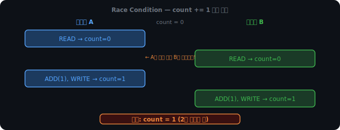
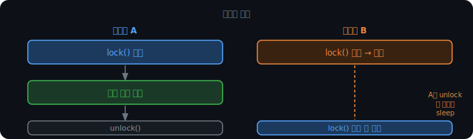
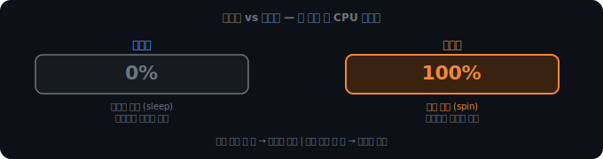
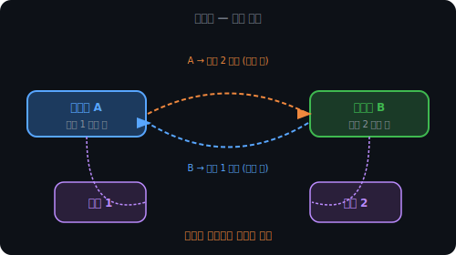
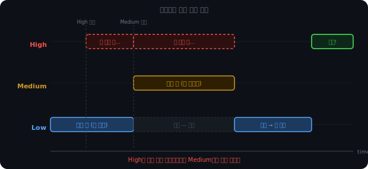

# 경쟁 조건과 데드락

## 스레드가 자원을 공유하면 생기는 일

앞에서 스레드는 코드, 데이터, 힙을 공유한다고 했다. 이 공유가 편리한 동시에 문제의 시작이다.

인스타그램 게시물에 100명이 동시에 좋아요를 누른다고 생각해보자. 서버는 요청마다 스레드를 하나씩 만들어 처리하는데, 각 스레드가 하는 일은 결국 `like_count += 1`이다. 100개의 스레드가 같은 변수에 동시에 접근한다.

`count += 1`을 스레드 두 개가 동시에 실행한다고 생각해보자. count가 0이라면 결과가 2가 되어야 맞다. 그런데 실제로는 1이 나올 수 있다.

이유는 `count += 1`이 원자적이지 않기 때문이다. CPU 입장에서 이 한 줄은 세 단계다.

```
READ  → count 값을 레지스터에 올린다
ADD   → 레지스터 값에 1을 더한다
WRITE → 결과를 count에 쓴다
```



두 스레드가 각각 1씩 더했는데 count는 1이다. 이것이 경쟁 조건(Race Condition)이다. 실행 순서에 따라 결과가 달라지는 상황.

이게 디버깅하기 어려운 이유도 여기 있다. 보통은 잘 된다. 스레드들이 운 좋게 겹치지 않으면 문제가 안 보인다. 부하가 높아지거나 타이밍이 맞아야 터진다.

<iframe src="/DEV_LOG/OS/assets/demo_race_condition.html" width="100%" height="900" frameborder="0" style="border-radius:10px;border:1px solid #334155;display:block;" onload="this.style.height=(this.contentDocument||this.contentWindow.document).documentElement.scrollHeight+'px'"></iframe>

더 현실적인 예시를 들면, 쇼핑몰에서 두 사용자가 동시에 마지막 재고 1개를 구매하는 상황이다. 재고 확인(READ)과 차감(WRITE)이 원자적이지 않으면 두 스레드 모두 재고가 1이라고 읽은 뒤 각자 0으로 덮어쓴다. 두 주문이 모두 통과되고 재고는 -1이 된다.

<br>

<br>

---

<br>

<br>

## 임계 구역

경쟁 조건이 생기는 구간을 임계 구역(Critical Section)이라고 한다. 공유 자원에 접근하는 코드 영역이다.

임계 구역을 보호하려면 한 번에 하나의 스레드만 들어오게 해야 한다. 이때 쓰는 것이 락(Lock)이다.

<br>

<br>

---

<br>

<br>

## 뮤텍스와 세마포어

락을 구현하는 두 가지 대표적인 방법이 뮤텍스와 세마포어다.

뮤텍스(Mutex)는 상호 배제(Mutual Exclusion)의 약자다. 한 번에 하나의 스레드만 임계 구역에 들어올 수 있다. 락을 건 스레드만 해제할 수 있다. 이 소유권이 핵심이다.

비유하자면 화장실 열쇠다. 열쇠를 가져간 사람만 반납할 수 있고, 다음 사람은 밖에서 기다린다.



세마포어(Semaphore)는 정수 카운터를 가진다. 카운터만큼 동시 접근을 허용한다. 소유권이 없어서 어느 스레드든 카운터를 올리고 내릴 수 있다. 주차장과 비슷하다. 자리가 N개 있고, 들어올 때 카운터를 내리고 나갈 때 올린다. 누가 나가든 상관없다.

뮤텍스를 왜 따로 쓰는지는 세마포어의 단점을 보면 명확하다. 소유권이 없으면 A가 건 락을 B가 실수로 해제할 수 있다. 임계 구역 보호가 깨진다. 그래서 임계 구역에는 뮤텍스, 자원 개수 제한이나 실행 순서 조율에는 세마포어를 쓴다.

세마포어가 쓰이는 곳을 구체적으로 보면:

- 넷플릭스 계정 동시 재생 기기 수 제한 — 카운터가 2라면 세 번째 기기는 다른 기기가 재생을 끊을 때까지 대기한다.
- DB 커넥션 풀 — 커넥션을 무한정 열면 DB가 죽는다. 세마포어로 최대 개수를 제한하면 초과 요청은 커넥션이 반환될 때까지 기다린다.
- 시그널링 — 주방 스레드는 평소에 대기 중이다. 주문 스레드가 주문을 받으면 세마포어를 올려서(signal) 주방 스레드를 깨운다. 실행 순서를 조율하는 용도다.

<br>

<br>

---

<br>

<br>

## 스핀락

뮤텍스는 락을 못 얻으면 스레드를 재운다. OS가 그 스레드를 ready queue에서 꺼내 wait queue로 옮기고, 락이 풀릴 때 다시 깨운다. 이 과정에서 컨텍스트 스위칭이 두 번 발생한다.

락을 아주 짧게 쥐는 상황이라면 이 오버헤드가 문제다. 락 대기 시간보다 잠들고 깨는 비용이 더 클 수 있다.

스핀락(Spinlock)은 이 상황을 위해 만들어졌다. 잠들지 않는다. ready queue에 계속 남아서 락이 풀릴 때까지 루프를 돈다.

```
while lock.is_held():
    pass  # 확인, 확인, 확인...
## 풀리면 바로 획득
```



그래서 스핀락은 커널 내부나 인터럽트 핸들러처럼 락을 아주 짧게 쥐는 게 보장되는 영역에서만 쓴다. 일반 애플리케이션 코드에서는 뮤텍스가 맞다.

<br>

<br>

---

<br>

<br>

## 락으로 경쟁 조건을 막으면 생기는 새 문제

락이 경쟁 조건을 해결하면 다른 문제가 생길 수 있다. 데드락이다.



A는 B가 자원 2를 놓길 기다리고, B는 A가 자원 1을 놓길 기다린다. 둘 다 영원히 기다린다.

<br>

<br>

---

<br>

<br>

## 데드락이 발생하는 조건

데드락이 발생하려면 아래 네 가지가 동시에 성립해야 한다.

**상호 배제**: 자원을 한 번에 하나의 스레드만 사용할 수 있다.  
**점유와 대기**: 자원을 가진 채로 다른 자원을 기다린다.  
**비선점**: 다른 스레드의 자원을 강제로 빼앗을 수 없다.  
**순환 대기**: 스레드들이 원형으로 서로를 기다린다.

네 조건 중 하나라도 깨지면 데드락은 발생하지 않는다.

게임 서버에서 플레이어 A와 B가 동시에 아이템을 교환하는 상황을 예로 들면, A는 자신의 인벤토리를 락하고 B의 인벤토리를 기다리며, B는 자신의 인벤토리를 락하고 A의 인벤토리를 기다린다. 4조건이 전부 성립한다.

<br>

<br>

---

<br>

<br>

## 데드락 처리 전략

### 예방

조건 네 가지 중 하나를 설계 단계에서 제거한다. 가장 현실적인 방법은 순환 대기를 차단하는 것이다. 모든 스레드가 자원을 같은 순서로 요청하게 강제하면 원형 구조가 만들어지지 않는다.

게임 서버 예시로 돌아오면, 플레이어 ID가 낮은 쪽 인벤토리를 항상 먼저 락하는 규칙을 정하면 된다. A(ID=1)와 B(ID=2)가 교환할 때 둘 다 ID 1 인벤토리를 먼저 요청한다. 순환이 없다.

다른 조건을 제거하는 방법도 있지만 대부분 현실에서 쓰기 어렵다. 점유와 대기를 제거하려면 필요한 자원을 전부 한꺼번에 요청해야 하는데, 어떤 자원이 필요한지 미리 알기 어렵고 자원을 오래 묶어두는 문제가 생긴다.

### 회피

자원을 할당하기 전에 데드락이 발생할 가능성을 미리 계산한다. 위험하면 할당을 거부한다. 은행가 알고리즘이 대표적이다. 각 스레드가 필요한 자원 최대치를 미리 신고해두고, 할당 후 안전한 실행 순서가 존재하는지 확인한다.

이론적으로 깔끔하지만 실제 시스템에서는 잘 안 쓴다. 스레드가 필요한 자원 최대치를 미리 알기 어렵고, 계산 오버헤드도 있다.

### 탐지 후 회복

데드락을 허용한다. 주기적으로 자원 할당 그래프를 검사해서 사이클이 생겼으면 탐지한다. 탐지되면 스레드 하나를 골라 강제 종료한다.

종료할 스레드를 고르는 것이 Victim Selection이다. 진행도가 낮은 것, 보유 자원이 많은 것, 다른 스레드 의존도가 낮은 것을 우선한다. 재시작이 가능한 작업인지도 고려한다.

### 무시

데드락을 그냥 무시한다. Windows와 Linux가 기본적으로 이 방식이다. 데드락은 드물게 발생하고, 탐지와 회복의 오버헤드가 발생 빈도에 비해 크기 때문이다. 발생하면 사용자가 프로그램을 강제 종료하는 것으로 해결한다.

<br>

<br>

---

<br>

<br>

## 데드락과 기아

비슷해 보이지만 다르다.

데드락은 관련된 모든 스레드가 멈춘다. 어느 쪽도 진행하지 못하는 완전한 교착 상태다.

기아(Starvation)는 특정 스레드 하나가 계속 양보하다가 영원히 실행되지 못하는 상태다. 나머지 스레드들은 잘 돌아간다. 우선순위 기반 스케줄링에서 낮은 우선순위 스레드가 계속 밀리는 것이 전형적인 예다.

해결책은 에이징(Aging)이다. 오래 기다린 스레드의 우선순위를 시간이 지날수록 점점 올려준다. 아무리 낮은 우선순위로 시작해도 충분히 기다리면 결국 실행된다. 우선순위 스케줄링의 장점은 유지하면서 기아만 막는 방식이다.

Round Robin처럼 우선순위 없이 순서대로 돌리면 기아 자체가 생기지 않는다. 하지만 응급 처리 프로세스와 로그 기록 프로세스가 CPU를 동등하게 나눠 쓸 수 없는 것처럼, 우선순위가 반드시 필요한 상황이 있다. 에이징은 그 상황을 위한 해결책이다.

<br>

<br>

---

<br>

<br>

## 우선순위 역전

뮤텍스의 소유권 모델이 예상치 못한 문제를 만들기도 한다.

스레드 셋이 있다. 우선순위 High, Medium, Low 순이다. Low가 뮤텍스를 쥐고 임계 구역을 처리하는 중에 High가 같은 락을 요청한다. High는 Low가 끝날 때까지 기다려야 한다. 여기까지는 정상이다.

문제는 Medium이 끼어들 때다. Medium은 이 락이 필요 없다. 그런데 우선순위가 Low보다 높기 때문에 CPU 스케줄러가 Low를 선점해서 Medium을 실행시킨다. Low는 CPU를 뺏겨 락을 해제할 수 없고, High는 Low를 기다리는 채로 Medium이 끝날 때까지 묶인다.



결과적으로 High < Medium < Low 순서로 실행된다. 우선순위가 역전된 것이다. Medium이 여럿이면 High는 그 전부가 끝날 때까지 기다려야 한다.

<br>

해결책은 두 가지다.

우선순위 상속(Priority Inheritance)은 High가 락을 기다리는 순간, 락을 쥔 Low의 우선순위를 High 수준으로 임시 상승시킨다. 이제 Medium이 Low를 선점할 수 없다. Low가 임계 구역을 처리하고 락을 반납하면 원래 우선순위로 돌아온다. Linux 뮤텍스가 기본으로 쓰는 방식이다.

우선순위 천장(Priority Ceiling)은 락을 잡는 순간 미리 정해둔 최고값으로 무조건 올린다. 누가 기다리든 관계없이 선제적으로 상승한다. 단순하지만 불필요하게 우선순위가 올라가는 경우도 생긴다.

<br>

이 문제가 실제로 터진 적이 있다. 1997년 화성 탐사선 Mars Pathfinder가 착륙 후 계속 리셋되는 현상이 발생했다. 원인은 우선순위 역전이었다. 통신 태스크(High)가 제때 실행되지 못해 watchdog 타이머를 리셋하지 못했고, 타이머가 만료되면서 시스템이 반복 재부팅됐다. 지구에서 원격으로 Priority Inheritance 옵션을 활성화해서 해결했다.

여기까지는 스레드 수준의 이야기였다. 하나의 프로세스 안에서 여러 스레드가 자원을 공유할 때 생기는 문제들이다. 그런데 스레드 대신 프로세스를 여러 개 쓰면 어떨까. 프로세스들은 메모리를 공유하지 않으니 경쟁 조건 자체가 생기지 않는다. 대신 프로세스 간에 데이터를 주고받는 방법이 필요하다. 다음은 멀티프로세스와 멀티스레드의 트레이드오프, 그리고 프로세스 간 통신(IPC)이다.
