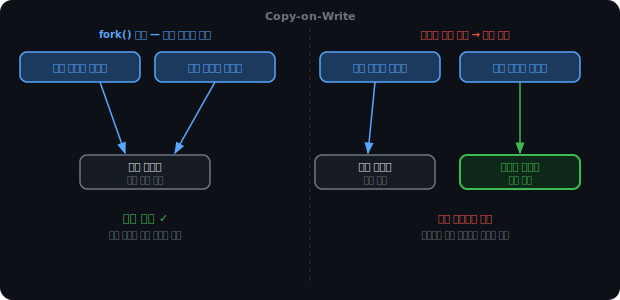
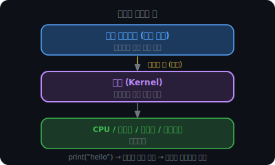
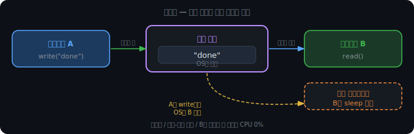
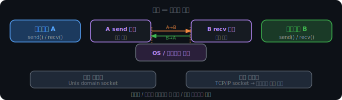
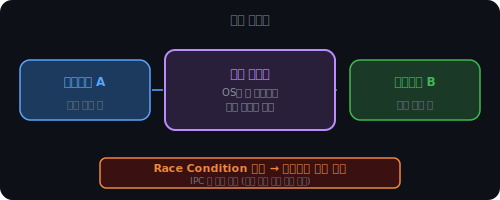
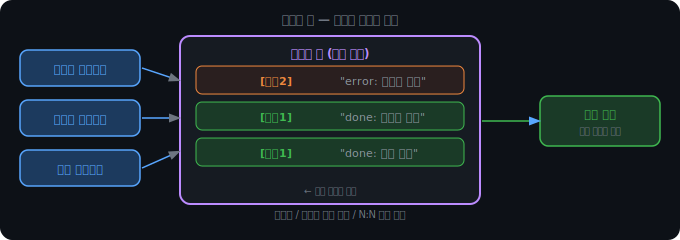

# 멀티프로세스와 프로세스 간 통신

## 스레드가 항상 답은 아니다

앞에서 스레드를 쓰면 공유 메모리 때문에 경쟁 조건과 데드락이 생긴다고 했다. 락으로 보호하면 되지만, 락이 많아질수록 코드는 복잡해지고 데드락 위험도 커진다.

더 근본적인 문제가 있다. 스레드는 메모리를 공유하기 때문에, 한 스레드가 잘못된 주소에 쓰거나 메모리를 오염시키면 같은 프로세스 안의 다른 스레드가 전부 영향을 받는다. 스레드 하나의 버그가 프로세스 전체를 죽인다.

크롬 초창기엔 탭마다 스레드를 썼다. 한 탭이 잘못된 스크립트를 실행해서 메모리를 오염시키면 브라우저 전체가 죽었다. 지금 크롬이 탭마다 별도 프로세스를 쓰는 이유가 여기 있다.

 

 

---

 

 

## 멀티프로세스 vs 멀티스레드

프로세스는 독립된 주소 공간을 가진다. 한 프로세스가 죽어도 다른 프로세스의 메모리에 영향을 줄 수 없다. OS가 그 프로세스만 종료하면 된다.

대신 비용이 있다. 프로세스 생성 시 코드/데이터/힙/스택 4영역을 전부 새로 할당해야 한다. 스레드는 스택만 추가하면 된다.

컨텍스트 스위칭도 프로세스가 더 비싸다. 프로세스마다 주소 공간이 다르기 때문에 전환 시 TLB(가상→물리 주소 변환 캐시)를 전부 비워야 한다. 이후 메모리 접근마다 캐시 미스가 연속으로 발생한다. 스레드는 주소 공간을 공유하므로 TLB를 유지한 채 스택 포인터만 교체하면 된다.

|  | 멀티프로세스 | 멀티스레드 |
|--|--|--|
| 격리성 | 강함 | 약함 |
| 메모리 | 많음 | 적음 |
| 생성 비용 | 높음 | 낮음 |
| 통신 | IPC 필요 | 공유 변수 직접 접근 |

무엇을 선택할지는 상황에 따라 다르다.

- 작업이 독립적이고 하나가 실패해도 나머지는 계속돼야 한다 → 멀티프로세스
- 작업들이 데이터를 자주 공유하고 빠른 통신이 필요하다 → 멀티스레드

유튜브에서 영상을 업로드하면 인코딩, 썸네일 추출, 자막 생성, 알림 발송이 동시에 일어난다. 이 작업들은 서로 독립적이고, 인코딩이 실패해도 알림 발송은 계속돼야 한다. 멀티프로세스가 맞다.

웹 서버가 요청마다 DB 커넥션과 캐시를 공유하며 처리하는 건 멀티스레드가 맞다.

### Copy-on-Write

프로세스 생성 비용이 높다고 했다. fork() 시 부모의 코드/데이터/힙/스택을 전부 복사해야 하기 때문이다. 그런데 실제로 OS는 이 복사를 최대한 미룬다.

fork() 직후 자식 프로세스에게 새 물리 메모리를 주는 대신, 부모와 같은 물리 페이지를 공유하게 한다. 페이지 테이블만 복사하고, 모든 페이지를 읽기 전용으로 표시한다. 자식이 읽기만 하는 동안은 실제 복사가 일어나지 않는다.

쓰기가 발생하면 그때 해당 페이지만 복사한다. 읽기 전용 페이지에 쓰려 하면 폴트가 발생하고, OS가 그 페이지를 복사해서 자식에게 새 사본을 준다. 자식이 건드리지 않은 페이지는 계속 공유 상태로 남는다. 이것이 Copy-on-Write(COW)다.

 

터미널에서 명령을 실행할 때 이 최적화가 핵심이다. 쉘(bash)은 명령어 하나를 실행하기 위해 fork()로 자식을 만들고, 자식은 곧바로 exec()으로 새 프로그램을 로드한다. exec()은 기존 주소 공간을 완전히 교체하기 때문에 fork() 시점의 공유 페이지들은 즉시 버려진다.

COW가 없으면 bash의 메모리를 전부 복사한 뒤 바로 버리는 낭비가 매번 발생한다. COW 덕분에 복사 없이 공유하다가 exec()에서 그냥 버리니 실질적인 복사 비용이 0에 가깝다.

 

 

---

 

 

## 프로세스 간 통신이 필요한 이유

멀티프로세스를 선택하면 새 문제가 생긴다. 프로세스들은 메모리가 완전히 독립이라 전역 변수를 공유할 수 없다. A가 변수를 바꿔도 B는 전혀 모른다. 프로세스 간에 데이터를 주고받으려면 OS를 거쳐야 한다.

 

 

---

 

 

## 커널과 시스템 콜

IPC를 이해하려면 커널이 뭔지 알아야 한다.

커널은 OS의 핵심이다. CPU, 메모리, 디스크, 네트워크 카드 같은 하드웨어를 직접 다루는 유일한 소프트웨어다. 일반 프로그램은 하드웨어에 직접 접근할 수 없다. 프로그램이 커널에 작업을 요청하는 행위가 시스템 콜이다. `print("hello")`도 커널한테 출력 장치에 써달라고 부탁하는 시스템 콜이다.

IPC도 마찬가지다. 프로세스들이 직접 서로의 메모리에 접근할 수 없으니, 커널이 중간에서 데이터를 전달해준다.

 

 

---

 

 

## IPC 4종

### 파이프

파이프의 실체는 커널이 관리하는 임시 버퍼다. 한쪽이 write()로 데이터를 넣으면 다른 쪽이 read()로 꺼낸다.

B가 read()를 호출했는데 버퍼가 비어있으면, 커널이 B를 sleep 상태로 전환한다. 스케줄러는 더 이상 B에게 CPU를 주지 않는다. A가 write()하는 순간 커널이 B를 깨운다. B가 주기적으로 확인하며 CPU를 낭비하는 게 아니라, OS가 데이터 도착 시점에 정확히 깨워준다.

터미널에서 `ls | grep .py`가 파이프다. ls 프로세스가 결과를 파이프에 write()하면 grep 프로세스가 read()해서 필터링한다.

단점이 있다. 단방향이라 양방향 통신에는 파이프 두 개가 필요하다. 그리고 fork()로 파일 디스크립터를 물려받는 부모-자식 관계에서만 편하게 쓸 수 있다.

### 소켓

소켓은 통신의 엔드포인트다. 파이프가 단방향 단일 버퍼라면, 소켓은 양쪽에 버퍼가 있어 양방향 통신이 가능하다.

파이프와 결정적인 차이는 네트워크를 넘을 수 있다는 것이다. 커널이 데이터를 네트워크 카드로 내보내면 다른 컴퓨터의 커널이 받아서 상대 소켓 버퍼에 넣는다. 같은 컴퓨터 안에서도 쓸 수 있고(Unix domain socket), 다른 컴퓨터끼리도 된다(TCP/IP socket). 어떤 프로세스 사이에서도 사용 가능하다. 대신 연결 수립 과정이 있어 파이프보다 오버헤드가 크다.

### 공유 메모리

OS가 특정 메모리 영역을 두 프로세스의 주소 공간 모두에 매핑해준다. 프로세스임에도 스레드처럼 메모리를 직접 공유하는 효과다.

커널을 경유하지 않고 메모리를 직접 읽고 쓰기 때문에 IPC 방법 중 가장 빠르다.

대신 동기화를 직접 해야 한다. 두 프로세스가 같은 메모리에 동시에 접근하면 경쟁 조건이 생긴다. CH2에서 다룬 문제와 완전히 같다. 공유 메모리 영역 접근 시 뮤텍스로 보호해야 한다.

대용량 데이터를 자주 주고받을 때 유리하다. 이미지 처리 결과처럼 수 MB짜리 데이터를 파이프로 넘기면 복사 비용이 크다. 공유 메모리에 써두면 상대방이 같은 메모리를 그대로 읽어간다.

### 메시지 큐

커널이 관리하는 큐에 메시지를 넣고 꺼내는 방식이다. 파이프와 다른 점은 메시지 단위로 구분된다는 것이다. 메시지마다 타입 번호가 붙어 받는 쪽이 특정 타입만 골라서 꺼낼 수 있다.

비동기가 핵심이다. 파이프와 소켓은 read/recv 시점에 데이터가 없으면 블로킹된다. 메시지 큐는 보내는 쪽이 큐에 넣고 바로 자기 일을 계속할 수 있다. 받는 쪽이 준비됐을 때 꺼내가면 된다. 송신자와 수신자의 실행 타이밍이 맞지 않아도 된다.

Redis, RabbitMQ 같은 것들은 이 개념을 네트워크 너머 여러 서버 사이에서 쓸 수 있게 키운 것이다.

 

 

---

 

 

## 언제 뭘 쓸까

| | 파이프 | 소켓 | 공유 메모리 | 메시지 큐 |
|--|--|--|--|--|
| 방향 | 단방향 | 양방향 | 양방향 | 양방향 |
| 대상 | 부모-자식 | 아무 프로세스 | 아무 프로세스 | 아무 프로세스 |
| 속도 | 중간 | 느림 | 가장 빠름 | 중간 |
| 동기화 | 불필요 | 불필요 | 직접 필요 | 불필요 |

멀티프로세스는 격리성을 얻는 대신 통신 비용을 치른다. 그렇다면 여러 프로세스에게 CPU를 어떻게 나눠줄지를 결정해야 한다. 그게 CPU 스케줄링의 영역이다.
