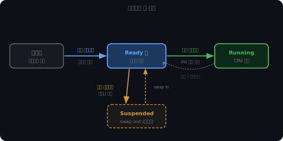
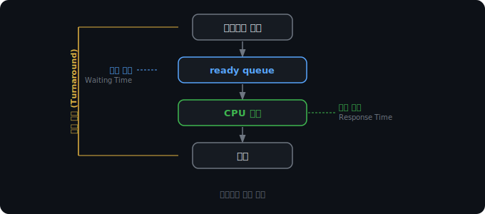
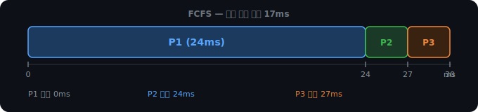
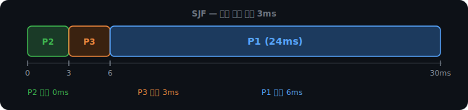
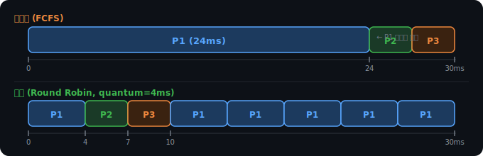
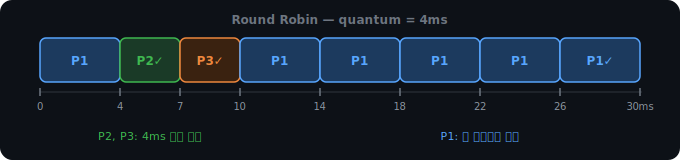
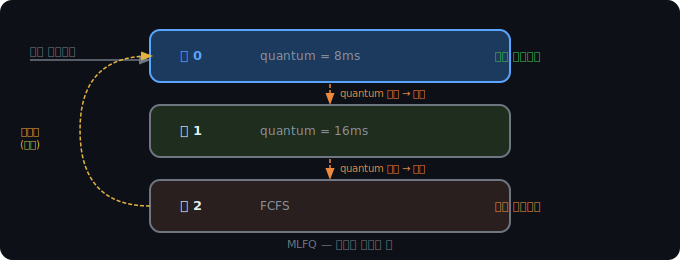
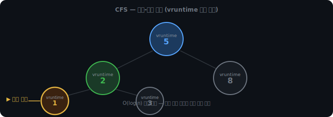

# CPU 스케줄링

## CPU는 한 번에 하나만 실행한다

CPU 코어는 한 번에 하나의 프로세스만 실행할 수 있다. 그런데 PC를 켜면 수십 개의 프로세스가 동시에 돌아간다. 브라우저, 음악 플레이어, 백그라운드 업데이트, 바이러스 백신. 이것들이 실제로 동시에 실행되는 게 아니라, CPU가 매우 빠르게 프로세스를 번갈아 실행하기 때문에 동시처럼 느껴지는 것이다.

그러면 누구에게 CPU를 줄지를 결정해야 한다. 이게 CPU 스케줄링이다.

<br>

<br>

---

<br>

<br>

## 스케줄러의 세 단계

스케줄러는 하나가 아니다. OS는 목적에 따라 세 종류의 스케줄러를 운용한다.



장기 스케줄러(Long-term scheduler)는 디스크에 있는 프로그램 중 어떤 것을 메모리에 올려 Ready 큐에 넣을지 결정한다. 동시에 실행할 프로세스 수를 조절해 메모리가 과부하되지 않게 한다. 실행 빈도가 낮고, 현대 시스템에서는 메모리가 충분해서 거의 쓰지 않는다.

단기 스케줄러(Short-term scheduler)는 Ready 큐에서 어떤 프로세스에 CPU를 줄지 결정한다. ms 단위로 계속 호출된다. 이 챕터에서 다루는 FCFS, SJF, Round Robin, MLFQ, CFS가 전부 단기 스케줄러의 알고리즘이다.

중기 스케줄러(Medium-term scheduler)는 메모리가 부족할 때 일부 프로세스를 통째로 디스크로 내보낸다(swap out). 스래싱이 발생하면 워킹셋 모델이나 PFF가 "이 프로세스를 내려라"고 판단하는데, 그 결정을 실행하는 것이 중기 스케줄러다. 메모리에 여유가 생기면 다시 올린다(swap in).

<br>

<br>

---

<br>

<br>

## 잘 된 스케줄링의 기준

스케줄링의 품질을 측정하는 지표는 두 가지 관점에서 본다.

CPU 관점에서는 얼마나 바쁘게 돌았냐를 본다. CPU 이용률(CPU Utilization)과 단위 시간당 완료한 프로세스 수인 처리량(Throughput)이다.

사용자 관점에서는 얼마나 빠르게 느껴지냐를 본다.



응답 시간과 반환 시간은 다르다. 응답 시간은 요청 후 첫 응답이 오는 시간이고, 반환 시간은 완전히 끝날 때까지의 시간이다. 인터랙티브한 프로그램은 응답 시간이 중요하고, 배치 작업은 반환 시간이 중요하다.

이 지표들은 서로 충돌한다. CPU 이용률을 극대화하려면 긴 작업을 쭉 돌리면 되는데, 그러면 짧은 작업의 응답 시간이 나빠진다. 알고리즘마다 어떤 지표를 우선하느냐가 다르다.

<br>

<br>

---

<br>

<br>

## FCFS

First Come First Served. 먼저 온 순서대로 처리한다. 은행 창구와 같다.

세 프로세스가 이 순서로 도착했다고 하자. P1(24ms), P2(3ms), P3(3ms).



문제는 P2와 P3다. 3ms짜리 짧은 작업들이 24ms짜리 P1 때문에 오래 기다린다. 이것을 Convoy Effect라고 한다. 긴 트럭 뒤에 짧은 차들이 줄줄이 막히는 것처럼, 긴 작업 하나가 뒤의 모든 짧은 작업을 막는다.

<br>

<br>

---

<br>

<br>

## SJF

Shortest Job First. 짧은 것부터 처리한다.



FCFS 17ms에서 SJF 3ms로 줄었다. 수학적으로 평균 대기 시간이 최소임이 증명된 알고리즘이다.

그런데 실제로는 거의 쓰지 않는다. 두 가지 이유가 있다.

첫째, 스케줄러는 프로세스가 얼마나 걸릴지 미리 알 수 없다. 과거 실행 시간으로 예측하는 방법이 있지만 어디까지나 추정이다.

둘째, 짧은 작업이 계속 들어오면 긴 작업은 영원히 실행되지 못하는 기아(Starvation)가 발생한다. 이론적으로 최적이지만 현실에선 쓰기 어렵다.

SJF의 선점 버전을 SRTF(Shortest Remaining Time First)라고 한다. 실행 중에 더 짧은 작업이 들어오면 현재 프로세스를 멈추고 새 것을 먼저 실행한다.

<br>

<br>

---

<br>

<br>

## 선점과 비선점

알고리즘들은 선점형과 비선점형으로 나뉜다.

비선점(Non-preemptive)은 실행 중인 프로세스를 강제로 중단하지 않는다. 끝날 때까지 CPU를 보장한다. FCFS와 SJF가 비선점형이다.

선점(Preemptive)은 실행 중인 프로세스라도 강제로 빼앗을 수 있다. 더 중요한 작업이 들어오면 현재 것을 멈추고 새 것을 실행한다. Round Robin, SRTF, 선점형 우선순위 스케줄링이 여기 해당한다.



<br>

<br>

---

<br>

<br>

## Round Robin

모든 프로세스에게 동일한 time quantum(시간 조각)을 준다. 다 쓰면 ready queue 맨 뒤로 돌아간다. 현실에서 가장 많이 쓰이는 공평한 방식이다.



time quantum 설정이 핵심이다.

```
너무 크면 → FCFS와 같아짐 (짧은 작업이 오래 기다림)
너무 작으면 → 컨텍스트 스위칭이 너무 자주 일어나 오버헤드 폭발
```

보통 10~100ms 사이로 설정한다. 전체 프로세스의 80%가 quantum 안에 끝나는 값이 경험적으로 적당하다고 알려져 있다.

<br>

<br>

---

<br>

<br>

## 직접 비교해보자

알고리즘을 바꿔가며 같은 프로세스 세트로 Gantt 차트와 평균 대기 시간을 비교해볼 수 있다.

<iframe
  src="/DEV_LOG/OS/assets/demo_cpu_scheduling.html"
  width="100%"
  height="1050"
  frameborder="0"
  style="border-radius:10px;border:1px solid #334155;display:block;"
  onload="this.style.height=(this.contentDocument||this.contentWindow.document).documentElement.scrollHeight+'px'">
</iframe>

<br>

<br>

---

<br>

<br>

## 다단계 피드백 큐

FCFS는 Convoy Effect, SJF는 기아와 예측 불가, Round Robin은 모든 작업을 동등하게 취급한다. 카카오톡 메시지 수신(5ms)과 영상 인코딩(500ms)이 같은 줄에서 기다리면, 카카오톡은 인코딩 차례가 끝날 때까지 응답하지 못한다.

다단계 피드백 큐(Multilevel Feedback Queue, MLFQ)는 이 문제를 해결한다. 프로세스 스스로가 자신의 성격을 드러내도록 두고, 그 행동에 따라 분류한다.



모든 프로세스는 큐 0에서 시작한다. quantum을 다 쓰면 하위 큐로 강등된다. 그 안에서 끝나면 그대로 완료된다.

실제 흐름을 보자. 카카오톡(5ms), 인코딩(500ms), 백업(200ms)이 동시에 들어왔다.

```
① 인코딩: 큐 0 → 8ms 실행 → 492ms 남음 → 큐 1로 강등
② 백업:   큐 0 → 8ms 실행 → 192ms 남음 → 큐 1로 강등
③ 카카오톡: 큐 0 → 5ms 실행 → 완료 ✓

④ 인코딩: 큐 1 → 16ms 실행 → 476ms 남음 → 큐 2로 강등
⑤ 백업:   큐 1 → 16ms 실행 → 176ms 남음 → 큐 2로 강등

⑥ 인코딩, 백업: 큐 2에서 FCFS로 처리
```

카카오톡은 큐 0에서 5ms 만에 끝난다. 인코딩이나 백업이 얼마나 남았는지와 무관하게 바로 응답한다. 스케줄러가 "이 프로세스는 짧은 작업이다"라고 판단할 필요가 없다. 행동 자체가 분류를 결정한다.

MLFQ는 짧은 작업의 응답성과 긴 작업의 처리량을 동시에 챙기는 방식이다. 단점은 quantum 크기, 큐 개수, 에이징 임계값 같은 파라미터 튜닝이 까다롭다는 것이다.

<br>

<br>

---

<br>

<br>

## CFS — Linux의 선택

Linux는 MLFQ 대신 CFS(Completely Fair Scheduler)를 쓴다. 파라미터가 많은 MLFQ보다 단순하고 예측 가능한 방식을 선택한 것이다.

아이디어는 이것이다. 프로세스 N개가 있으면 각자 CPU의 1/N씩을 받아야 공평하다. 이 이상적인 상태를 목표로 한다.

실제로 동시에 실행할 수 없으니, vruntime(virtual runtime)이라는 값을 각 프로세스마다 추적한다. "이 프로세스가 지금까지 CPU를 얼마나 썼냐"를 기록하는 숫자다. 항상 vruntime이 가장 작은 프로세스, 즉 CPU를 제일 못 받은 프로세스를 다음에 실행한다.

우선순위 같은 프로세스 세 개로 보면:

```
시작: A.vruntime=0, B.vruntime=0, C.vruntime=0

t=0: 셋 다 0 → A 실행, 1ms  →  A=1, B=0, C=0
t=1: B, C가 0으로 작음 → B 실행  →  A=1, B=1, C=0
t=2: C=0으로 가장 작음 → C 실행  →  A=1, B=1, C=1
t=3: 전부 1 → A 실행...
```

셋이 1ms씩 번갈아 받으며 vruntime이 나란히 유지된다.

우선순위가 다르면 vruntime 증가 속도가 달라진다. 우선순위 높은 프로세스는 실제 1ms를 실행해도 vruntime이 0.5밖에 오르지 않는다. 낮은 우선순위는 1ms 실행에 vruntime이 2 오른다.

```
A (우선순위 높음): 실제 1ms → vruntime +0.5
B (우선순위 보통): 실제 1ms → vruntime +1.0

t=0: A=0, B=0 → A 실행  →  A=0.5, B=0
t=1: B=0 < A=0.5 → B 실행  →  A=0.5, B=1
t=2: A=0.5 < B=1 → A 실행  →  A=1.0, B=1
t=3: A 실행  →  A=1.5, B=1
t=4: B=1 < A=1.5 → B 실행  →  A=1.5, B=2
```

A가 2번 실행될 때 B가 1번 실행된다. A가 CPU의 2/3, B가 1/3을 받는다. 우선순위를 vruntime 증가 속도 하나로 자연스럽게 반영한다.

프로세스들은 vruntime을 기준으로 정렬된 레드-블랙 트리에 저장된다. 항상 가장 왼쪽 노드, 즉 vruntime이 가장 작은 프로세스를 꺼내 실행한다. 삽입과 삭제가 O(log n)이라 프로세스 수천 개도 빠르게 처리된다.



MLFQ와 비교하면:

```
MLFQ: 큐 여러 개 + 강등/승급 규칙 + 에이징 → 파라미터 많음
CFS:  vruntime 하나 + 레드-블랙 트리       → 단순하고 예측 가능
```

<br>

<br>

---

<br>

<br>

## 스케줄링은 아직도 중요한가

하드웨어가 좋아지고 멀티코어가 기본이 된 지금도 스케줄링의 중요성은 줄지 않았다. 코어 수가 늘어나는 만큼 프로세스 수도 늘어난다.

서버 환경에서는 동시 접속자가 수백만이다. 자율주행이나 의료기기처럼 반드시 Xms 안에 응답해야 하는 실시간 시스템은 스케줄링이 보장 못 하면 사람이 죽는다. 클라우드에서는 여러 고객이 같은 물리 서버를 나눠 쓰는데, 스케줄링이 공정하지 않으면 한 고객이 다른 고객 자원을 잠식한다.

GPU가 AI 연산의 중심이 되면서 GPU 스케줄링은 지금 가장 활발한 연구 주제 중 하나다. 하드웨어가 좋아진다고 스케줄링 문제가 사라지는 게 아니라, 문제의 규모가 같이 커진다.
