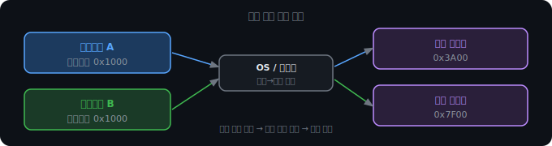
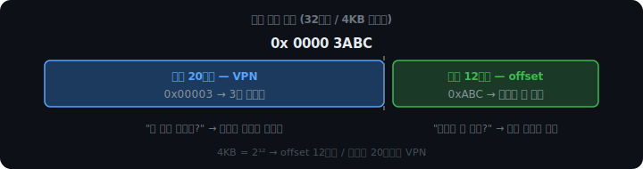
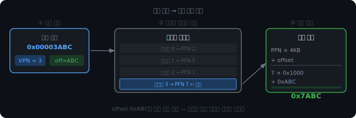
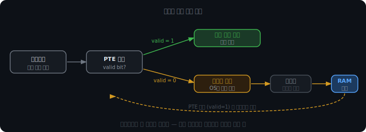

# 가상 메모리와 주소 변환

# 주소 충돌 문제

`int x = 0;`을 선언하면 컴파일러는 x를 특정 메모리 주소에 배치한다. 이 주소는 바이너리 안에 하드코딩된다. 문제는 컴파일러가 프로그램을 만들 때 "이 프로그램이 RAM의 어디에 올라갈지" 모른다는 것이다. 그래서 여러 프로그램이 독립적으로 컴파일되면 같은 주소를 쓰게 된다.

프로세스 A가 0x1000번지를 쓰는데, 프로세스 B도 0x1000번지를 쓴다. 두 프로세스가 동시에 RAM에 올라오면 같은 물리 주소를 서로 덮어쓴다. 멀티태스킹이 근본적으로 불가능해진다.

"로드할 때 OS가 주소를 바꿔주면 되지 않나"라고 할 수 있다. 그 방식도 존재한다. 하지만 프로그램 바이너리 전체를 스캔해 모든 주소 참조를 수정해야 하고, 프로그램이 크면 느리고 복잡해진다. 여전히 프로세스 A가 B의 메모리를 덮어쓰는 보안 문제도 해결되지 않는다.

가상 메모리는 바이너리를 건드리지 않고 하드웨어 수준에서 주소 변환을 끼워 넣는다. A와 B 모두 자기 코드에 0x1000이라고 쓰여 있지만, 실제로는 서로 다른 물리 위치에 매핑된다.



이 격리는 보안 면에서도 중요하다. 프로세스 A는 자기 가상 주소 공간 밖으로 나갈 수 없으므로, 프로세스 B의 메모리를 훔쳐보거나 덮어쓸 수 없다.

<br>

<br>

<br>

---

<br>

<br>

<br>

# 가상 주소의 구조

가상 주소는 단순한 숫자처럼 보이지만, 실제로는 두 부분으로 나뉜다.

메모리는 4KB 단위의 페이지로 쪼개져 있다. 그러면 가상 주소를 자연스럽게 "몇 번째 페이지인가"와 "그 페이지 안에서 몇 번째 바이트인가"로 분리할 수 있다.

```
[ 가상 페이지 번호(VPN) | 오프셋(offset) ]
     "어느 페이지?"          "페이지 내 위치"
```

4KB는 2의 12제곱이다. 페이지 안에서 0번부터 4095번 바이트까지 주소를 매기려면 12비트가 필요하다. 32비트 가상 주소라면 하위 12비트가 오프셋, 상위 20비트가 VPN이 된다.



가상 주소 0x00003ABC를 분석하면:

```
0x00003ABC
상위 20비트 → VPN    = 3     (3번 페이지)
하위 12비트 → offset = 0xABC (그 페이지의 2748번째 바이트)
```

<br>

<br>

<br>

---

<br>

<br>

<br>

# 페이지 테이블과 주소 변환

"3번 페이지"가 물리 메모리 어디에 있는지를 기록하는 자료구조가 페이지 테이블이다. 프로세스마다 하나씩 존재하고, RAM의 OS 커널 영역에 저장된다.

페이지 테이블은 배열이다. 인덱스가 VPN이고, 그 위치에 저장된 값이 물리 프레임 번호(PFN)다. CPU가 가상 주소를 들고 오면 VPN을 인덱스로 페이지 테이블을 조회해 PFN을 꺼낸다.



<iframe src="/DEV_LOG/OS/assets/demo_virtual_address.html" width="100%" height="780" frameborder="0" style="border-radius:10px;border:1px solid #334155;display:block;"></iframe>

변환 과정은 세 단계다.

```
① 가상 주소에서 VPN과 offset 추출
   0x00003ABC → VPN = 3, offset = 0xABC

② 페이지 테이블[3] 조회 → PFN = 7

③ 물리 주소 계산
   PFN × 4KB + offset = 7 × 0x1000 + 0xABC = 0x7ABC
```

오프셋은 변환 전후로 동일하다. 페이지 안에서의 위치는 바뀌지 않는다. 어느 프레임인지만 달라진다.

<br>

<br>

<br>

---

<br>

<br>

<br>

# 페이지 테이블 엔트리

페이지 테이블의 각 칸을 PTE(Page Table Entry)라고 한다. PFN 외에 여러 메타데이터 비트가 함께 저장된다.


valid bit는 이 페이지가 현재 RAM에 있는지를 나타낸다. 1이면 RAM에 있고, 0이면 디스크에 있다. 프로세스가 valid = 0인 주소에 접근하면 페이지 폴트가 발생한다.

reference bit는 최근에 이 페이지에 접근했는지를 기록한다. 페이지에 접근할 때 하드웨어가 자동으로 1로 세팅한다. 어떤 페이지를 RAM 밖으로 내보낼지 결정할 때 기준 데이터로 쓰인다.

dirty bit는 이 페이지가 RAM에 올라온 후 수정됐는지를 기록한다. 프로세스가 페이지에 무언가를 쓰면 하드웨어가 1로 세팅한다. dirty = 0이면 디스크에 있는 데이터와 동일하므로 교체 시 그냥 버리면 된다. dirty = 1이면 RAM의 내용이 디스크보다 새롭기 때문에 반드시 디스크에 쓰고 내보내야 한다. 이 비트 하나가 불필요한 디스크 쓰기를 걸러준다.

권한 비트(rwx)는 이 페이지가 읽기/쓰기/실행 가능한지를 나타낸다. 위반하면 segfault가 발생한다. 코드 영역을 실수로 덮어쓰는 일이 이 비트로 막힌다.

<br>

<br>

<br>

---

<br>

<br>

<br>

# 페이지 폴트

프로세스가 가상 주소를 들고 왔는데 해당 PTE의 valid bit가 0이다. 이 페이지는 지금 RAM이 아니라 디스크에 있다. 이 순간 페이지 폴트가 발생한다.



```
① 프로세스가 가상 주소 접근
② valid = 0 확인 → 페이지 폴트 발생
③ OS가 디스크에서 해당 페이지를 찾아 RAM의 빈 프레임에 복사
④ PTE 갱신: valid = 1, PFN = 새 프레임 번호
⑤ 프로세스 재개
```

프로세스 입장에서는 잠깐 멈췄다가 다시 실행되는 것처럼 느낀다. 이 과정 전체가 프로세스에게는 보이지 않는다.

RAM이 꽉 차 있으면 기존 페이지 하나를 디스크로 내보내고 그 자리에 새 페이지를 올린다. 어떤 페이지를 내보낼지가 문제다. 무작위로 고르면 금방 다시 필요한 페이지를 내보낼 수 있고, 그러면 또 페이지 폴트가 난다. 이 선택을 어떻게 하느냐가 성능을 결정한다. 잘못된 선택이 쌓이면 CPU가 실제 연산보다 페이지 교체에 더 많은 시간을 쓰게 된다.
