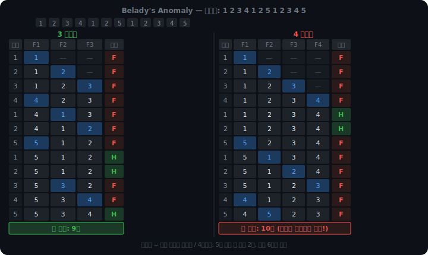
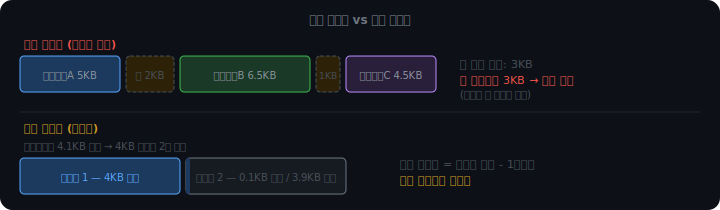
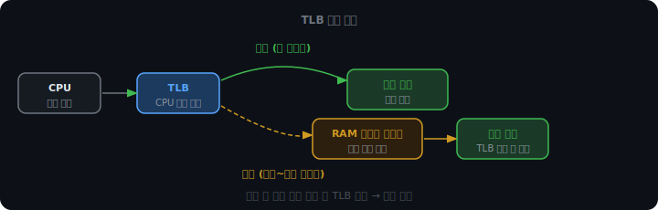
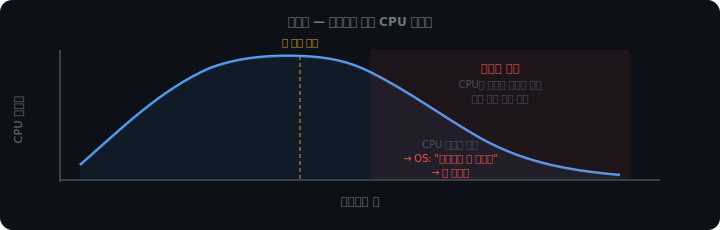

# 페이지 교체와 TLB

## 어떤 페이지를 내보낼까

RAM이 꽉 찼을 때 페이지 폴트가 나면 기존 페이지 하나를 디스크로 밀어내야 한다. 어떤 것을 고르느냐에 따라 이후 페이지 폴트 횟수가 달라진다. 금방 또 필요한 페이지를 내보내면 바로 또 폴트가 난다.

### FIFO

가장 단순한 선택은 가장 먼저 들어온 페이지를 내보내는 것이다. 줄 선 순서대로 내보낸다. 구현이 단순하다.

문제는 Belady's anomaly다. FIFO에서는 프레임 수를 늘렸는데 오히려 페이지 폴트가 늘어나는 현상이 생길 수 있다.

참조열 `1 2 3 4 1 2 5 1 2 3 4 5`로 확인하면:



3 프레임에서는 5가 들어온 뒤에도 1, 2가 메모리에 남아 히트가 3번 난다. 4 프레임에서는 초반에 1, 2, 3, 4를 모두 올려두어 히트가 2번 나지만, 5가 들어오는 순간 1이 쫓겨나고 이후 1→2→3→4→5를 차례로 다시 불러야 하는 연쇄 폴트가 발생한다. 더 여유가 생기면 더 많이 쌓아두고, 그 더미가 한꺼번에 무너진다.

FIFO는 "오래됐지만 자주 쓰는 페이지"를 가려내지 못한다. 오래됐다는 것이 곧 "더 이상 필요 없다"는 의미가 아닌데, FIFO는 그 둘을 구분하지 않는다.

### OPT

앞으로 가장 오래 사용되지 않을 페이지를 내보낸다. 이론적으로 최적임이 증명된 알고리즘이다. 어떤 알고리즘보다도 폴트 횟수가 적다.

실제 구현은 불가능하다. 미래 접근 패턴을 알아야 하기 때문이다. 다른 알고리즘이 얼마나 최적에 가까운지 비교하는 기준점으로만 쓰인다.

### LRU

가장 오래 접근되지 않은 페이지를 내보낸다. "최근에 쓴 건 곧 또 쓸 가능성이 높다"는 참조 지역성에 근거한다. Belady's anomaly도 없고, OPT에 가장 가깝다.

완벽한 구현에는 문제가 있다. 모든 메모리 접근마다 타임스탬프를 기록해야 한다. 메모리 읽기 한 번에 타임스탬프 쓰기 한 번이 따라붙어, 모든 접근 비용이 두 배가 된다.

### Clock 알고리즘

실제 OS에서 쓰는 방식이다. LRU를 완벽히 구현하는 대신, PTE의 reference bit 하나로 근사한다.

페이지에 접근할 때 하드웨어가 reference bit를 자동으로 1로 세팅한다. 교체 대상을 고를 때는 원형으로 배열된 페이지들을 시계 방향으로 순회한다.

```
reference bit = 1  →  0으로 초기화하고 통과 (한 번 기회 줌)
reference bit = 0  →  이 페이지 교체
```

초기화 후 다시 접근이 오면 하드웨어가 1로 돌려놓는다. 다음 순회에서 살아남는다. 접근이 없으면 0인 채로 남아 결국 교체된다.

<iframe src="/DEV_LOG/OS/assets/demo_clock_algorithm.html" width="100%" height="880" frameborder="0" style="border-radius:10px;border:1px solid #334155;display:block;"></iframe>

<br>

<br>

---

## 메모리 단편화

페이징이 등장하기 전, 프로세스는 가변 크기 덩어리로 메모리에 올라갔다. 프로세스가 생겨나고 사라지기를 반복하면 이런 상황이 된다.



빈 공간이 2KB + 1KB로 흩어져 있다. 합치면 3KB인데, 연속된 공간이 없어서 3KB짜리 프로세스가 들어오지 못한다. 이게 외부 단편화다.

페이징은 4KB 고정 단위로 쪼개서 이 문제를 없앤다. 빈 프레임이 어디 있든 새 페이지가 딱 맞게 들어간다.

대신 내부 단편화가 생긴다. 프로세스가 4.1KB를 필요로 하면 페이지 두 개(8KB)를 받아야 한다. 두 번째 페이지의 3.9KB는 낭비된다. 페이지 크기보다 작은 마지막 조각이 남을 때 항상 발생한다.

외부 단편화와 내부 단편화는 트레이드오프다. 외부 단편화는 공간이 있어도 못 쓰는 상황을 만들고 최악의 경우를 예측하기 어렵다. 내부 단편화는 최대 낭비가 (페이지 크기 - 1바이트)로 한정되어 있어 다루기 쉽다. 페이징은 이 트레이드오프에서 내부 단편화를 선택한다.

<br>

<br>

---

## TLB

페이지 테이블은 RAM의 커널 영역에 있다. 주소 변환을 할 때마다 RAM을 한 번 더 읽어야 한다. 메모리에 접근하기 위해 메모리를 또 접근하는 것이다.

TLB(Translation Lookaside Buffer)는 CPU 내부에 있는 주소 변환 캐시다. 최근에 변환한 가상→물리 주소 쌍을 저장해둔다. 같은 주소를 다시 변환할 때 RAM 조회 없이 수 사이클 만에 끝난다.



자주 접근하는 주소는 TLB에 남아 거의 항상 히트가 난다. 프로그램은 같은 코드와 같은 변수를 반복해서 건드리는 경향이 있기 때문이다.

컨텍스트 스위칭할 때는 TLB를 비워야 한다. 같은 가상 주소라도 프로세스마다 물리 주소가 다르다. 비우지 않으면 프로세스 B가 A의 물리 주소를 받아 엉뚱한 메모리를 읽거나 보안 침해가 일어난다.

매번 통째로 비우는 비용을 줄이기 위해 현대 CPU는 ASID(Address Space Identifier)를 쓴다. TLB 엔트리마다 프로세스 ID를 태깅해두면, 컨텍스트 스위칭 때 전체를 비우지 않아도 된다. 현재 프로세스 ASID와 일치하는 엔트리만 유효하고 나머지는 자동으로 무시된다.

<br>

<br>

---

## 스래싱

프로세스가 많아질수록 각 프로세스에게 돌아가는 프레임 수가 줄어든다. 프레임이 너무 적으면 프로세스가 실행에 필요한 페이지를 RAM에 유지하지 못한다. 페이지 폴트가 계속 나고, 디스크에서 페이지를 올리고 내리는 일이 반복된다.

CPU 이용률이 떨어진다. OS는 이를 보고 "CPU가 놀고 있다"고 판단해 프로세스를 더 올린다. 프레임은 더 부족해지고 폴트는 더 많아진다. CPU가 거의 일을 못 하면서 디스크와 RAM 사이에서 페이지만 오가는 상태, 이게 스래싱이다.



해결책은 두 가지다.

워킹셋 모델은 프로세스가 현재 활발히 쓰는 페이지 집합을 추적한다. 프로그램은 특정 구간에 같은 페이지들을 집중적으로 접근하는 경향이 있다. 이 집합을 워킹셋이라고 하며, 시스템 전체 워킹셋 합이 물리 프레임 수를 넘으면 프로세스 일부를 통째로 suspend한다. 억지로 쪼개서 모두 스래싱 상태에 빠지는 것보다, 일부를 잠시 내려놓고 나머지가 제대로 도는 편이 낫다.

PFF(Page Fault Frequency)는 프로세스별 페이지 폴트 빈도를 실시간으로 관찰한다. 폴트가 너무 잦으면 프레임을 더 주고, 너무 적으면 프레임을 회수한다. 줄 프레임이 없는데 폴트가 계속 나면 해당 프로세스를 suspend한다. 워킹셋이 사전 예방이라면 PFF는 사후 대응이다.

지금까지 페이징은 메모리를 고정된 크기로 잘라서 관리한다고 했다. 그런데 프로세스를 코드, 데이터, 스택, 힙처럼 논리적인 단위로 나눠서 관리하는 방식도 있다. 크기가 제각각이고 외부 단편화도 생기지만, 프로세스의 구조를 그대로 반영한다. 이것이 세그멘테이션이다.
