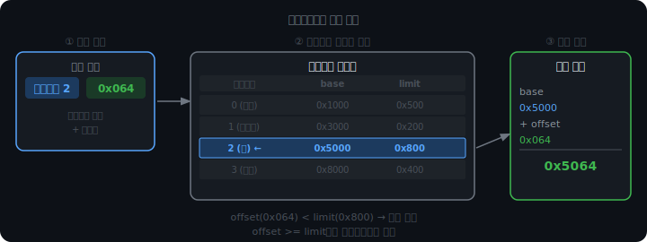
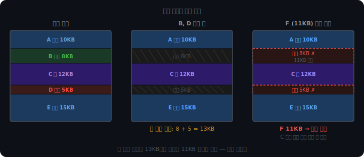
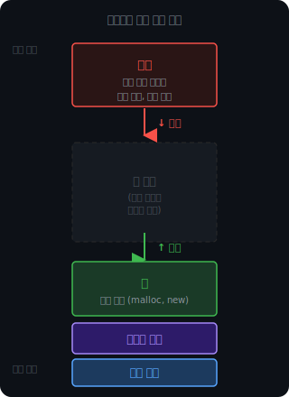
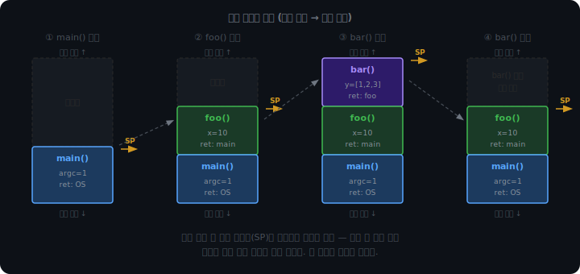
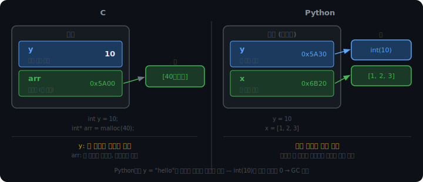

# 세그멘테이션과 스택, 힙

## 세그멘테이션

가상 주소 공간을 4KB 단위로 자르는 페이징은 물리 메모리 관리를 단순하게 만들었다. 빈 프레임이 있으면 어느 프레임이든 어느 페이지든 들어갈 수 있다. 크기가 모두 같으니 맞는 구멍을 찾는 문제가 사라진다.

대신 페이지 하나에 코드와 힙이 섞일 수 있다. 페이지는 그냥 번호다. "이 페이지가 코드인지 데이터인지"를 구조적으로 표현하지 않는다.

세그멘테이션은 반대 방향에서 출발했다. 프로그래머가 프로그램을 구성하는 방식, 즉 코드/데이터/힙/스택이라는 논리적 단위를 메모리에 그대로 반영하자는 아이디어다.

```
세그먼트 0: 코드 (text)
세그먼트 1: 데이터 (전역변수)
세그먼트 2: 힙
세그먼트 3: 스택
```

각 세그먼트는 가변 크기다. 코드가 10KB면 10KB, 힙이 3KB면 3KB.

<br>

<br>

---

<br>

<br>

### 주소 변환

페이징이 가상 주소를 VPN과 오프셋으로 분리하듯, 세그멘테이션은 세그먼트 번호와 오프셋으로 분리한다.

```
가상 주소 = (세그먼트 번호, 오프셋)
```

세그먼트 테이블의 각 엔트리는 base와 limit 두 값을 갖는다. base는 이 세그먼트가 물리 메모리에서 시작하는 주소, limit는 세그먼트의 크기다.

```
물리 주소 = base + 오프셋
단, 오프셋 >= limit이면 세그멘테이션 폴트
```



한 프로세스의 세그먼트들은 물리 메모리에서 연속일 필요가 없다. 코드 세그먼트가 1000번지에, 힙이 5000번지에 있어도 무방하다. 세그먼트 테이블이 각자의 base를 기록하고 있으니 CPU는 세그먼트 번호만 보면 된다.

세그멘테이션의 이점은 권한 설정이 자연스럽다는 것이다. 코드 세그먼트에는 실행만, 힙 세그먼트에는 읽기/쓰기만 허용하는 식으로 세그먼트 단위로 보호할 수 있다.

<br>

<br>

---

<br>

<br>

### 외부 단편화

세그멘테이션의 대가는 외부 단편화다. 세그먼트는 가변 크기이므로 연속된 물리 공간이 필요하다. 프로세스들이 올라왔다 내려가면서 빈 공간이 조각조각 남는다.



빈 공간의 총합은 충분한데 맞는 크기의 연속 공간이 없는 상태, 이것이 외부 단편화다.

페이징은 이 문제를 구조적으로 없앤다. 모든 페이지가 4KB로 동일하므로 빈 프레임이면 어디든 들어갈 수 있다. 맞는 구멍을 찾는 문제 자체가 사라진다. 대신 마지막 페이지에서 4KB를 다 채우지 못하는 내부 단편화가 생기는데, 이쪽이 손해가 적다. 내부 단편화는 페이지당 최대 4KB - 1바이트로 상한이 고정된다. 외부 단편화는 시스템 상태에 따라 무한정 커질 수 있다.

현대 OS가 페이징을 선택한 이유가 여기 있다.

<br>

<br>

---

<br>

<br>

## 스택과 힙

### 배치

프로세스의 가상 주소 공간에서 스택과 힙은 서로 마주보며 자란다.



스택과 힙이 양 끝에서 마주보며 자라는 이유는 둘 다 실행 중에 크기가 변하기 때문이다. 컴파일 시점에 얼마나 커질지 알 수 없는 두 영역이 가운데 빈 공간을 공유하면서 각자 필요한 만큼 확장한다. 둘이 만나는 순간이 메모리 고갈이다.

<br>

<br>

---

<br>

<br>

### 스택 프레임

스택에 올라가는 단위를 스택 프레임이라고 한다. 함수가 호출될 때 프레임이 생성되고, 종료되면 자동으로 사라진다. 프레임 안에는 지역 변수와 반환 주소가 들어있다.



함수가 호출될수록 스택 포인터(SP)가 낮은 주소 방향으로 내려가며 프레임이 쌓인다. 함수가 종료되면 SP가 올라가고, 해당 프레임의 내용은 자동으로 무효화된다. 별도의 해제 과정이 없다.

아래 시뮬레이터에서 직접 확인해볼 수 있다.

<iframe src="/DEV_LOG/OS/assets/demo_stack_frames.html" width="100%" height="950" frameborder="0" style="border-radius:10px;border:1px solid #334155;display:block;"></iframe>

<br>

<br>

---

<br>

<br>

### 저장 기준

구분 기준은 수명과 크기다.

스택에는 함수가 끝나면 사라져도 되는 것, 그리고 크기가 컴파일 시점에 고정된 것이 올라간다. 함수의 지역 변수와 함수 호출 정보가 여기에 해당한다.

힙에는 함수가 끝난 후에도 살아있어야 하는 것, 또는 크기가 런타임에 결정되는 것이 올라간다.

```c
int* create_array() {
    int* p = malloc(40);  // 힙에 40바이트 할당
    return p;             // 포인터(힙 주소)를 반환
}

int main() {
    int* arr = create_array();
    arr[0] = 999;  // create_array가 끝났지만 힙 메모리는 살아있음
}
```

create_array가 종료되면 스택 프레임의 포인터 변수 p는 사라진다. 하지만 p가 가리키던 힙의 40바이트는 그대로 남는다. 포인터가 반환값으로 전달됐고 main의 arr이 그 주소를 이어받았기 때문이다.

Python과 Java에서는 이 구분이 더 철저하다. 모든 객체가 힙에 존재하고, 변수는 그 주소만 들고 있다. 변수가 값을 직접 저장하는 C와 달리, Python의 변수는 항상 힙 객체를 가리키는 참조다.



이 차이 때문에 Python에서 `y = 10`에서 `y = "hello"`로 바꾸는 게 자연스럽다. 스택의 참조값만 교체하면 되고, 힙의 int(10) 객체는 참조 카운트가 0이 되면 GC가 해제한다.

<br>

<br>

---

<br>

<br>

## 메모리 관리

### 메모리 누수

C에서 malloc으로 할당한 공간은 free를 호출해야 힙으로 돌아간다. free를 빠뜨리면 그 공간은 사용 중으로 남는다. 더 심각한 경우는 그 주소를 아는 포인터까지 사라지는 상황이다.

```c
void foo() {
    int* p = malloc(100);
    // free(p) 빠짐
}
// foo 종료: 스택의 p는 사라짐
// 힙의 100바이트: 접근할 방법도, 해제할 방법도 없음
```

이 100바이트는 프로그램이 종료될 때까지 누구도 쓸 수 없는 상태로 남는다. 함수가 반복 호출될수록 누수가 쌓이고 결국 메모리가 고갈된다.

Python은 가비지 컬렉터(GC)로 이를 자동화한다. CPython의 GC는 참조 카운팅을 기본으로 쓴다. 객체를 가리키는 참조의 수를 추적하다가 0이 되는 순간 자동으로 해제한다.

```python
x = [1, 2, 3]  # 참조 1개
y = x           # 참조 2개
x = None        # 참조 1개
y = None        # 참조 0개 → GC가 즉시 해제
```

단, 참조 카운팅만으로는 해결되지 않는 경우가 있다. 두 객체가 서로를 참조하는 순환 구조에서는 외부 참조가 없어도 카운트가 0이 되지 않는다. Python은 이를 위해 순환 참조 탐지기를 별도로 실행한다. 주기적으로 서로만 가리키고 외부 참조가 없는 그룹을 찾아 통째로 해제한다.

<br>

<br>

---

<br>

<br>

### malloc의 내부

malloc을 호출할 때마다 OS에 메모리를 요청하지는 않는다. 시스템 콜은 비용이 크기 때문이다. 대신 malloc은 OS에서 큰 덩어리를 미리 받아두고 내부적으로 free list를 관리한다.

```
malloc(10)  → free list에서 10바이트 블록 찾아서 반환
malloc(20)  → free list에서 20바이트 블록 찾아서 반환
free(p)     → 반납된 블록을 free list에 추가
malloc(15)  → free list에 20바이트 블록이 있음 → 재사용
```

free list에 적합한 블록이 없을 때 비로소 OS에 추가 공간을 요청한다. free를 호출하지 않으면 블록이 free list로 돌아오지 않는다. 힙 공간은 있는데 malloc이 쓸 수 없는 상태가 쌓이는 것이 메모리 누수의 실체다.

OS가 프로세스에게 실행 흐름을 넘기고 다시 빼앗는 메커니즘, 인터럽트가 그 기반에 있다.
