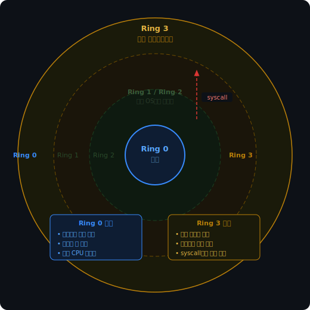
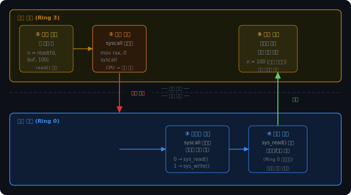
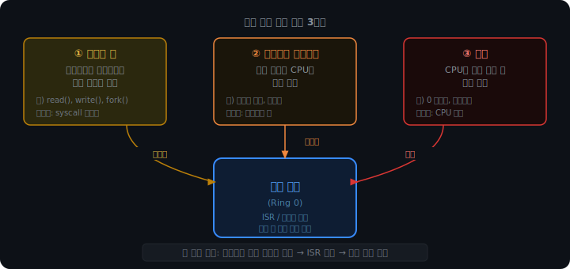

# 커널 모드와 시스템 콜

## 왜 모드가 필요한가

프로그램이 하드웨어에 직접 접근할 수 있다면 어떤 일이 생길까.

악성 프로그램이 디스크의 OS 영역을 덮어쓸 수 있다. 다른 프로세스의 메모리를 읽어 비밀번호를 훔칠 수 있다. 네트워크 카드에 직접 패킷을 쏴 방화벽을 우회할 수도 있다. 프로그램 하나의 버그가 시스템 전체를 날린다.

이 문제를 해결하기 위해 CPU는 실행 모드를 나눈다. 커널 모드와 유저 모드다.

<br>

<br>

---

<br>

<br>

### CPU 보호 링 구조

CPU는 하드웨어 수준에서 권한을 링(Ring) 번호로 구분한다.



Ring 0이 가장 높은 권한이다. 하드웨어 직접 접근, 메모리 맵 변경, 모든 CPU 명령어 실행이 가능하다. 커널이 여기서 실행된다.

Ring 3이 가장 낮은 권한이다. 일반 연산만 가능하고 하드웨어 접근은 막혀있다. 유저 애플리케이션이 여기서 실행된다.

Ring 1, 2는 원래 장치 드라이버와 OS 서비스용으로 설계됐지만, Linux와 Windows는 사용하지 않는다. 모놀리식 커널 구조에서 드라이버가 커널과 같은 Ring 0에서 실행되기 때문이다.

CPU가 현재 어떤 Ring에서 실행 중인지는 CS(Code Segment) 레지스터의 하위 2비트로 알 수 있다. OS와 CPU가 협력해서 이 값을 관리한다.

<br>

<br>

---

<br>

<br>

## 유저 모드에서 할 수 없는 것들

Ring 3에서 실행 중인 프로그램이 특권 명령어를 실행하려 하면 CPU가 즉시 예외(Exception)를 발생시킨다. 프로세스가 강제 종료된다.

막혀있는 것들의 예시:

```
in / out   — I/O 포트 직접 읽기/쓰기
hlt        — CPU 정지
lgdt / ldt — 전역 디스크립터 테이블 변경 (메모리 맵)
mov cr0    — 제어 레지스터 수정 (페이징 활성화 등)
```

유저 프로그램이 디스크에 접근하거나 화면에 출력하려면, 커널에게 대신 해달라고 요청해야 한다. 그 요청 창구가 시스템 콜이다.

<br>

<br>

---

<br>

<br>

## 시스템 콜

시스템 콜은 유저 프로그램이 커널 서비스를 요청하는 유일한 공식 창구다.

파일을 읽고 쓰고, 프로세스를 만들고, 네트워크에 접근하는 모든 것이 시스템 콜을 통해 이루어진다. Python에서 `open()`, `print()`, `socket()`을 호출할 때도 내부 어딘가에서 시스템 콜이 일어나고 있다.

Linux x86-64의 주요 시스템 콜:

```
번호   함수명       기능
0      read         파일/소켓에서 읽기
1      write        파일/소켓에 쓰기
2      open         파일 열기
3      close        파일 닫기
57     fork         프로세스 복제
59     execve       프로그램 실행
60     exit         프로세스 종료
```

<br>

<br>

---

<br>

<br>

### 시스템 콜 흐름

유저 코드가 `read()`를 호출하면 내부에서 다섯 단계가 일어난다.



아래 시뮬레이터에서 단계별로 확인할 수 있다.

<iframe src="/DEV_LOG/OS/assets/ch8_demo_syscall_steps.html" width="100%" height="520" frameborder="0" style="border-radius:10px;border:1px solid #334155;display:block;" onload="this.style.height=(this.contentDocument||this.contentWindow.document).documentElement.scrollHeight+'px'"></iframe>

<br>

핵심은 두 가지다.

첫째, 모드 전환은 `syscall` CPU 명령어 하나로 시작된다. 소프트웨어가 임의로 Ring 0에 진입하는 건 불가능하다. 반드시 이 명령어를 통해야 하고, CPU가 하드웨어 수준에서 안전하게 전환을 처리한다.

둘째, 시스템 콜 테이블이 커널 코드의 어디로 점프할지를 결정한다. 유저는 번호만 지정할 수 있고, 번호가 테이블에 있는 것만 호출할 수 있다. 임의의 커널 함수를 직접 호출하는 건 불가능하다.

<br>

<br>

---

<br>

<br>

### 커널 모드 진입 경로

`syscall` 명령어가 커널로 들어가는 유일한 경로는 아니다. 커널 모드에 진입하는 경로는 세 가지다.



시스템 콜은 프로그램이 의도적으로 요청하는 것이다. 하드웨어 인터럽트는 외부 장치가 비동기적으로 보내는 신호다. 예외는 CPU가 오류를 감지했을 때 자동으로 발생한다.

셋 다 결국 같은 메커니즘으로 처리된다. 인터럽트 벡터 테이블을 조회해 해당 핸들러를 실행하고, 처리가 끝나면 유저 모드로 돌아온다.

커널은 이 세 가지 진입점을 통해 하드웨어와 유저 프로그램 사이의 중재자 역할을 한다. CPU가 언제, 무엇을, 얼마만큼 할 수 있는지를 통제하는 것이 커널의 본질적인 역할이다.
