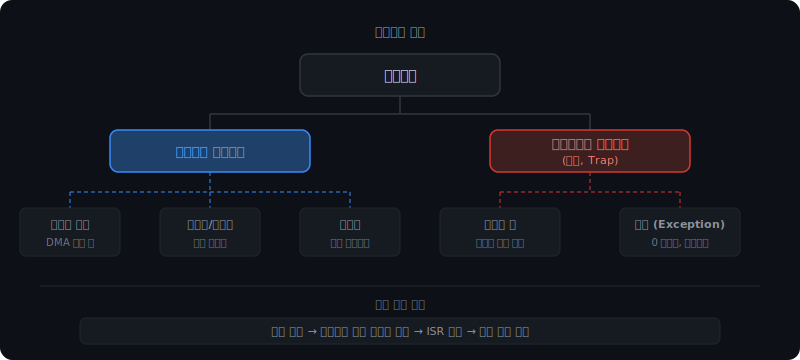
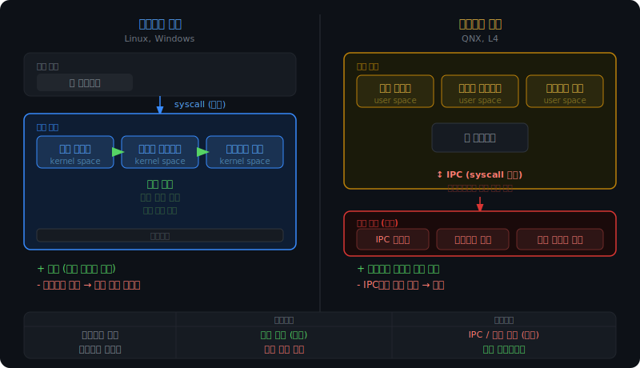

# 인터럽트

## 왜 필요한가

프로세스가 `read()` 시스템 콜을 호출하면 커널이 디스크 컨트롤러에 읽기 명령을 보내고, 디스크가 DMA로 데이터를 옮기는 동안 해당 프로세스는 Waiting 상태가 된다. 그 사이 CPU는 다른 프로세스를 실행한다.

디스크 읽기가 완료됐을 때 CPU는 어떻게 아는가. CPU는 지금 다른 프로세스를 실행하는 중이다.

이것이 인터럽트가 필요한 이유다. 하드웨어 장치가 작업을 완료했을 때 CPU에 알리는 신호 메커니즘이다.

인터럽트 없이도 방법이 하나 있긴 하다. 폴링(Polling)이다. CPU가 루프를 돌면서 주기적으로 장치 상태를 직접 확인하는 방식이다.

```c
while (disk_not_ready()) {
    // 계속 확인
}
// 완료됐으면 처리
```

문제는 디스크 읽기가 수십 밀리초 걸리는 동안 CPU가 루프만 돌고 있다는 것이다. 그 사이 다른 프로세스를 실행할 수 없다. 인터럽트는 이 낭비를 없앤다. CPU는 다른 일을 하다가 장치가 완료 신호를 보내면 그때 처리한다.

<br>

<br>

---

<br>

<br>

## 처리 흐름

CPU는 매 명령어 사이클마다 인터럽트 핀을 확인한다. 디스크, 키보드 같은 하드웨어 장치가 작업을 마치면 이 핀에 신호를 보낸다. 신호가 감지되면 CPU는 현재 실행 흐름을 멈추고 인터럽트를 처리한다.

```
1. 디스크가 인터럽트 핀에 신호 전송
2. CPU가 현재 프로세스(B)의 레지스터와 PC를 PCB에 저장
3. 인터럽트 벡터 테이블 조회 → 어떤 ISR을 실행할지 결정
4. ISR(Interrupt Service Routine) 실행
   → I/O 완료된 프로세스(A)를 Waiting → Ready Queue로 이동
5. B의 상태 복원 → B 재개
6. 이후 스케줄러가 A를 선택하면 A가 CPU를 받아 실행
```

3단계에서 인터럽트 벡터 테이블을 조회한다. 인터럽트 종류마다 어떤 ISR을 실행할지 매핑해놓은 테이블로, OS 부팅 때 커널이 미리 만들어둔다. "디스크 완료는 0x21번, 키보드 입력은 0x09번" 식으로 번호마다 ISR 주소가 들어있다. CPU는 이 번호만 보고 즉시 해당 처리 코드로 점프한다.

여기서 주의할 점이 있다. 인터럽트가 발생했을 때 CPU를 쓰고 있던 프로세스(B)와, I/O가 완료된 프로세스(A)는 다른 프로세스다. ISR이 끝난 뒤 CPU는 A가 아니라 B로 돌아간다. A는 Ready Queue에 올라가고, 실제로 CPU를 받는 건 스케줄러가 결정한다.

아래 시뮬레이터에서 단계별로 확인할 수 있다.

<iframe src="/DEV_LOG/OS/assets/ch9_demo_interrupt_timeline.html" width="100%" height="520" frameborder="0" style="border-radius:10px;border:1px solid #334155;display:block;" onload="this.style.height=(this.contentDocument||this.contentWindow.document).documentElement.scrollHeight+'px'"></iframe>

<br>

<br>

---

<br>

<br>

## 인터럽트의 두 종류

인터럽트는 신호를 보내는 주체에 따라 두 가지로 나뉜다.



처리 메커니즘은 둘 다 동일하다. 신호 감지 → 인터럽트 벡터 테이블 조회 → ISR 실행 → 복귀. 다른 건 트리거뿐이다.

<br>

<br>

---

<br>

<br>

### 하드웨어 인터럽트

외부 장치가 CPU에 신호를 보내는 방식이다. 디스크 완료, 키보드 입력이 여기 해당한다. 프로그램의 의지와 무관하게 언제든 발생할 수 있다.

그 중 타이머 인터럽트는 특별히 중요하다. 메인보드의 하드웨어 타이머가 일정 주기(수 밀리초)마다 자동으로 CPU에 인터럽트를 보낸다. 이 신호를 받은 커널이 현재 실행 중인 프로세스를 강제로 중단하고 스케줄러를 실행한다.

Round Robin의 time quantum이 구현되는 방식이 바로 이것이다. quantum이 10ms라면, 타이머가 10ms마다 인터럽트를 보내고, 커널이 그때마다 다음 프로세스로 전환한다. 선점 스케줄링은 타이머 인터럽트 없이는 불가능하다.

<br>

<br>

---

<br>

<br>

### 트랩: 소프트웨어 인터럽트

트랩은 두 가지 경우에 발생한다.

첫 번째는 시스템 콜이다. `read()`, `write()`, `fork()` 같은 시스템 콜을 호출하면 내부적으로 `syscall` 명령어가 실행된다. 이 명령어가 소프트웨어 인터럽트를 발생시키고, CPU가 유저 모드에서 커널 모드로 전환된다. 커널이 요청을 처리한 뒤 다시 유저 모드로 돌아온다.

```
read() 호출
  → syscall 명령어 실행 (트랩 발생)
  → 인터럽트 벡터 테이블 조회
  → 커널 시스템 콜 핸들러(ISR) 실행  ← 여기서 유저→커널 모드 전환
  → 처리 완료 후 유저 모드 복귀
```

두 번째는 예외(Exception)다. 프로그램이 잘못된 동작을 했을 때 CPU가 자동으로 트랩을 발생시킨다. 0으로 나누기, 잘못된 메모리 주소 접근(세그폴트)이 여기에 해당한다. 프로그램이 의도적으로 부른 게 아니라, CPU가 "이건 OS에 넘겨야 해"하고 자동으로 날리는 것이다.

```
DIV 명령어 실행 중 0 감지
  → CPU가 자동으로 트랩 발생
  → 인터럽트 벡터 테이블 조회 → Divide-by-Zero ISR
  → OS: 해당 프로세스에 SIGFPE 시그널 전송
  → 프로세스 종료
```

시스템 콜과 예외는 둘 다 트랩이지만 방향이 반대다. 시스템 콜은 프로그램이 OS에게 "이것 좀 해줘"라고 요청하는 것이고, 예외는 CPU가 OS에게 "이 프로그램이 잘못됐어"라고 보고하는 것이다.

Python에서 보는 `ZeroDivisionError`는 이 경로로 만들어진다. CPU 트랩 → 커널 처리 → Python 인터프리터가 시그널을 받아 예외 객체 생성 → `try/except`가 있으면 잡고, 없으면 프로그램 종료.

<br>

<br>

---

<br>

<br>

## 인터럽트 중첩과 우선순위

ISR을 실행하는 도중 또 다른 인터럽트가 들어오면 어떻게 될까.

기본적으로 CPU는 ISR 진입 시 인터럽트 플래그를 끈다. 다른 인터럽트가 들어와도 무시한다. ISR이 끝난 뒤 플래그를 다시 켜면, 그동안 쌓인 인터럽트를 순서대로 처리한다. ISR 자체가 중단되는 일이 없으니 처리 흐름이 단순하다.

단, 모든 인터럽트를 무시할 수는 없다. NMI(Non-Maskable Interrupt)는 플래그와 무관하게 항상 처리된다. 하드웨어 오류, 전원 이상처럼 즉각 대응이 필요한 상황에서 사용한다. 일반 인터럽트는 잠깐 미뤄도 되지만 NMI는 미룰 수 없다.

우선순위가 다른 인터럽트들이 동시에 들어오는 경우는 인터럽트 컨트롤러(PIC/APIC)가 중재한다. 우선순위가 높은 인터럽트를 먼저 CPU에 전달하고, 낮은 것은 대기시킨다. CPU 자체가 아니라 별도 하드웨어가 이 역할을 담당하는 덕분에 CPU는 처리에만 집중할 수 있다.

<br>

<br>

---

<br>

<br>

## 모놀리식 커널 vs 마이크로 커널

인터럽트와 시스템 콜이 정착하면서 OS 설계에 하나의 선택지가 생겼다. 커널이 어디까지 담당할 것인가.



<br>

<br>

---

<br>

<br>

### 모놀리식 커널

파일 시스템, 디스크 드라이버, 네트워크 스택을 전부 커널 모드에서 실행한다. 이 컴포넌트들은 같은 커널 주소 공간에 있기 때문에 서로 함수 호출로 통신한다. 모드 전환이 없으니 빠르다.

대신 취약점이 있다. 드라이버에 버그가 있으면 커널 전체가 크래시된다. 드라이버도 커널 모드에서 실행되므로 메모리를 잘못 건드리면 OS 전체가 멈춘다. Linux에서 커널 패닉이 발생하는 경우 대부분 드라이버 문제다.

Linux와 Windows가 모놀리식 커널이다. 범용 OS에서는 성능이 우선이고, 드라이버 안정성은 코드 리뷰와 커널 모듈 분리 방식으로 관리한다.

<br>

<br>

---

<br>

<br>

### 마이크로 커널

반대 방향으로 설계했다. 커널에는 최소한만 두고, 파일 시스템과 드라이버를 유저 모드 프로세스로 분리한다. 커널이 담당하는 건 기본적인 IPC 라우팅, 프로세스 관리, 메모리 관리 정도다.

드라이버가 죽어도 커널은 살아있다. 해당 드라이버 프로세스만 재시작하면 된다. 이 특성 때문에 의료 기기, 항공, 자동차 제어 시스템처럼 안정성이 생존 조건인 분야에서 마이크로 커널을 쓴다.

비용은 통신 속도다. 파일 시스템이 디스크 드라이버를 호출하려면 IPC를 써야 한다. IPC는 시스템 콜이므로 유저 모드 → 커널 모드 → 유저 모드 전환이 필요하다. 컴포넌트 간 요청 하나에 모드 전환이 두 번씩 붙는다. 이게 누적되면 성능 차이가 커진다.

| | 모놀리식 | 마이크로 |
|--|--|--|
| 컴포넌트 통신 | 함수 호출 (빠름) | IPC / 모드 전환 (느림) |
| 드라이버 크래시 영향 | 커널 전체 | 해당 프로세스만 |
| 주 사용처 | Linux, Windows | QNX, L4 (임베디드/안전 시스템) |

인터럽트가 하드웨어와 커널을 연결하는 수직 구조라면, 하나의 프로세스 안에서 I/O를 어떻게 다루느냐는 수평 구조의 문제다. 동기와 비동기, Blocking과 Non-blocking이 그 선택지다.
